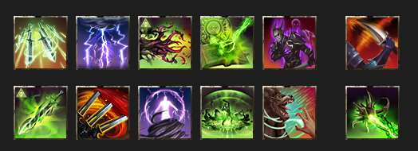
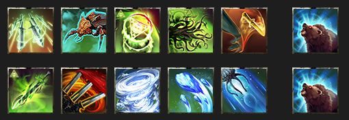
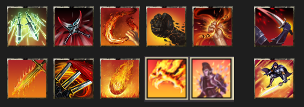
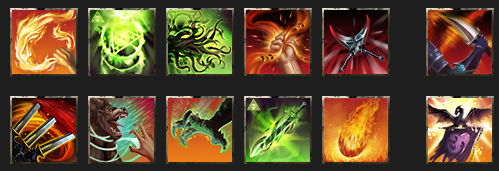
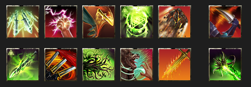

<input type="checkbox" id="menu-toggle" class="menu-toggle">
<label for="menu-toggle" class="hamburger-menu">
  
  
  
</label>

  

    <h3>Contents</h3>
    <!-- TOC will be inserted here by JavaScript -->
  

* TOC
{:toc}

# ESO Update 49 Mid-tier Build Guides

_This is a work in progess; last updated 2026-02-21._

These capture the mid-tier meta for Update 49 (U49), aimed at groups who regularly do vet and vet HM content; venturing in trifecta progs. **Wait, you've got it all wrong!** Yeah, maybe I do, that's totally fair. And in any case, there's lots of good approaches and strategies, and not a one-size-fits-all approach that will always apply. Thanks for all the feedback I've received to date!

For all the guides, see the full [Paradoxdruid's Guides](./) site

---

## Update 49 DPS Loadouts

See also [Why Do I Use These Skills?](#why-do-i-use-these-skills) for details on why different skills are selected.

**DPS Builds**

**Fatecarver (Beam) Builds**

- [Meta Beam Arcanist - Dawn's Wrath variant](#meta-beam-arcanist-dawns-wrath-variant)
- [Meta Beam Arcanist - Draconic Power variant](#meta-beam-arcanist-draconic-power-variant)
- [Meta Beam Arcanist - Aedric Spear variant](#meta-beam-arcanist-aedric-spear-variant)
- [Meta Beam Arcanist - Gravelord variant](#meta-beam-arcanist-gravelord-variant)
- [Meta Beam Arcanist - Storm Calling variant](#meta-beam-arcanist-stormcalling-variant)
- [Beam Arcanist Gear Guide](#beam-arcanist-gear-guides)

**Spammable (Non-Beam) Builds**

- [Chill Warden](#chill-warden)
- [Dragon Assassin](#dragon-assassin)
- [Runeblades - Ardent Flames variant](#runeblades-ardent-flames-variant)
- [Runeblades - Earthen variant](#runeblades-earthen--variant)
- [Runeblades - Stormcalling variant](#runeblades-stormcalling-variant)
- [Blastbones](#blastbones)
- [Support Zen/Colo DPS](#support-zencolo-dps)

See [Guiding Principles](#guiding-principles) and [Buff Calculations](#buff-calculations) for explanations of set selections.

### Meta Beam Arcanist (Dawn's Wrath variant)

  

    <h5>Class Lines</h5>
    

      <ul>
        <li>Herald of the Tome (Arcanist),</li>
        <li>Assassination (Nightblade),</li>
        <li>Dawn's Wrath (Templar)</li>
      </ul>
    

  

  

    <h5>Skill Bars</h5>
    

      
<em>FB</em>: Quick Cloak, Radiant Glory, Cephaliarch's Flail, Pragmatic Fatecarver, Camo Hunter, Ult: Incapacitating Strike

      
<em>BB</em>: Inspired Scholarship, Stampede, Solar Barrage, Fulminating Rune, Barbed Trap, Ult: Languid Eye

      
<a href="https://sheumais.github.io/esoskillbarbuilder/?skills=299,94,18,17,370,36,20,334,89,22,372,12">Beam skill bars</a>

    

  

  

    <h5>Typical Sets</h5>
    

      <ul>
        <li>See <a href="#beam-arcanist-gear-guides">Beam Gear Guides</a></li>
        <li>AOE: Ansuul's Torment/Deadly Strikes/Velothi/1 light Slimecraw/Maelstrom Inferno</li>
        <li>Single</li>
        <li>Target: Null Arca/Tideborn/Velothi/1 light Slimecraw/Maelstrom Greatsword</li>
      </ul>
    

  

  

    <h5>Notes</h5>
    

      <ul>
        <li>If running <strong>Banner</strong> (Shock/Cavaliar's Charge/Courage), replace Camo Hunter and Barbed Trap, and replace Fulminating with Merciless Resolve (for passive Major Savagery)</li>
      </ul>
    

  

### Meta Beam Arcanist (Draconic Power variant)

  

    <h5>Class Lines</h5>
    

      <ul>
        <li>Herald of the Tome (Arcanist),</li>
        <li>Assassination (Nightblade),</li>
        <li>Draconic Power (Dragonknight)</li>
      </ul>
    

  

  

    <h5>Skill Bars</h5>
    

      
<em>FB</em>: Quick Cloak, Engulfing Dragonfire, Cephaliarch's Flail, Pragmatic Fatecarver, Camo Hunter, Ult: Soul Harvest

      
<em>BB</em>: Inspired Scholarship, Stampede, Carve, Fulminating Rune, Barbed Trap, Ult: Take Flight

      
<a href="https://sheumais.github.io/esoskillbarbuilder/?skills=299,80,18,17,370,36,20,334,336,22,372,12">Beam skill bars</a>

    

  

  

    <h5>Typical Sets</h5>
    

      <ul>
        <li>See <a href="#beam-arcanist-gear-guides">Beam Gear Guides</a></li>
        <li>AOE: Ansuul's Torment/Deadly Strikes/Velothi/1 light Slimecraw/Maelstrom Inferno</li>
        <li>Single</li>
        <li>Target: Null Arca/Tideborn/Velothi/1 light Slimecraw/Maelstrom Greatsword</li>
      </ul>
    

  

  

    <h5>Notes</h5>
    

      <ul>
        <li>When Take Flight is up, cast it, then Engulfing Dragonfire 3 times, otherwise, normal beam rotation</li>
        <li>Replace Camo Hunter and Barbed Trap if running <strong>Banner</strong> (Shock/Cavaliar's Charge/Courage)</li>
      </ul>
    

  

**See [Parse Examples](./parses.html) for the Beam Arcanist**

### Meta Beam Arcanist (Aedric Spear variant)

  

    <h5>Class Lines</h5>
    

      <ul>
        <li>Herald of the Tome (Arcanist),</li>
        <li>Aedric Spear (Templar),</li>
        <li>Assassination (Nightblade)</li>
      </ul>
    

  

  

    <h5>Skill Bars</h5>
    

      
<em>FB</em>: Quick Cloak, Blazing Spear, Cephaliarch's Flail, Pragmatic Fatecarver, Camo Hunter, Ult: Soul Harvest

      
<em>BB</em>: Inspired Scholarship, Stampede, Carve, Fulminating Rune, Barbed Trap, Ult: Languid Eye

      
<a href="https://sheumais.github.io/esoskillbarbuilder/?skills=299,80,18,17,370,36,20,334,336,22,372,12">Beam skill bars</a>

    

  

  

    <h5>Typical Sets</h5>
    

      <ul>
        <li>See <a href="#beam-arcanist-gear-guides">Beam Gear Guides</a></li>
        <li>AOE: Ansuul's Torment/Deadly Strikes/Velothi/1 light Slimecraw/Maelstrom Inferno</li>
        <li>Single</li>
        <li>Target: Null Arca/Tideborn/Velothi/1 light Slimecraw/Maelstrom Greatsword</li>
      </ul>
    

  

  

    <h5>Notes</h5>
    

      <ul>
        <li>Replace Camo Hunter and Barbed Trap if running <strong>Banner</strong> (Shock/Cavaliar's Charge/Courage)</li>
      </ul>
    

  

**See [Parse Examples](./parses.html) for the Beam Arcanist**

### Meta Beam Arcanist (Gravelord variant)

  

    <h5>Class Lines</h5>
    

      <ul>
        <li>Herald of the Tome (Arcanist),</li>
        <li>Assassination (Nightblade),</li>
        <li>Gravelord (Necromancer)</li>
      </ul>
    

  

  

    <h5>Skill Bars</h5>
    

      
<em>FB</em>: Quick Cloak, Detonating Siphon, Cephaliarch's Flail, Pragmatic Fatecarver, Camo Hunter, Ult: Incapacitating Strike

      
<em>BB</em>: Inspired Scholarship, Stampede, Gravelord's Sacrifice, Fulminating Rune, Barbed Trap, Ult: Languid Eye

      
<a href="https://sheumais.github.io/esoskillbarbuilder/?skills=299,238,18,17,370,36,20,334,233,22,372,12">Beam skill bars</a>

    

  

  

    <h5>Typical Sets</h5>
    

      <ul>
        <li>See <a href="#beam-arcanist-gear-guides">Beam Gear Guides</a></li>
        <li>AOE: Ansuul's Torment/Deadly Strikes/Velothi/1 light Slimecraw/Maelstrom Inferno</li>
        <li>Single</li>
        <li>Target: Null Arca/Tideborn/Velothi/1 light Slimecraw/Maelstrom Greatsword</li>
      </ul>
    

  

  

    <h5>Notes</h5>
    

      <ul>
        <li>Replace Camo Hunter and Barbed Trap if running <strong>Banner</strong> (Shock/Cavaliar's Charge/Courage)</li>
      </ul>
    

  

### Meta Beam Arcanist (Stormcalling variant)

  

    <h5>Class Lines</h5>
    

      <ul>
        <li>Herald of the Tome (Arcanist),</li>
        <li>Assassination (Nightblade),</li>
        <li>Storm Calling (Sorcerer)</li>
      </ul>
    

  

  

    <h5>Skill Bars</h5>
    

      
<em>FB</em>: Quick Cloak, Lightning Flood, Cephaliarch's Flail, Pragmatic Fatecarver, Camo Hunter, Ult: Incapacitating Strike

      
<em>BB</em>: Inspired Scholarship, Stampede, Hurricane, Fulminating Rune, Barbed Trap, Ult: Languid Eye

      
<a href="https://sheumais.github.io/esoskillbarbuilder/?skills=299,174,18,17,370,36,20,334,173,22,372,12">Beam skill bars</a>

    

  

  

    <h5>Typical Sets</h5>
    

      <ul>
        <li>See <a href="#beam-arcanist-gear-guides">Beam Gear Guides</a></li>
        <li>AOE: Ansuul's Torment/Deadly Strikes/Velothi/1 light Slimecraw/Maelstrom Inferno</li>
        <li>Single</li>
        <li>Target: Null Arca/Tideborn/Velothi/1 light Slimecraw/Maelstrom Greatsword</li>
      </ul>
    

  

  

    <h5>Notes</h5>
    

      <ul>
        <li>Replace Camo Hunter and Barbed Trap if running <strong>Banner</strong> (Shock/Cavaliar's Charge/Courage)</li>
      </ul>
    

  

### Beam Arcanist Gear Guides

**AoE Fight Gear Sets**

| Gear Set                                    | Location(s)                          | Traits / Enchants                                                                                                             | Notes                                                           |
| ------------------------------------------- | ------------------------------------ | ----------------------------------------------------------------------------------------------------------------------------- | --------------------------------------------------------------- |
| Ansuul's Torment                            | Body                                 | Divines / Stamina                                                                                                             | Can use craftable Order's Wrath if unavailable, or Aegis Caller |
| Deadly Strikes                              | Belt / 2 Rings / 2 front-bar Daggers | Belt: Divines / Stamina, Rings: Bloodthristy / Increase Physical Harm, Daggers: Nirnhoned / Flame & Charged / Poison | Purchasable at guild traders                                    |
| Velothi Ur-Mage's Amulet                    | Necklace                             | Bloodthirsty / Increase Physical Harm                                                                                         |                                                                 |
| Slimecraw (or other crit line monster helm) | Head                                 | Divines / Stamina                                                                                                             | Light armor weight                                              |
| The Maelstrom's Inferno Staff               | backbar                              | Infused / Increase Weapon Damage                                                                                              |                                                                 |

**Single Target Fight Gear Sets**

| Gear Set                                    | Location(s)                          | Traits / Enchants                                                                                                             | Notes                                                                              |
| ------------------------------------------- | ------------------------------------ | ----------------------------------------------------------------------------------------------------------------------------- | ---------------------------------------------------------------------------------- |
| Slivers of the Null Arca                    | Body                                 | Divines / Stamina                                                                                                             | Can use craftable Order's Wrath if unavailable, or Aegis Caller, or Pillar of Nirn |
| Tide-Born Wild Stalker                      | Belt / 2 Rings / 2 front-bar Daggers | Belt: Divines / Stamina, Rings: Bloodthristy / Increase Physical Harm, Daggers: Nirnhoned / Flame & Charged / Poison | Craftable                                                                          |
| Velothi Ur-Mage's Amulet                    | Necklace                             | Bloodthirsty / Increase Physical Harm                                                                                         |                                                                                    |
| Slimecraw (or other crit line monster helm) | Head                                 | Divines / Stamina                                                                                                             | Light armor weight                                                                 |
| The Maelstrom's Greatsword                  | backbar                              | Infused / Increase Weapon Damage                                                                                              |                                                                                    |
### Chill Warden

  

    <h5>Class Lines</h5>
    

      <ul>
        <li>Animal Companions (Warden),</li>
        <li>Winter's Embrace (Warden),</li>
        <li>Herald of the Tome (Arcanist)</li>
      </ul>
    

  

  

    <h5>Skill Bars</h5>
    

      
<em>FB</em>: Quick Cloak, Deep Fissure, Writhing Runeblades, Tentacular Dread, Venomous Knife, Ult: Wild Guardian

      
<em>BB</em>: Inspired Scholarship, Stampede, Arctic Blast, Winter's Revenge, Blue Betty, Ult: Wild Guardian

      
<a href="https://sheumais.github.io/esoskillbarbuilder/?skills=299,184,15,19,302,181,20,334,210,209,188,181">Warden skill bars</a>

    

  

  

    <h5>Typical Sets</h5>
    

      
Null Arca / Aegis Caller / Shattered Paths Signet / 1 piece light Slimecraw / Maelstrom Greatsword

    

  

  

    <h5>Notes</h5>
    

      <ul>
        <li>Relies on the Shattered Paths Signet mythic to enable a status effect</li>
        <li>centered build.</li>
        <li>Venomous Knife: Poison / Assassin's Misery / Major Savagery & Prophesy</li>
      </ul>
    

  

### Dragon Assassin

  

    <h5>Class Lines</h5>
    

      <ul>
        <li>Earthen Heart (Dragonknight),</li>
        <li>Ardent Flames (Dragonknight),</li>
        <li>Assassination (Nightblade)</li>
      </ul>
    

  

  

    <h5>Skill Bars</h5>
    

      
<em>FB</em>: Quick Cloak, Killer's Blade, Molten Whip, Magma Fist, Merciless Resolve, Ult: Soul Harvest

      
<em>BB</em>: Igneous Weapons, Stampede, Incinerate, Searing Claw, Shatterspike Mantle, Ult: Flawless Dawnbreaker

      
<a href="https://sheumais.github.io/esoskillbarbuilder/?skills=299,43,111,135,46,37,136,334,119,,,365">Dragon skill bars</a>

    

  

  

    <h5>Typical Sets</h5>
    

      
Null Arca / Tideborn Wildstalker / Huntsman's Warmask / 1 piece light Slimecraw / Maelstrom Greatsword

    

  

  

    <h5>Notes</h5>
    

      

    

  

### Runeblades (Ardent Flames variant)

  

    <h5>Class Lines</h5>
    

      <ul>
        <li>Herald of the Tome (Arcanist),</li>
        <li>Assassination (Nightblade),</li>
        <li>Ardent Flames (Dragonknight)</li>
      </ul>
    

  

  

    <h5>Skill Bars</h5>
    

      
<em>FB</em>: Flame Lash, Escalating Runeblades, Tentacular Dread, Merciless Resolve, Killer's Blade, Ult: Incapacitating Strike

      
<em>BB</em>: Inspired Scholarship, Stampede, Searing Claw, Incinerate, Barbed Trap, Ult: Shifting Standard

      
<a href="https://sheumais.github.io/esoskillbarbuilder/?skills=110,19,14,46,43,37,20,338,119,113,378,108">Runeblades skill bars</a>

    

  

  

    <h5>Typical Sets</h5>
    

      
Null Arca/Tideborn/Velothi/1 piece light Slimecraw/Maelstrom Greatsword

    

  

  

    <h5>Notes</h5>
    

      <ul>
        <li>Can also use the new Warmask mythic.</li>
      </ul>
    

  

### Runeblades (Earthen Heart variant)

  

    <h5>Class Lines</h5>
    

      <ul>
        <li>Herald of the Tome (Arcanist),</li>
        <li>Assassination (Nightblade),</li>
        <li>Earthen Heart (Dragonknight)</li>
      </ul>
    

  

  

    <h5>Skill Bars</h5>
    

      
<em>FB</em>: Quick Cloak, Relentless Focus, Escalating Runeblades, Shattering Knife, Magma Fist, Ult: Incapacitating Strike

      
<em>BB</em>: Inspired Scholarship, Stampede, Tentacular Dread, Igneous Weapons, Barbed Trap, Ult: The Languid Eye

      
<a href="https://sheumais.github.io/esoskillbarbuilder/?skills=299,47,302,14,134,36,20,334,19,372,136,12">Runeblades skill bars</a>

    

  

  

    <h5>Typical Sets</h5>
    

      
Null Arca/Tideborn/Velothi/1 piece light Slimecraw/Maelstrom Greatsword

    

  

  

    <h5>Notes</h5>
    

      <ul>
        <li>Can also use the new Warmask mythic.</li>
        <li>Shattering Knife: Multitarget / Assassin's Misery / Off Balance or Flex</li>
      </ul>
    

  

### Runeblades (Stormcalling variant)

  

    <h5>Class Lines</h5>
    

      <ul>
        <li>Herald of the Tome (Arcanist),</li>
        <li>Assassination (Nightblade),</li>
        <li>Stormcalling (Sorcerer)</li>
      </ul>
    

  

  

    <h5>Skill Bars</h5>
    

      
<em>FB</em>: Quick Cloak, Relentless Focus, Escalating Runeblades, Shattering Knife, Killer's Blade, Ult: Incapacitating Strike

      
<em>BB</em>: Inspired Scholarship, Stampede, Tentacular Dread, Hurricane, Barbed Trap, Ult: The Languid Eye

      
<a href="https://sheumais.github.io/esoskillbarbuilder/?skills=299,47,302,14,372,36,20,334,19,174,173,12">Runeblades skill bars</a>

    

  

  

    <h5>Typical Sets</h5>
    

      
Null Arca/Tideborn/Velothi/1 piece light Slimecraw/Maelstrom Greatsword

    

  

  

    <h5>Notes</h5>
    

      <ul>
        <li>Can also use the new Warmask mythic.</li>
        <li>Shattering Knife: Multitarget / Assassin's Misery / Off Balance or flex</li>
      </ul>
    

  

### Blastbones

  

    <h5>Class Lines</h5>
    

      <ul>
        <li>Herald of the Tome (Aranist),</li>
        <li>Assassination (Nightblade),</li>
        <li>Gravelord (Necromancer)</li>
      </ul>
    

  

  

    <h5>Skill Bars</h5>
    

      
<em>FB</em>: Quick Cloak, Escalating Runeblades, Blighted Blastbones, Detonating Siphon, Merciless Resolve, Ult: Incapacitating Strike

      
<em>BB</em>: Inspired Scholarship, Stampede, Tentacular Dread, Unnerving Boneyard, Barbed Trap, Ult: The Languid Eye

      
<a href="https://sheumais.github.io/esoskillbarbuilder/?skills=299,14,232,238,46,36,20,334,19,235,372,12">Blastbones skill bars</a>

    

  

  

    <h5>Typical Sets</h5>
    

      
Null Arca/Tideborn/Velthi/1 piece light Slimecraw/Maelstrom Greatsword

    

  

  

    <h5>Notes</h5>
    

      <ul>
        <li>Can also use the new Warmask mythic.</li>
      </ul>
    

  

### Support Zen/Colo DPS

  

    <h5>Class Lines</h5>
    

      
Herald of the Tome (Arcanist),

      
Gravelord (Necromancer),

      
Assassination (Nightblade)

    

  

  

    <h5>Skill Bars</h5>
    

      
<em>FB:</em> Quick Cloak, Relentless Focus, Traveling Knife, Escalating Runeblades, Barbed Trap, Incapacitating Strikes

      
<em>BB:</em> Inspired Scholarship, Stampede, Soul Burst, Tentacular Dread, Fulminting Rune, Glacial Colossus

      
<a href="https://sheumais.github.io/esoskillbarbuilder/?skills=299,47,302,14,372,36,20,334,336,19,22,228">Zen skill bars</a>

    

  

  

    <h5>Typical Sets</h5>
    

      <ul>
        <li>Zen/Null Arca</li>
        <li>Zen/Kosh</li>
      </ul>
    

  

  

    <h5>Notes</h5>
    

      <ul>
        <li>Provides Major Vuln</li>
        <li>Can wear Encratis monster set</li>
        <li>Zen DoTs: Knife, Soul Burst, Fulminating, Barbed Trap, Bleeding, Burning, Poison</li>
        <li><strong>Traveling Knife</strong>: Multitarget / Lingering Torment / Off Balance</li>
        <li><strong>Soul Burst</strong>: Bleed / Lingering Torment / Major Savagery</li>
        <li>Can replace Barbed Trap with Structured Entropy (Mage's Guild) for ranged fights</li>
      </ul>
    

  

---

# Why Do I Use These Skills?

- [Beam DPS Skill explanations](#beam-skills)

## Beam Skills

**Disclaimer**: As always, the "right" abilities will depend on group composition (what skills and gear the other players are running), what content you are doing (mechanics, boss specific needs, are you going to need to chain things), and other factors. This is just a starting point!

### Front Bar

| Icon                                                                                                              | Name                                                          | Explanation                                                                                                                                                                                                                                                                                                                                                                                                                                                                                               |
| ----------------------------------------------------------------------------------------------------------------- | ------------------------------------------------------------- | --------------------------------------------------------------------------------------------------------------------------------------------------------------------------------------------------------------------------------------------------------------------------------------------------------------------------------------------------------------------------------------------------------------------------------------------------------------------------------------------------------- |
|                                                               | **Quick Cloak**                                               | This important close-range DoT provides the important Major Evasion buff (-20% damage from AoEs), and procs both of the enchantments on your frontbar daggers.                                                                                                                                                                                                                                                                                                                                            |
|                                                                | **Cephaliarch's Flail**                                       | Your essential skill for building Crux. You should almost always follow the pattern (with Inspired Scholarship running) of "Flail, Flail, Beam". It also heals you if it hits an enemy, and gives a +5% damage taken to enemies hit.                                                                                                                                                                                                                                                                      |
|                                                           | **Pragmatic Fatecarver**                                      | Your core skill and typical over 50% of your total damage. **ABB: Always Be Beaming.** It gives you a strong damage shield as well. To survive extended AoE damage (vAS, vSS Lokke, etc), you can cast beam, tap Bash to cancel the beam, and immediately recast Beam to refresh the shield repeatedly.                                                                                                                                                                                                   |
|   | **Camouflaged Hunter** or **Banner Bearer**                | Slotted purely for the passives and never cast. You get Minor Berserk for +5% damage attacking enemies from behind, and +3% Weapon Damage for having it slotted. Can be replaced by **Banner Bearer** (typically Shock/Cavalier's Charge/Heroism). In fights like vSS, where you can never get behind the boss, it's less useful.                                                                                                                                                                         |
|                                                                                                                   | Variant slot:                                                 |                                                                                                                                                                                                                                                                                                                                                                                                                                                                                                           |
|                                                                                                                   |    | **Radiant Glory**: A powerful channeled attack that you will use instead of Fatecarver during execute phase, generally swapping around 15% boss health remaining.                                                                                                                                                                                                                                                                                                                                         |
|                                                                                                                   |    | **Engulfing Dragonfire**: A powerful channeled attack that you should use always prioritize using 3 times in a row after casting Take Flight ultimate (which causes Engulfing Dragonfire to _always_ deal maxmimum damage while active), and do not cast this ability otherwise.                                                                                                                                                                                                                          |
|                                                                                                                   |       | **Luminous Shards**: A weak DoT and resource refresh; can be pre-cast before boss spawns, but usually present simply for passives and not cast.                                                                                                                                                                                                                                                                                                                                                           |
|                                                                                                                   |        | **Detonating Siphon**: A powerful DoT cast on a corpse-- without adds, make sure to prioritize using the corpse generated from Grave Lord's Sacrifice; also passively boosts damage +3%.                                                                                                                                                                                                                                                                                                                  |
|                                                                                                                   |  | **Lightning Flood**: A strong magicka DoT; slotted front bar for a small increase in Weapon Damage from passives.                                                                                                                                                                                                                                                                                                                                                                                         |
|                                                              | Ultimate: **Incapacitating Strike** or **Soul Harvest**       | This serves two purposes. Passively slotted, it gives you +10% Crit Damage, and provides Minor Savagery (+6% Crit Chance). Second, it's a good "need damage now" skill or if you know you won't save enough ultimate to use Standard of Might before the fight ends. The morph choice depends on the content. When doing content with many enemies, such as dungeons and certain trials, soul harvest is the preferred morph due to its unique passive of giving 10 ultimate upon dealing a killing blow. |

### Back Bar

| Icon                                                                                                                     | Name                                                                                                                 | Explanation                                                                                                                                                                                                                                                                                      |
| ------------------------------------------------------------------------------------------------------------------------ | -------------------------------------------------------------------------------------------------------------------- | ------------------------------------------------------------------------------------------------------------------------------------------------------------------------------------------------------------------------------------------------------------------------------------------------ |
|                                                                 | **Inspired Scholarship**                                                                                             | A critical buff that passively provides Major Brutality (+20% damage done), generates a free Crux every time you spend Crux, and gives extra direct damage hits.                                                                                                                                 |
|                                                                                                                          | Weapon Skill:                                                                                                        | This is the most important backbar skill to keep up because it procs your infused backbar weapon damage enchantment (regardless of sets/arena weapons).                                                                                                                                          |
|                                                                                                                          |                                                                 | **Stampede**: If using Maelstrom Greatsword, this skill gives a guaranteed Crit hit, a decent DoT, but more importantly gives up to +12% direct damage done from Maelstrom set. Note that the small ground-based DoT is what needs to deal damage to proc your enchantment.                      |
|                                                                                                                          |                                                        | **Blockade of Fire**: If using Maelstrom Inferno Staff, this skill gives a very, very high damage DoT (often in the top 3 or 4 sources of total dps).                                                                                                                                            |
|                                                                                                                          | Variant Slot:                                                                                                        |                                                                                                                                                                                                                                                                                                  |
|                                                                                                                          |                                                              | **Solar Barrage**: A decent DoT that more importantly adds +5% damage to your Beam and most other skills. Should always be kept up. Casting it will also grant your group the very powerful Minor Sorcery buff (+10% Spell/Weapon damage).                                                       |
|                                                                                                                          |   | **Carve** or **Ulfsild's Contingency**: Both are good DoTs to add more damage to your build. Carve can only be used with Greatsword Backbar. Contingency should be scribed **Fiery/Lingering Torment/Flex**.                                                                                     |
|                                                                                                                          |                                                                  | **Grave Lord's Sacrifice**: A decent skill that generates a corpse for Detonating Siphon, as well as increasing Siphon's damage and all DoT damage by +15%.                                                                                                                                      |
|                                                                                                                          |                                                 | **Hurricane**: A strong AoE DoT skill with ramping damage that also gives speed and resistances.                                                                                                                                                                                                 |
|                                                                 | **Fulminating Rune**                                                                                                 | A good DoT that also provides a good synergy to your team. This skill is a group dps net gain over other options if group members take the synergy. Its cost is tied to the lower of your maximum resources, which can help balance out sustain issues especially if using a Greatsword backbar. |
|   | **Barbed Trap** or **Banner Bearer**                                                                              | A very strong DoT and source of hemorrhage status damage. Can be replaced by **Banner Bearer** (typically Shock/Cavalier's Charge/Courage).                                                                                                                                                      |
|                                                                                                                          | Variant Ultimate Slot:                                                                                               |                                                                                                                                                                                                                                                                                                  |
|                                                                                                                          |                                                             | Ultimate: **The Languid Eye**: A very strong AoE DoT effect. Generally worth casting instead of Incapacitating Strikes / Soul Harvest if there are a large number of targets.                                                                                                                    |
|                                                                                                                          |                                                         | Ultimate: **Take Flight**: A very strong ult that increases your damage by 20%. It also causes **Engulfing Dragonfire** to _always_ deal maximum damage. When you cast Take Flight, you have time to cast Engulfing Dragonfire 3 times in a row for maximum impact.                              |

---

# Buff Calculations

- **Typical Meta Penetration (Arc/NB/Aedric):**
  - Major Breach (Ele Sus) 5,949
  - Minor Breach (Cruxweaver on MT or good Wall/Ele Sus uptimes) 2,974
  - Crusher 2,108
  - Piercing Blue CP 700
  - (note than common Null Arca and Deadliy Strikes sets have no Pen lines)
  - Velothi: 1,650
  - Arcanist passives, 2 abilities slotted (Flail and Beam): 2,490
  - 1 Light Armor 939
  - Either:
    - Set with Penetration line (Ansuuls or Tideborn) 1,497
    - 1-piece Monster set with penetration (Valkyn Skoria) 1,497
    - Tank running Runic Sunder as Taunt 2,200
  - **TOTAL**: 18,307 (pen line set) or 19,010 (runic sunder taunt)
  - Over the penetration cap with no need for Kosh or Crimson

- **Typical Meta Crit Damage (Arc/NB):**
  - Base 50%
  - Minor Brittle 10%
  - Velothi / Minor Force 10%
  - 6 Medium armor 12%
  - Nightblade passive 10%
  - Arcanist passive 12%
  - Lucent Echoes 11%
  - Either:
    - Major Force (Saxhleel Champion, Aggressive Horn, or both) 20%
    - Elemental Catalyst 15%
  - **TOTAL**: 135% or 130%
  - Over the crit damage cap

---

# Other Useful Guide Pages

| Other Page                                  | Why Do I Want To Read This?                                                                                |
| ------------------------------------------- | ---------------------------------------------------------------------------------------------------------- |
| • [Full Guides Site](./)                    | I want to return to the full guides site with supports, rosters, and metrics                               |
| • [Quickstart DPS Guide](./quickstart.html) | I want a quick checklist of everything I need to get my trial-ready **DPS** up and running                 |
| • [U49 Parses](./parses.html)               | I want to see how some of these builds perform on the target dummy, dummy optimized and in-content setups. |
| • [Top DPS Skills and Gear](./usage.html)   | I want to see the the most used skills and gear for DPS players on each boss, pulled from esologs.com data |


