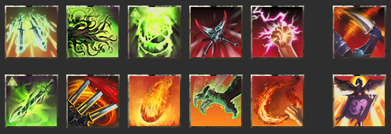
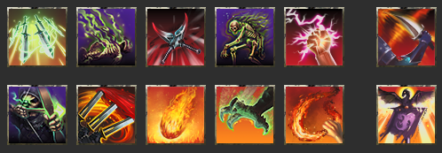
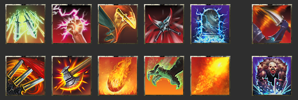

<input type="checkbox" id="menu-toggle" class="menu-toggle">
<label for="menu-toggle" class="hamburger-menu">
  
  
  
</label>

  

    <h3>Contents</h3>
    <!-- TOC will be inserted here by JavaScript -->
  

* TOC
{:toc}

_This is a work in progess; last updated 2026-02-01._

These capture the mid-tier meta for Update 48 (U48), aimed at groups who regularly do vet and vet HM content; venturing in trifecta progs. **Wait, you've got it all wrong!** Yeah, maybe I do, that's totally fair. And in any case, there's lots of good approaches and strategies, and not a one-size-fits-all approach that will always apply. Thanks for all the feedback I've received to date!

For all the guides, see the full [Paradoxdruid's Guides](./) site

---

# ESO Update 48 Mid-tier Build Guides

## Update 48 DPS Loadouts

**See also [Why Do I Use These Skills?](#why-do-i-use-these-skills) for details on why different skills are selected.**

**DPS Builds**

- [Meta Beam Arcanist - Assassination variant](#meta-beam-arcanist-assassination-variant)
- [Meta Beam Arcanist - Aedric Spear variant](#meta-beam-arcanist-aedric-spear-variant)
- [Meta Beam Arcanist - Dawn's Wrath variant](#meta-beam-arcanist-dawns-wrath-variant)
- [Runeblades - Ardent Flames variant](#runeblades-ardent-flame-variant)
- [Blastbones](#blastbones)
- [Support Zen/Colo DPS](#support-zencolo-dps)

### Meta Beam Arcanist (Assassination variant)

| Class Lines                                                                                    | Skill Bars                                                                                                                                                                                                                                                                                                                                                                     | Typical Sets                                                                                                                                                                  | Notes                                                                                         |
| ---------------------------------------------------------------------------------------------- | ------------------------------------------------------------------------------------------------------------------------------------------------------------------------------------------------------------------------------------------------------------------------------------------------------------------------------------------------------------------------------ | ----------------------------------------------------------------------------------------------------------------------------------------------------------------------------- | --------------------------------------------------------------------------------------------- |
| Herald of the Tome (Arcanist),  Assassination (Nightblade),  Ardent Flame (Dragonknight) | _FB_: Quick Cloak, Venomous Claw, Cephaliarch's Flail, Pragmatic Fatecarver, Camo Hunter, Ult: Incapacitating Strike  _BB_: Inspired Scholarship, Blockade of Fire, Flames of Oblivion, Fulminating Rune, Molten Whip, Ult: Standard of Might  [Beam skill bars](https://sheumais.github.io/esoskillbarbuilder/?skills=299,113,18,17,370,36,20,274,119,22,111,109) | • AOE: Ansuul's Torment/Deadly Strikes/Velothi/1 light Slimecraw/Maelstrom Inferno   • Single-Target: Null Arca/Tideborn/Velothi/1 light Slimecraw/Maelstrom Greatsword | • Replace Camo Hunter and Molten whip if running **Banner** (Shock/Cavaliar's Charge/Courage) |

### Meta Beam Arcanist (Aedric Spear variant)

| Class Lines                                                                                | Skill Bars                                                                                                                                                                                                                                                                                                                                                              | Typical Sets                                                                                                                                                                  | Notes                                                                                         |
| ------------------------------------------------------------------------------------------ | ----------------------------------------------------------------------------------------------------------------------------------------------------------------------------------------------------------------------------------------------------------------------------------------------------------------------------------------------------------------------- | ----------------------------------------------------------------------------------------------------------------------------------------------------------------------------- | --------------------------------------------------------------------------------------------- |
| Herald of the Tome (Arcanist),  Aedric Spear (Templar),  Ardent Flame (Dragonknight) | _FB_: Quick Cloak, Venomous Claw, Cephaliarch's Flail, Pragmatic Fatecarver, Camo Hunter, Ult: Crescent Sweep  _BB_: Inspired Scholarship, Blockade of Fire, Flames of Oblivion, Fulminating Rune, Molten Whip, Ult: Standard of Might  [Beam skill bars](https://sheumais.github.io/esoskillbarbuilder/?skills=299,113,18,17,370,72,20,274,119,22,111,109) | • AOE: Ansuul's Torment/Deadly Strikes/Velothi/1 light Slimecraw/Maelstrom Inferno   • Single-Target: Null Arca/Tideborn/Velothi/1 light Slimecraw/Maelstrom Greatsword | • Replace Camo Hunter and Molten whip if running **Banner** (Shock/Cavaliar's Charge/Courage) |

**See [Parse Examples](./parses.html) for the Beam Arcanist**

### Meta Beam Arcanist (Dawn's Wrath variant)

| Class Lines                                                                               | Skill Bars                                                                                                                                                                                                                                                                                                                                                   | Typical Sets                                                                                                                                                                  | Notes                                                       |
| ----------------------------------------------------------------------------------------- | ------------------------------------------------------------------------------------------------------------------------------------------------------------------------------------------------------------------------------------------------------------------------------------------------------------------------------------------------------------ | ----------------------------------------------------------------------------------------------------------------------------------------------------------------------------- | ----------------------------------------------------------- |
| Herald of the Tome (Arcanist),  Assassination (Nightblade),  Dawn's Wrath (Templar) | _FB_: Quick Cloak, Radiant Glory, Cephaliarch's Flail, Pragmatic Fatecarver, Banner Bearer, Ult: Incapacitating Strike  _BB_: Inspired Scholarship, Stampede, Solar Barrage, Fulminating Rune, Banner Bearer, Ult: Languid Eye  [Beam skill bars](https://sheumais.github.io/esoskillbarbuilder/?skills=299,94,18,17,429,36,20,334,89,47,429,12) | • AOE: Ansuul's Torment/Deadly Strikes/Velothi/1 light Slimecraw/Maelstrom Inferno   • Single-Target: Null Arca/Tideborn/Velothi/1 light Slimecraw/Maelstrom Greatsword | • **Banner Bearer**: Shocking / Cavaliar's Charge / Courage |

### Runeblades (Ardent Flame variant)

| Class Lines                                                                                    | Skill Bars                                                                                                                                                                                                                                                                                                                                                                   | Typical Sets                                                           | Notes                                |
| ---------------------------------------------------------------------------------------------- | ---------------------------------------------------------------------------------------------------------------------------------------------------------------------------------------------------------------------------------------------------------------------------------------------------------------------------------------------------------------------------- | ---------------------------------------------------------------------- | ------------------------------------ |
| Herald of the Tome (Arcanist),  Assassination (Nightblade),  Ardent Flame (Dragonknight) | _FB_: Quick Cloak, Tentacular Dread, Escalating Runeblades, Relentless Focus, Killer's Blade, Ult: Incapacitating Strike  _BB_: Inspired Scholarship, Stampede, Flames of Oblivion, Venomous Claw, Molten Whip, Ult: Standard of Might  [Runeblades skill bars](https://sheumais.github.io/esoskillbarbuilder/?skills=299,19,14,43,47,36,20,334,119,113,111,109) | Null Arca/Tideborn/Velthi/1 piece light Slimecraw/Maelstrom Greatsword | Can also use the new Warmask mythic. |

### Blastbones

| Class Lines                                                                              | Skill Bars                                                                                                                                                                                                                                                                                                                                                                | Typical Sets                                                           | Notes                                |
| ---------------------------------------------------------------------------------------- | ------------------------------------------------------------------------------------------------------------------------------------------------------------------------------------------------------------------------------------------------------------------------------------------------------------------------------------------------------------------------- | ---------------------------------------------------------------------- | ------------------------------------ |
| Ardent Flame (Dragonknight),  Assassination (Nightblade),  Gravelord (Necromancer) | _FB_: Quick Cloak, Detonating Siphon, Killer's Blade, Relentless Focus, Blighted Blastbones, Ult: Incapacitating Strike  _BB_: Skeletal Archer, Stampede, Flames of Oblivion, Venomous Claw, Molten Whip, Ult: Standard of Might  [Blastbones skill bars](https://sheumais.github.io/esoskillbarbuilder/?skills=299,238,43,232,47,36,237,334,119,113,111,109) | Null Arca/Tideborn/Velthi/1 piece light Slimecraw/Maelstrom Greatsword | Can also use the new Warmask mythic. |

### Support Zen/Colo DPS

| Class Lines                                                                              | Skill Bars                                                                                                                                                                                                                                                                                                                                       | Typical Sets                  | Notes                                                                                                                                                                                                 |
| ---------------------------------------------------------------------------------------- | ------------------------------------------------------------------------------------------------------------------------------------------------------------------------------------------------------------------------------------------------------------------------------------------------------------------------------------------------ | ----------------------------- | ----------------------------------------------------------------------------------------------------------------------------------------------------------------------------------------------------- |
| Ardent Flame (Dragonknight),  Gravelord (Necromancer),  Assassination (Nightblade) | _FB:_ Quick Cloak, Relentless Focus, Traveling Knife, Killer's Blade, Unnerving Boneyard, Incapacitating Strikes  _BB:_ Stampede, Carve, Flames of Oblivion, Venomous Claw, Engulfing Flames, Glacial Colossus  [Zen skill bars](https://sheumais.github.io/esoskillbarbuilder/?skills=299,47,302,43,235,36,334,336,119,113,114,228) | • Zen/Null Arca • Zen/Kosh | • Provides Major Vuln • Can wear Encratis monster set • Zen DoTs: Knife, Venom Claw, Engulfing, Carve, Burning, Poison  • **Traveling Knife**: Multitarget / Lingering Torment / Off Balance |

---

# Why Do I Use These Skills?

- [Beam DPS Skill explanations](#beam-skills)

## Beam Skills

**Disclaimer**: As always, the "right" abilities will depend on group composition (what skills and gear the other players are running), what content you are doing (mechanics, boss specific needs, are you going to need to chain things), and other factors. This is just a starting point!

### Front Bar

| Icon                                                                                                              | Name                                                     | Explanation                                                                                                                                                                                                                                                                                                                                                                                                                                                                                               |
| ----------------------------------------------------------------------------------------------------------------- | -------------------------------------------------------- | --------------------------------------------------------------------------------------------------------------------------------------------------------------------------------------------------------------------------------------------------------------------------------------------------------------------------------------------------------------------------------------------------------------------------------------------------------------------------------------------------------- |
|                                                               | **Quick Cloak**                                          | This important close-range DoT provides the important Major Evasion buff (-20% damage from AoEs), and procs both of the enchantments on your frontbar daggers.                                                                                                                                                                                                                                                                                                                                            |
|                                                                | **Cephaliarch's Flail**                                  | Your essential skill for building Crux. You should almost always follow the pattern (with Inspired Scholarship running) of "Flail, Flail, Beam". It also heals you if it hits an enemy, and gives a +5% damage taken to enemies hit.                                                                                                                                                                                                                                                                      |
|                                                           | **Pragmatic Fatecarver**                                 | Your core skill and typical over 50% of your total damage. **ABB: Always Be Beaming.** It gives you a strong damage shield as well. To survive extended AoE damage (vAS, vSS Lokke, etc), you can cast beam, tap Bash to cancel the beam, and immediately recast Beam to refresh the shield repeatedly.                                                                                                                                                                                                   |
|   | **Camouflaged Hunter** or **Banner Bearer**           | Slotted purely for the passives and never cast. You get Minor Berserk for +5% damage attacking enemies from behind, and +3% Weapon Damage for having it slotted. Can be replaced by **Banner Bearer** (typically Shock/Cavalier's Charge/Heroism). In fights like vSS, where you can never get behind the boss, it's less useful.                                                                                                                                                                         |
|                                                                                                                   | Flex spot:                                               |                                                                                                                                                                                                                                                                                                                                                                                                                                                                                                           |
|                                                                                                                   |  | **Engulfing Flames**: A decent DoT that makes enemies take +6% fire damage from all sources, and can refresh your Molten Whip stacks.                                                                                                                                                                                                                                                                                                                                                                     |
|                                                                                                                   |   | **Venomous Claw**: A very strong DoT that refreshes whip stacks. Because it's damage ramps up, you generally don't want to recast it early.                                                                                                                                                                                                                                                                                                                                                               |
|                                                                                                                   |   | **Barbed Trap**: A very strong DoT and source of hemorrhage status damage which provides +3% Weapon Damage from passives.                                                                                                                                                                                                                                                                                                                                                                                 |
|                                                                                                                   |  | **Resolving Vigor**: A self heal and source of Minor Resolve, useful for portals or other mechanics where you'll be far from healer.                                                                                                                                                                                                                                                                                                                                                                      |
|                                                              | Ultimate: **Incapacitating Strike** or **Soul Harvest**  | This serves two purposes. Passively slotted, it gives you +10% Crit Damage, and provides Minor Savagery (+6% Crit Chance). Second, it's a good "need damage now" skill or if you know you won't save enough ultimate to use Standard of Might before the fight ends. The morph choice depends on the content. When doing content with many enemies, such as dungeons and certain trials, soul harvest is the preferred morph due to its unique passive of giving 10 ultimate upon dealing a killing blow. |

### Back Bar

| Icon                                                                                                             | Name                                                           | Explanation                                                                                                                                                                                                                                                                                                                                                                                                                               |
| ---------------------------------------------------------------------------------------------------------------- | -------------------------------------------------------------- | ----------------------------------------------------------------------------------------------------------------------------------------------------------------------------------------------------------------------------------------------------------------------------------------------------------------------------------------------------------------------------------------------------------------------------------------- |
|                                                         | **Inspired Scholarship**                                       | A critical buff that passively provides Major Brutality (+20% damage done), generates a free Crux every time you spend Crux, and gives extra direct damage hits.                                                                                                                                                                                                                                                                          |
|                                                                                                                  | Weapon Skill:                                                  | This is the most important backbar skill to keep up because it procs your infused backbar weapon damage enchantment (regardless of sets/arena weapons).                                                                                                                                                                                                                                                                                   |
|                                                                                                                  |           | **Stampede**: If using Maelstrom Greatsword, this skill gives a guaranteed Crit hit, a decent DoT, but more importantly gives up to +12% direct damage done from Maelstrom set. Note that the small ground-based DoT is what needs to deal damage to proc your enchantment.                                                                                                                                                               |
|                                                                                                                  |  | **Blockade of Fire**: If using Maelstrom Inferno Staff, this skill gives a very, very high damage DoT (often in the top 3 or 4 sources of total dps).                                                                                                                                                                                                                                                                                     |
|                                                             | **Flames of Oblivion**                                         | Passive Major Savagery for slotting, a very important buff, as well as a strong DoT when active. Also refreshes whip stacks.                                                                                                                                                                                                                                                                                                              |
|                                                                                                                  | DoT Spot:                                                      |                                                                                                                                                                                                                                                                                                                                                                                                                                           |
|                                                                                                                  |         | **Venomous Claw**: A very strong DoT that refreshes whip stacks. Because it's damage ramps up, you generally don't want to recast it early. Definitely what to put here if it isn't on your front bar.                                                                                                                                                                                                                                    |
|                                                                                                                  |       | **Fulminating Rune**: A good DoT that also provides a good synergy to your team. This skill is a group dps net gain over other options if group members take the synergy. Its cost is tied to the lower of your maximum resources, which can help balance out sustain issues especially if using a Greatsword backbar.                                                                                                                    |
|                                                                                                                  |               | **Anti-Cavalry Caltrops**: A good damage, large AoE DoT. Useful in large add packs.                                                                                                                                                                                                                                                                                                                                                       |
|   | **Molten Whip** or **Banner Bearer**                        | Slotted purely passively, it provides +300 Weapon Damage if stacks are kept up. Can be replaced by **Banner Bearer** (typically Shock/Cavalier's Charge/Courage). Could also be replaced by a DoT especially if whip stacks can't be kept at 3x (which is common).                                                                                                                                                                        |
|                                                        | Ultimate: **Standard of Might**                                | A very strong DoT effect that also gives you +15% damage done and -15% damage taken, as well as provides allies with a synergy. It's only downsides are that it's expensive to cast and immobile, so make sure not to cast it right before a boss moves or goes into an invuln stage. Particularly potent when combined with Pillager's or Crypt due to the stacking damage done effects of both Standard and your Incapacitating Strike. |

---

# Buff Calculations

- **Typical Meta Penetration (Arc/NB/Aedric):**
  - Major Breach (Ele Sus) 5,948
  - Minor Breach (Cruxweaver on MT or good Wall/Ele Sus uptimes) 2,974
  - Crusher 2,108
  - Piercing Blue CP 700
  - (note than common Null Arca and Deadliy Strikes sets have no Pen lines)
  - Velothi: 1,650
  - Arcanist passives, 2 abilities slotted (Flail and Beam): 2,480
  - 1 Light Armor 939
  - Either:
    - Set with Penetration line (Ansuuls or Tideborn) 1,487
    - 1-piece Monster set with penetration (Valkyn Skoria) 1,487
    - Tank running Runic Sunder as Taunt 2,200
  - **TOTAL**: 18,307 (pen line set) or 19,010 (runic sunder taunt)
  - Over the penetration cap with no need for Kosh or Crimson

- **Typical Meta Crit Damage (Arc/NB):**
  - Base 50%
  - Minor Brittle 10%
  - Velothi / Minor Force 10%
  - 6 Medium armor 12%
  - Nightblade passive 10%
  - Arcanist passive 12%
  - Lucent Echoes 11%
  - Either:
    - Major Force (Saxhleel Champion, Aggressive Horn, or both) 20%
    - Elemental Catalyst 15%
  - **TOTAL**: 135% or 130%
  - Over the crit damage cap

---

# Other Useful Guide Pages

| Other Page                                  | Why Do I Want To Read This?                                                                                |
| ------------------------------------------- | ---------------------------------------------------------------------------------------------------------- |
| • [Full Guides Site](./)                    | I want to return to the full guides site with supports, rosters, and metrics                               |
| • [Quickstart DPS Guide](./quickstart.html) | I want a quick checklist of everything I need to get my trial-ready **DPS** up and running                 |
| • [U48 Parses](./parses.html)               | I want to see how some of these builds perform on the target dummy, dummy optimized and in-content setups. |
| • [Top DPS Skills and Gear](./usage.html)   | I want to see the the most used skills and gear for DPS players on each boss, pulled from esologs.com data |


