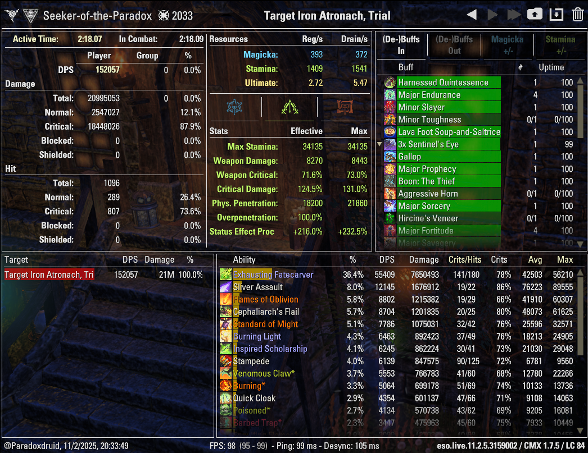
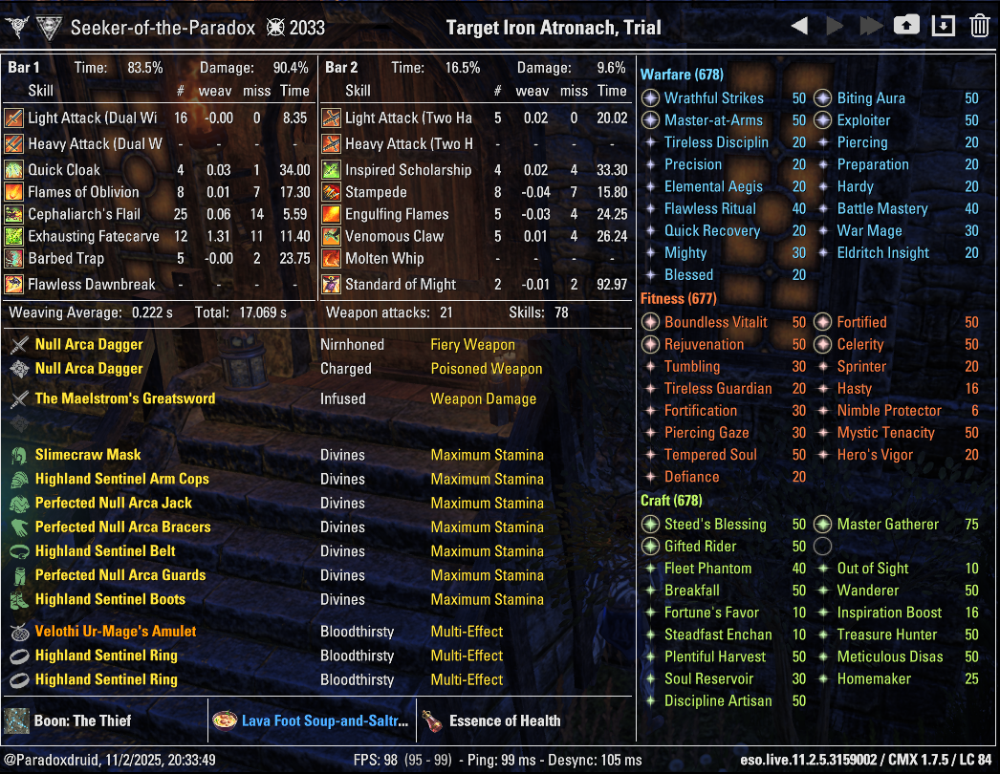

# Paradoxdruid's ESO Guides: Parses

_This is a work in progess; last updated 2025-11-14._

Return to [Paradoxdruid's ESO Guides: Builds and Rosters](./)

# Table of Contents

- [Beam (Aedric Variant) Trial Dummy Optimized Parse](#aedric-beam-trial-dummy-optimized-parse)

---

# Meta Beam Arcanist (Aedric Spear variant)

## Aedric Beam Trial Dummy Optimized Parse

| Damage                                                                                                     | Info                                                                                                 |
| ---------------------------------------------------------------------------------------------------------- | ---------------------------------------------------------------------------------------------------- |
|  |  |
