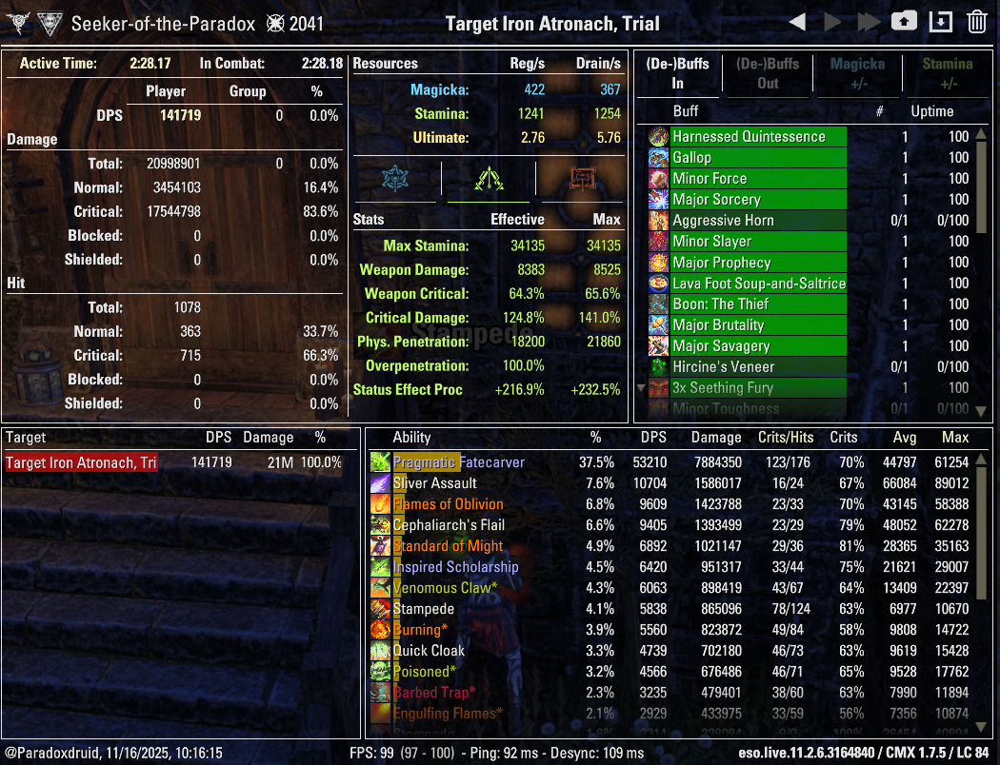
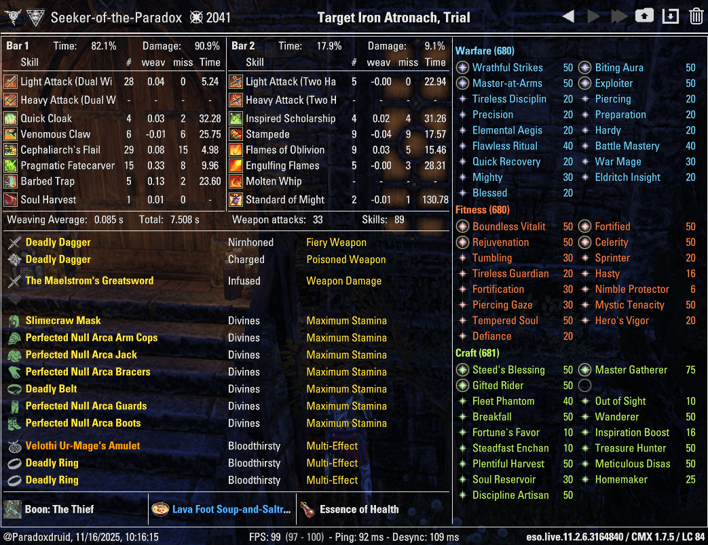
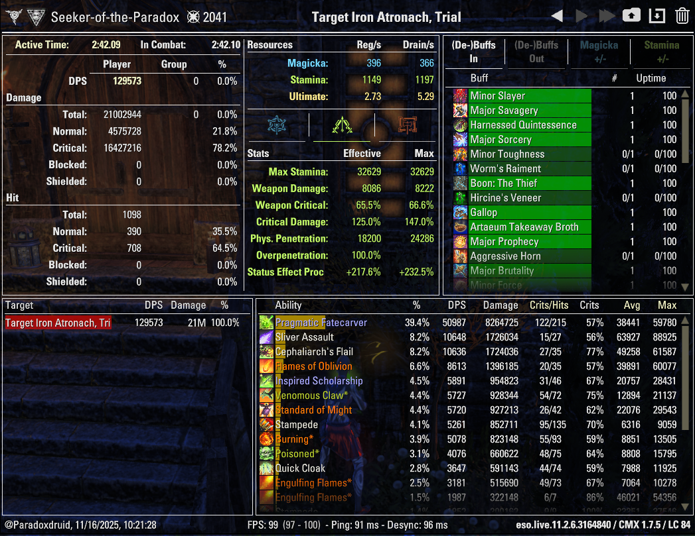
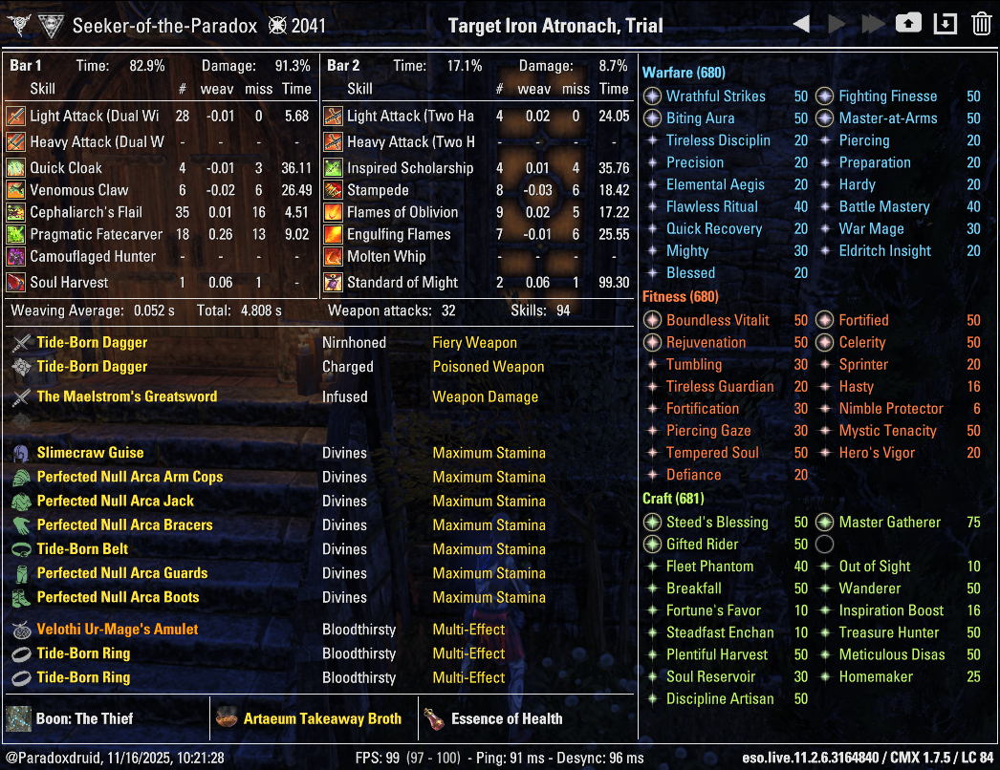
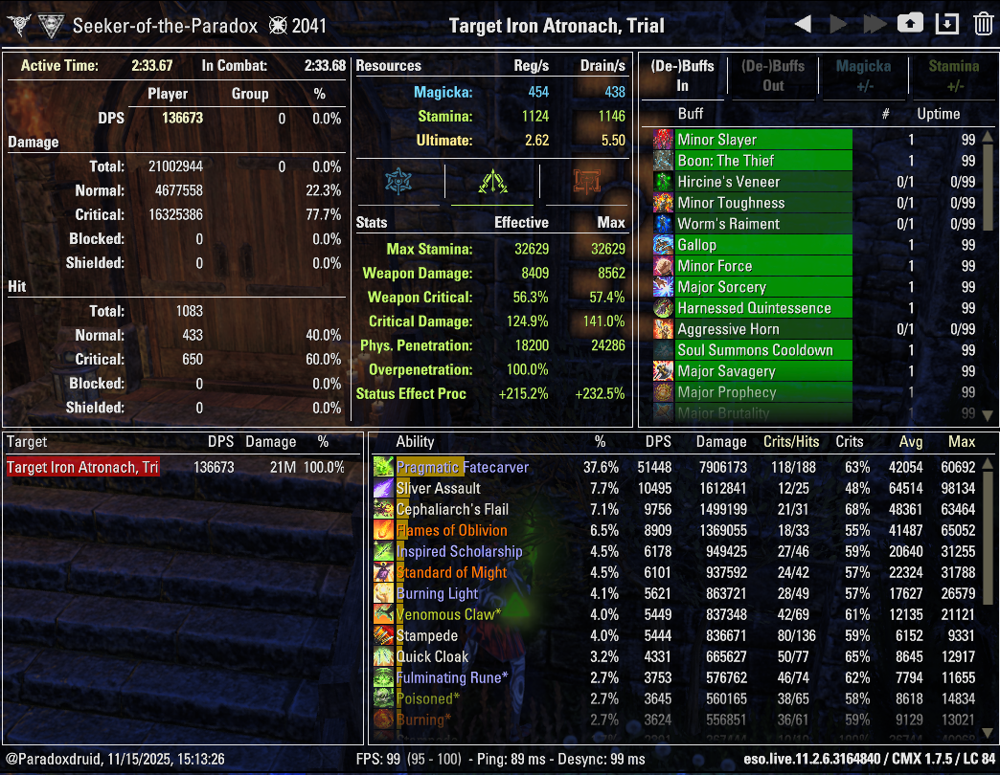
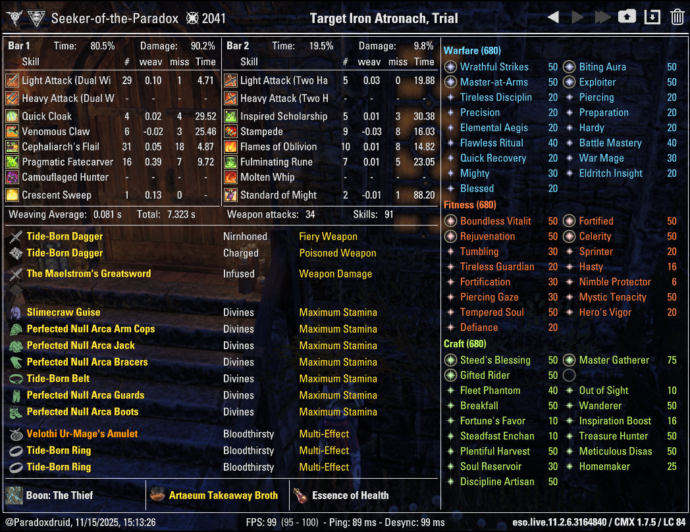

# Paradoxdruid's ESO Guides: Parses

_This is a work in progess; last updated 2025-11-14._

Return to [Paradoxdruid's ESO Guides: Builds and Rosters](./)

# Table of Contents

- [Beam (Assassination Variant) Trial Dummy Optimized Parse](#assassination-beam-trial-dummy-optimized-parse)
- [Beam (Assassination Variant) In Content Gear Optimized Parse](#assassination-beam-in-content-gear-parse)
- [Beam (Aedric Variant) Trial Dummy Optimized Parse](#aedric-beam-trial-dummy-optimized-parse)
- [Beam (Aedric Variant) In Content Gear Parse](#aedric-beam-in-content-gear-parse)

---

# Meta Beam Arcanist (Assassination variant)

## Assassination Beam Trial Dummy Optimized Parse

| Damage                                                                                                                          | Info                                                                                                                      |
| ------------------------------------------------------------------------------------------------------------------------------- | ------------------------------------------------------------------------------------------------------------------------- |
| {:height="auto !important" width="auto !important"} | {:height="auto !important" width="auto !important"} |

## Assassination Beam In Content Gear Parse

| Damage                                                                                                                                | Info                                                                                                                            |
| ------------------------------------------------------------------------------------------------------------------------------------- | ------------------------------------------------------------------------------------------------------------------------------- |
| {:height="auto !important" width="auto !important"} | {:height="auto !important" width="auto !important"} |

# Meta Beam Arcanist (Aedric Spear variant)

## Aedric Beam Trial Dummy Optimized Parse

| Damage                                                                                                     | Info                                                                                                 |
| ---------------------------------------------------------------------------------------------------------- | ---------------------------------------------------------------------------------------------------- |
| {:height="auto !important" width="auto !important"} | {:height="auto !important" width="auto !important"} |

## Aedric Beam In Content Gear Parse

| Damage                                                                                                           | Info                                                                                                     |
| ---------------------------------------------------------------------------------------------------------------- | -------------------------------------------------------------------------------------------------------- |
| {:height="auto !important" width="auto !important"} | {:height="auto !important" width="auto !important"} |
