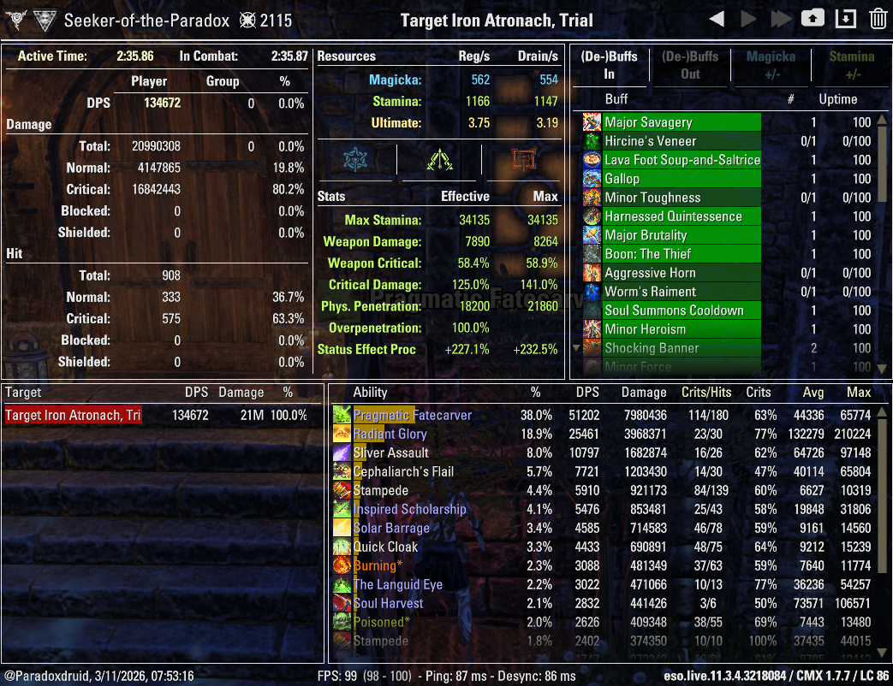
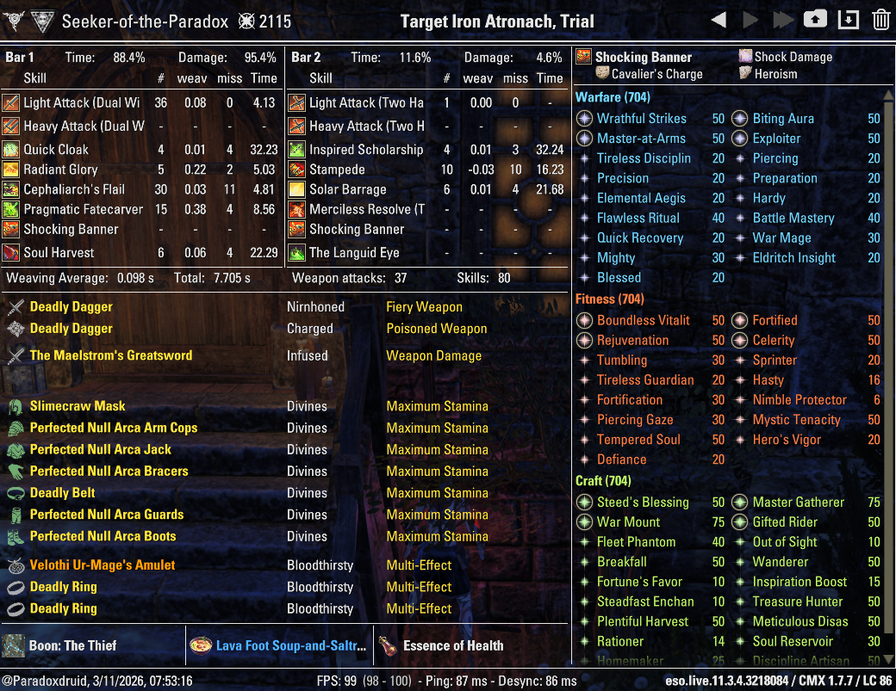
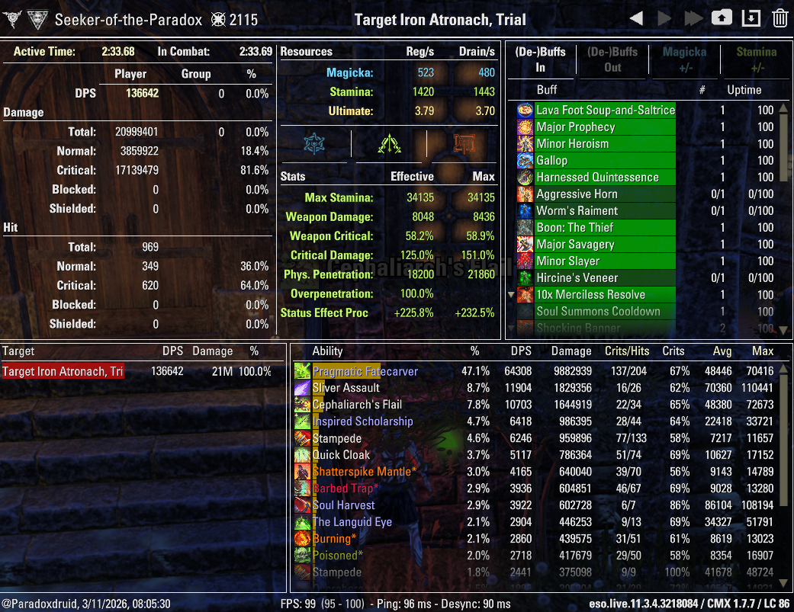
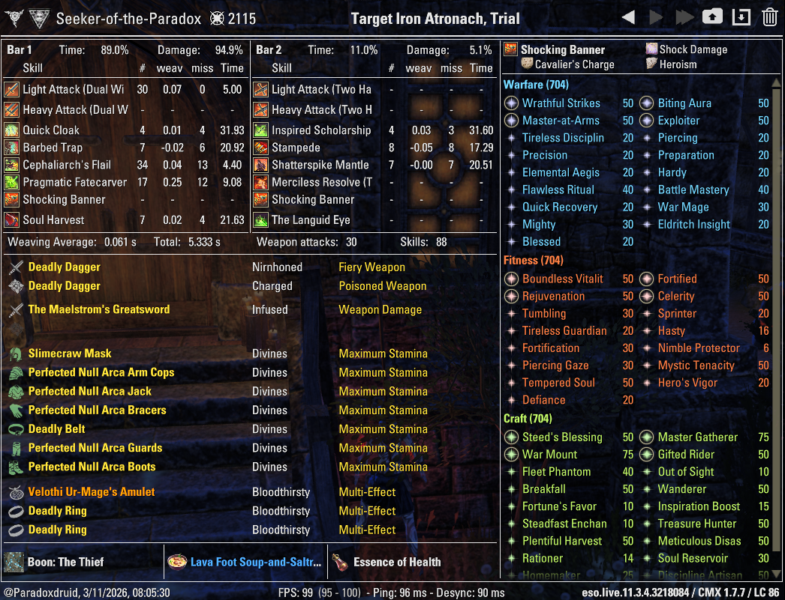
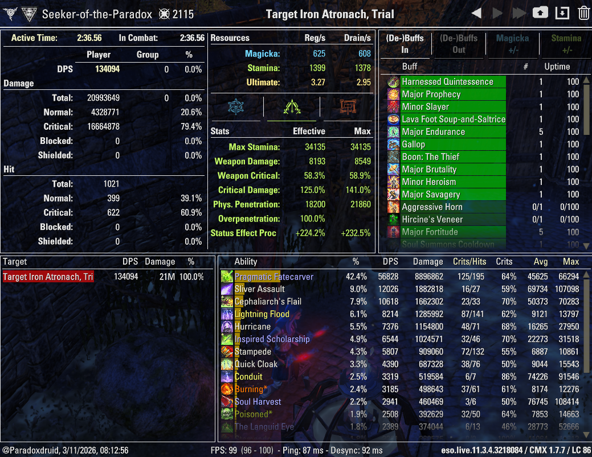
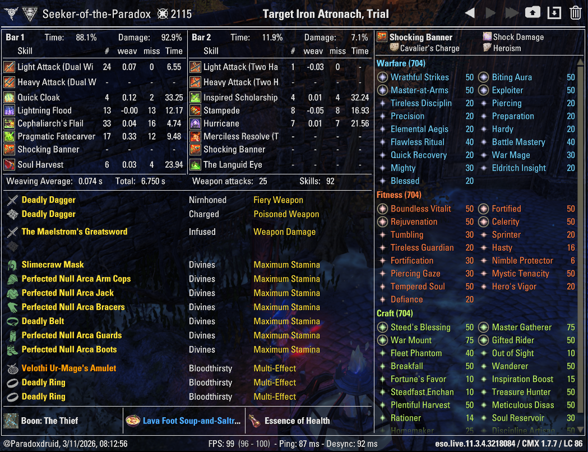
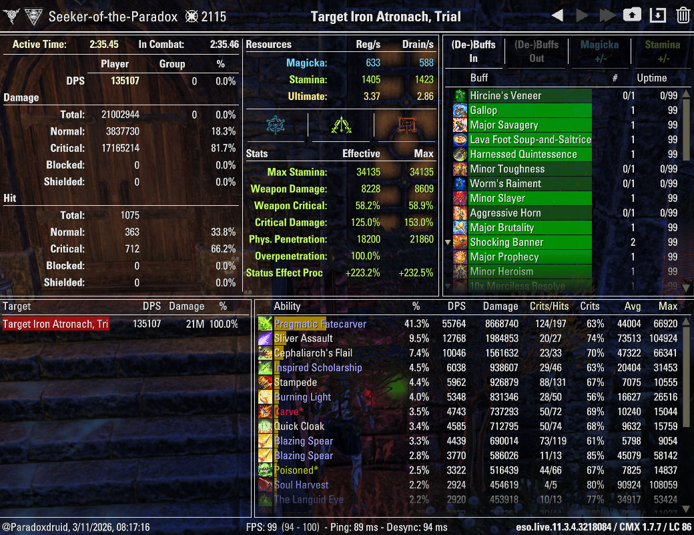
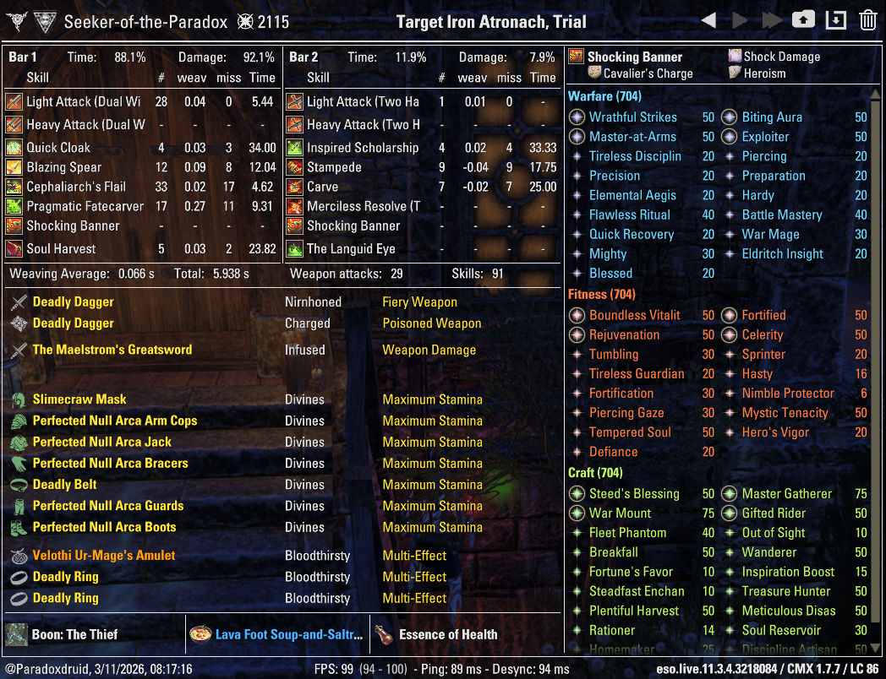
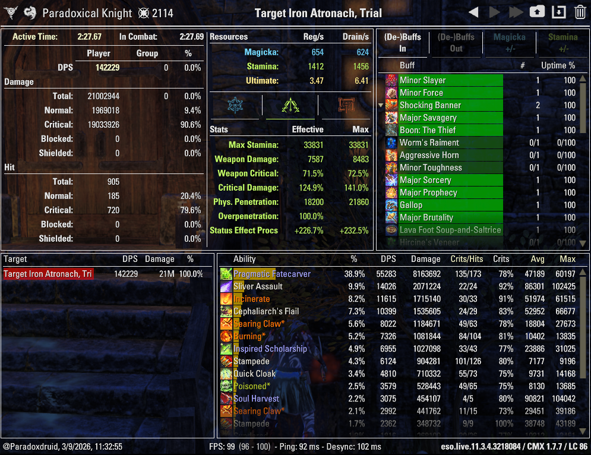
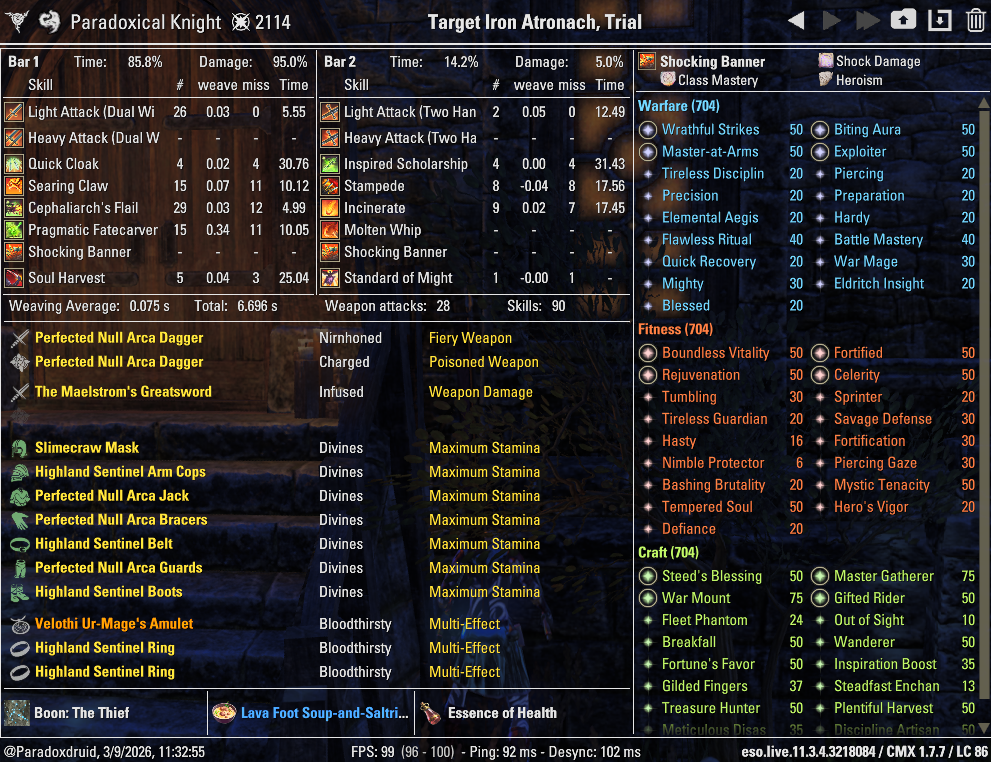

<input type="checkbox" id="menu-toggle" class="menu-toggle">
<label for="menu-toggle" class="hamburger-menu">
  
  
  
</label>

  

    <h3>Contents</h3>
    <!-- TOC will be inserted here by JavaScript -->
  

* TOC
{:toc}

# Parses

_This is a work in progess; last updated 2026-03-11._

Return to [Paradoxdruid's ESO Guides: Builds and Rosters](./)

---

# Meta Beam Arcanist (Dawn's Wrath variant)

## Dawn's Wrath Beam In-Content Gear Parse

| Damage                                                                                                               | Info                                                                                                           |
| -------------------------------------------------------------------------------------------------------------------- | -------------------------------------------------------------------------------------------------------------- |
|  |  |
{: class="parse-table"}

# Meta Beam Arcanist (Earthen Heart variant)

## Earthen Heart Beam In-Content Gear Parse

| Damage                                                                                                                        | Info                                                                                                                    |
| ----------------------------------------------------------------------------------------------------------------------------- | ----------------------------------------------------------------------------------------------------------------------- |
|  |  |
{: class="parse-table"}

# Meta Beam Arcanist (Stormcalling variant)

## Stormcalling Beam In-Content Gear Parse

| Damage                                                                                                                  | Info                                                                                                              |
| ----------------------------------------------------------------------------------------------------------------------- | ----------------------------------------------------------------------------------------------------------------- |
|  |  |
{: class="parse-table"}

# Meta Beam Arcanist (Aedric Spear variant)

## Aedric Spear Beam In-Content Gear Parse

| Damage                                                                                                                     | Info                                                                                                                 |
| -------------------------------------------------------------------------------------------------------------------------- | -------------------------------------------------------------------------------------------------------------------- |
|  |  |
{: class="parse-table"}

# Meta Beam Arcanist (Dawn's Wrath variant)

## Dawn's Wrath Beam In-Content Gear Parse

| Damage                                                                                                               | Info                                                                                                           |
| -------------------------------------------------------------------------------------------------------------------- | -------------------------------------------------------------------------------------------------------------- |
|  |  |
{: class="parse-table"}

# Dragonknight Base Class Beam Arcanist (Ardent Flames variant)

## DK Ardent Flames Beam Trial Dummy Gear Parse

| Damage                                                                                                                        | Info                                                                                                                    |
| ----------------------------------------------------------------------------------------------------------------------------- | ----------------------------------------------------------------------------------------------------------------------- |
|  |  |
{: class="parse-table"}


