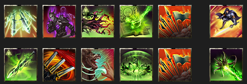
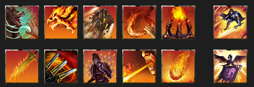
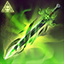

<input type="checkbox" id="menu-toggle" class="menu-toggle">
<label for="menu-toggle" class="hamburger-menu">
  
  
  
</label>

  

    <h3>Contents</h3>
    <!-- TOC will be inserted here by JavaScript -->
  

* TOC
{:toc}

# ESO Update 50 Pure Class Build Guides

_This is a work in progess; last updated 2026-04-26._

These capture the mid-tier pure class meta for Update 50 (U50), aimed at groups who regularly do vet and vet HM content; venturing in trifecta progs. **Wait, you've got it all wrong!** Yeah, maybe I do, that's totally fair. And in any case, there's lots of good approaches and strategies, and not a one-size-fits-all approach that will always apply. Thanks for all the feedback I've received to date!

For all the guides, see the full [Paradoxdruid's Guides](./) site

---

## Update 49 DPS Loadouts

See also [Why Do I Use These Skills?](#why-do-i-use-these-skills) for details on why different skills are selected.

**DPS Builds**

**Arcanist Builds**

- [Beam Arcanist](#beam-arcanist)

- [Beam Arcanist Gear Guide](#beam-arcanist-gear-guides)

**Dragonknight**

- [Spammable Dragonknight]
- [Firebreath Dragonknight]

**Nightblade Builds**

- [Nightblade]

**Necromancer**

- [Corpseburster Necromancer]

**Sorcerer Builds**

- [Non-Pet Sorcerer]
- [Pet Sorcerer]

**Templar Builds**

- [Templar]

**Warden Builds**

- [Warden]

See [Guiding Principles](#guiding-principles) and [Buff Calculations](#buff-calculations) for explanations of set selections.

## Arcanist Builds

### Beam Arcanist

  

    <h5>Class Masteries</h5>
    

      <ul>
        <li><strong>Unbound Potential</strong>: Fated Fortune grants +30% damage done</li>
        <li><strong>Abyssal Emergence</strong>: Using Arcanist ultimate grants 3 Crux and 666 Weapon Damage for 15 seconds</li>
        <li><strong>OR</strong> <strong>Fate Realigned</strong>: Implacable Outcome generates 3 Crux once every 15 seconds, and grants 300 Weapon Damage for 25 seconds</li>
      </ul>
    

  

  

    <h5>Skill Bars</h5>
    

      
<em>FB</em>: Quick Cloak, Camo Hunter, Cephaliarch's Flail, Pragmatic Fatecarver, Banner-Bearer, Ult: Flawless Dawnbringere

      
<em>BB</em>: Inspired Scholarship, Stampede, Barbed Trap, Fulminating Rune, Banner-Bearer, Ult: Languid Eye

      
<a href="https://sheumais.github.io/esoskillbarbuilder/?skills=303,376,18,17,435,371,20,338,378,22,435,12">Skill Bar Link</a>

    

  

  

    <h5>Typical Sets</h5>
    

      <ul>
        <li>See <a href="#beam-arcanist-gear-guides">Beam Gear Guides</a></li>
        <li>AOE: Ansuul's Torment/Deadly Strikes/Velothi/1 light Slimecraw/Maelstrom Inferno</li>
        <li>Single-Target: Null Arca/Spattering Disjunction/Velothi/1 light Slimecraw/Maelstrom Greatsword</li>
      </ul>
    

  

  

    <h5>Notes</h5>
    

      <ul>
        <li><strong>Banner-Bearer:</strong> Shock / (Cavaliar's Charge or Class Flourish) / (Courage or Heroism)</li>
      </ul>
    

  

### Beam Arcanist Gear Guides

**AoE Fight Gear Sets**

| Gear Set                                    | Location(s)                          | Traits / Enchants                                                                                                             | Notes                                                           |
| ------------------------------------------- | ------------------------------------ | ----------------------------------------------------------------------------------------------------------------------------- | --------------------------------------------------------------- |
| Ansuul's Torment                            | Body                                 | Divines / Stamina                                                                                                             | Can use craftable Order's Wrath or Highland Sentinel, or Aegis Caller |
| Deadly Strikes                              | Belt / 2 Rings / 2 front-bar Daggers | Belt: Divines / Stamina, Rings: Bloodthristy / Increase Physical Harm, Daggers: Nirnhoned / Flame & Charged / Poison | Purchasable at guild traders                                    |
| Velothi Ur-Mage's Amulet                    | Necklace                             | Bloodthirsty / Increase Physical Harm                                                                                         |                                                                 |
| Slimecraw (or other crit line monster helm) | Head                                 | Divines / Stamina                                                                                                             | Light armor weight                                              |
| The Maelstrom's Inferno Staff               | backbar                              | Infused / Increase Weapon Damage                                                                                              |                                                                 |

**Single Target Fight Gear Sets**

| Gear Set                                    | Location(s)                          | Traits / Enchants                                                                                                             | Notes                                                                              |
| ------------------------------------------- | ------------------------------------ | ----------------------------------------------------------------------------------------------------------------------------- | ---------------------------------------------------------------------------------- |
| Slivers of the Null Arca                    | Body                                 | Divines / Stamina                                                                                                             | Can use craftable Order's Wrath if unavailable, or Aegis Caller, or Pillar of Nirn |
| Tide-Born Wild Stalker **or** Spattering Disjunction                     | Belt / 2 Rings / 2 front-bar Daggers | Belt: Divines / Stamina, Rings: Bloodthristy / Increase Physical Harm, Daggers: Nirnhoned / Flame & Charged / Poison | Craftable / Infinite Archive                                                                         |
| Velothi Ur-Mage's Amulet                    | Necklace                             | Bloodthirsty / Increase Physical Harm                                                                                         |                                                                                    |
| Slimecraw (or other crit line monster helm) | Head                                 | Divines / Stamina                                                                                                             | Light armor weight                                                                 |
| The Maelstrom's Greatsword                  | backbar                              | Infused / Increase Weapon Damage                                                                                              |                                                                                    |

## Dragonknight Builds

### Spammable Dragonknight

  

    <h5>Class Masteries</h5>
    

      <ul>
        <li><strong>Unbound Potential</strong>: Fated Fortune grants +30% damage done</li>
        <li><strong>Abyssal Emergence</strong>: Using Arcanist ultimate grants 3 Crux and 666 Weapon Damage for 15 seconds</li>
        <li><strong>OR</strong> <strong>Fate Realigned</strong>: Implacable Outcome generates 3 Crux once every 15 seconds, and grants 300 Weapon Damage for 25 seconds</li>
      </ul>
    

  

  

    <h5>Skill Bars</h5>
    

      
<em>FB</em>: Barbed Trap, Searing Claw, Magma Fist, Molten Whip, Burning Talons, Ult: Flawless Dawnbringer

      
<em>BB</em>: Igneous Weapons, Stampede, Shatterspike Mantle, Disintegrating Dragon, Incinerate, Ult: Shifting Standard

      
<a href="https://sheumais.github.io/esoskillbarbuilder/?skills=378,113,135,111,124,371,136,338,143,123,119,108">Skill Bar Link</a>

    

  

  

    <h5>Typical Sets</h5>
    

      <ul>
        <li>AOE: Ansuul's Torment/Deadly Strikes/Velothi/1 light Slimecraw/Maelstrom Inferno</li>
        <li>Single-Target: Null Arca/Spattering Disjunction/Velothi/1 light Slimecraw/Maelstrom Greatsword</li>
      </ul>
    

  

  

    <h5>Notes</h5>
    

      <ul>
        <li>TBA</li>
      </ul>
    

  

---

# Why Do I Use These Skills?

- [Beam Arc Skill explanations](#beam-skills)

## Beam Arc Skills

**Disclaimer**: As always, the "right" abilities will depend on group composition (what skills and gear the other players are running), what content you are doing (mechanics, boss specific needs, are you going to need to chain things), and other factors. This is just a starting point!

### Front Bar

| Icon                                                                                                              | Name                                                          | Explanation                                                                                                                                                                                                                                                                                                                                                                                                                                                                                               |
| ----------------------------------------------------------------------------------------------------------------- | ------------------------------------------------------------- | --------------------------------------------------------------------------------------------------------------------------------------------------------------------------------------------------------------------------------------------------------------------------------------------------------------------------------------------------------------------------------------------------------------------------------------------------------------------------------------------------------- |
|                                                               | **Quick Cloak**                                               | This important close-range DoT provides the important Major Evasion buff (-20% damage from AoEs), and procs both of the enchantments on your frontbar daggers.                                                                                                                                                                                                                                                                                                                                            |
|                                                                | **Cephaliarch's Flail**                                       | Your essential skill for building Crux. You should almost always follow the pattern (with Inspired Scholarship running) of "Flail, Flail, Beam". It also heals you if it hits an enemy, and gives a +5% damage taken to enemies hit.                                                                                                                                                                                                                                                                      |
|                                                           | **Pragmatic Fatecarver**                                      | Your core skill and typical over 50% of your total damage. **ABB: Always Be Beaming.** It gives you a strong damage shield as well. To survive extended AoE damage (vAS, vSS Lokke, etc), you can cast beam, tap Bash to cancel the beam, and immediately recast Beam to refresh the shield repeatedly.                                                                                                                                                                                                   |
|  | **Camouflaged Hunter** | Slotted purely for the passives and never cast. You get Minor Berserk for +5% damage attacking enemies from behind, and +3% Weapon Damage for having it slotted.  |
|  | **Banner Bearer**  | Typically Shock / (Cavalier's Charge or Class Flourish) / (Courage or Heroism). Provides a large damage boost and/or ult generation.                                                                                                                                                                         |
|                                                              | Ultimate: **Incapacitating Strike** or **Soul Harvest**       | This serves two purposes. Passively slotted, it gives you +10% Crit Damage, and provides Minor Savagery (+6% Crit Chance). Second, it's a good "need damage now" skill or if you know you won't save enough ultimate to use Standard of Might before the fight ends. The morph choice depends on the content. When doing content with many enemies, such as dungeons and certain trials, soul harvest is the preferred morph due to its unique passive of giving 10 ultimate upon dealing a killing blow. |

### Back Bar

| Icon                                                                                                                     | Name                                                                                                                 | Explanation                                                                                                                                                                                                                                                                                      |
| ------------------------------------------------------------------------------------------------------------------------ | -------------------------------------------------------------------------------------------------------------------- | ------------------------------------------------------------------------------------------------------------------------------------------------------------------------------------------------------------------------------------------------------------------------------------------------ |
|                                                                 | **Inspired Scholarship**                                                                                             | A critical buff that passively provides Major Brutality (+20% damage done), generates a free Crux every time you spend Crux, and gives extra direct damage hits.                                                                                                                                 |
|                                                                                                                          | Weapon Skill:                                                                                                        | This is the most important backbar skill to keep up because it procs your infused backbar weapon damage enchantment (regardless of sets/arena weapons).                                                                                                                                          |
|                                                                                                                          |                                                                 | **Stampede**: If using Maelstrom Greatsword, this skill gives a guaranteed Crit hit, a decent DoT, but more importantly gives up to +12% direct damage done from Maelstrom set. Note that the small ground-based DoT is what needs to deal damage to proc your enchantment.                      |
|                                                                                                                          |                                                        | **Blockade of Fire**: If using Maelstrom Inferno Staff, this skill gives a very, very high damage DoT (often in the top 3 or 4 sources of total dps).                                                                                                                                            |
|                                                                 | **Fulminating Rune**                                                                                                 | A good DoT that also provides a good synergy to your team. This skill is a group dps net gain over other options if group members take the synergy. Its cost is tied to the lower of your maximum resources, which can help balance out sustain issues especially if using a Greatsword backbar. |
|  | **Barbed Trap**  | A very strong DoT and source of hemorrhage status damage.    |
|  | **Banner Bearer**  | Typically Shock / (Cavalier's Charge or Class Flourish) / (Courage or Heroism). Provides a large damage boost and/or ult generation.                                                                                                                                                                         |
|     |  Ultimate: **The Languid Eye**                                                           | A very strong AoE DoT effect.  |

---

# Buff Calculations

- **Typical Meta Penetration (Arc/NB/Aedric):**
  - Major Breach (Ele Sus) 5,949
  - Minor Breach (Cruxweaver on MT or good Wall/Ele Sus uptimes) 2,974
  - Crusher 2,108
  - Piercing Blue CP 700
  - (note than common Null Arca and Deadliy Strikes sets have no Pen lines)
  - Velothi: 1,650
  - Arcanist passives, 2 abilities slotted (Flail and Beam): 2,490
  - 1 Light Armor 939
  - Either:
    - Set with Penetration line (Ansuuls or Tideborn) 1,497
    - 1-piece Monster set with penetration (Valkyn Skoria) 1,497
    - Tank running Runic Sunder as Taunt 2,200
  - **TOTAL**: 18,307 (pen line set) or 19,010 (runic sunder taunt)
  - Over the penetration cap with no need for Kosh or Crimson

- **Typical Meta Crit Damage (Arc/NB):**
  - Base 50%
  - Minor Brittle 10%
  - Velothi / Minor Force 10%
  - 6 Medium armor 12%
  - Nightblade passive 10%
  - Arcanist passive 12%
  - Lucent Echoes 11%
  - Either:
    - Major Force (Saxhleel Champion, Aggressive Horn, or both) 20%
    - Elemental Catalyst 15%
  - **TOTAL**: 135% or 130%
  - Over the crit damage cap

---

# Other Useful Guide Pages

| Other Page                                  | Why Do I Want To Read This?                                                                                |
| ------------------------------------------- | ---------------------------------------------------------------------------------------------------------- |
| • [Full Guides Site](./)                    | I want to return to the full guides site with supports, rosters, and metrics                               |
| • [Quickstart DPS Guide](./quickstart.html) | I want a quick checklist of everything I need to get my trial-ready **DPS** up and running                 |
| • [U49 Parses](./parses.html)               | I want to see how some of these builds perform on the target dummy, dummy optimized and in-content setups. |
| • [Top DPS Skills and Gear](./usage.html)   | I want to see the the most used skills and gear for DPS players on each boss, pulled from esologs.com data |


