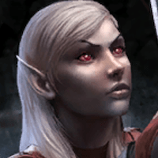
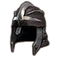
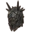
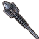

<input type="checkbox" id="menu-toggle" class="menu-toggle">
<label for="menu-toggle" class="hamburger-menu">
  
  
  
</label>

  

    <h3>Contents</h3>
    <!-- TOC will be inserted here by JavaScript -->
  

* TOC
{:toc}

# Paradoxdruid's Quickstart Guides

If you are just getting started on building a trial-ready character, these quickstart guides feature a bit more detail on some of the specifics that would be a good first step. You can see the full guides with much more details at [Paradoxdruid's ESO Guides: Builds and Rosters](./)

## Table of Contents

| Guide Section                                                       | Why Do I Want To Read This?                                                                                                                                                                              |
| ------------------------------------------------------------------- | -------------------------------------------------------------------------------------------------------------------------------------------------------------------------------------------------------- |
| • [Beam DPS Quickstart Guide](#beam-dps-quickstart-guide-update-48) | I want to see how to build a Beam-based DPS that's trial-ready, including stats, mundus, food, race, skill bars, subclassing, and commonly worn armor sets to get up and running fast. **(Start here!)** |

## Beam DPS Quickstart Guide (Update 48)

There's lots of ways to do good damage. But you want a cheatsheet on something effective, so you can get back to playing?

### The Basics

- **Race**: {: class="inline-image"} Dark Elf, {: class="inline-image"} Orc, {: class="inline-image"} Khajiit are the best races for DPS. Unsure? Pick Dark Elf.

- **Mundus**: {: class="inline-image"} [The Thief](<https://en.uesp.net/wiki/Online:The_Thief_(Mundus_Stone)>) provides important crit chance

- **Attributes**: 64 points in {: class="inline-image"} **Stamina** (damage is based off your highest stat, so you want all points in one category; high stamina is also important for trial mechanics that involve blocking, roll-dodging, or breaking free)

- **Food**: Max Stamina/Stamina Recovery/Health food ({: class="inline-image"} [Dubious Camoran Throne](https://en.uesp.net/wiki/Online:Dubious_Camoran_Throne) or {: class="inline-image"} [Artaeum Takeaway Broth](https://en.uesp.net/wiki/Online:Artaeum_Takeaway_Broth)) is best for content. For parsing on the trial dummy, use Max Stamina/Stamina Recovery food ({: class="inline-image"} [Lava Foot Soup and Saltrice](https://en.uesp.net/wiki/Online:Lava_Foot_Soup-and-Saltrice))

- **Subclassing**: Having useful skill lines from multiple classes greatly enhances your damage potential. Here, we'll use three all-around useful skill lines:
  - {: class="inline-image"} Arcanist: Herald of the Tome {: class="inline-image"}
  - {: class="inline-image"} Dragonknight: Ardent Flame {: class="inline-image"}
  - {: class="inline-image"} Nightblade: Assassination {: class="inline-image"} ( {: class="inline-image"} Templar: Aedric Spear {: class="inline-image"} is good, too, and better for single-target fights)

### Gear

- The most versatile starting gear is:
  - 1 piece {: class="inline-image"} **Slimecraw** monster set (or any +crit chance monster piece). Usually in Light armor weight, for added penetration.
  - {: class="inline-image"} **Velothi Ur-Mage's Amulet**
  - 5 piece {: class="inline-image"} **Deadly Strike** (buy from guild traders or farm PvP) on the front bar (2 daggers)
  - 5 piece {: class="inline-image"} **Ansuul's Torment** on the body/rings
  - a {: class="inline-image"} **Maelstrom Inferno Staff** backbar (for single target-fights {: class="inline-image"} **Maelstrom Greatsword** )
  - (For purely single target fights, {: class="inline-image"} **Null Arca** with {: class="inline-image"} **Tide-Born Wildstalker** is stronger)
- At the beginning, craftable {: class="inline-image"} **Order's Wrath** or {: class="inline-image"} **Tide-Born Wildstalker** can replace Ansuul's Torment.
- Enchantments:
  - all body pieces Divine trait with +Stam glyphs
  - all jewelry Bloodthirsty with +Physical Harm glyphs
  - daggers Nirnhoned/Charged, one with Flame glyph one with Poison glyph. Nirnhoned/Precise is better in AoE-heavy fights.

### Skills

- Front-Bar:
  - {: class="inline-image"} Quick Cloak
  - {: class="inline-image"} Venomous Claw (or Killer's Blade, with Venomous Claw replacing Fulminating Rune backbar)
  - {: class="inline-image"} Cephaliarch's Flail
  - {: class="inline-image"} Pragmatic Fatecarver
  - {: class="inline-image"} Camo Hunter (not cast, slotted for passives) / can replace with {: class="inline-image"} Banner-Bearer (Shock/Cavaliar's Charge/Courage)
  - {: class="inline-image"} Incapacitating Strikes (or {: class="inline-image"} Crescent Sweep if using Aedric skill line)
- Backbar:
  - {: class="inline-image"} Inspired Scholarship
  - {: class="inline-image"} Elemental Blockade (or {: class="inline-image"} Stampede if using greatsword)
  - {: class="inline-image"} Flames of Oblivion
  - {: class="inline-image"} Fulminating Rune
  - {: class="inline-image"} Molten Whip (not cast, slotted for passives) / can replace with {: class="inline-image"} Banner-Bearer (Shock/Cavaliar's Charge/Courage)
  - {: class="inline-image"} Standard of Might or {: class="inline-image"} Languid Eye

### What to do

- Arcanists have long range and high cleave; always aim your beam to maximize targets hit. It also strikes targets immediately behind you, so you can press up against them and damage them as well ("butt beam")
- Always get to 3 crux before beaming. With Inspired Scholarship running, that means 2 casts of Flail, then beam. **Beam is over 50% of your damage. ABB. Always Be Beaming.**
- Your next highest sources of damage are Flames of Oblivion and Blockade of Fire, always keep them up.
- Arcanists cannot block-cast well; both Flail and Beam can't be block cast. In trial mechanics that require block casting, be mindful of this fact.


