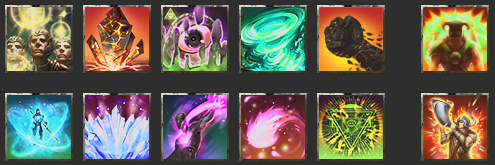

<input type="checkbox" id="menu-toggle" class="menu-toggle">
<label for="menu-toggle" class="hamburger-menu">
  
  
  
</label>

  

    <h3>Contents</h3>
    <!-- TOC will be inserted here by JavaScript -->
  

* TOC
{:toc}

_This is a work in progess; last updated 2026-02-01._

These capture the mid-tier meta for Update 48 (U48), aimed at groups who regularly do vet and vet HM content; venturing in trifecta progs. **Wait, you've got it all wrong!** Yeah, maybe I do, that's totally fair. And in any case, there's lots of good approaches and strategies, and not a one-size-fits-all approach that will always apply. Thanks for all the feedback I've received to date!

For all the guides, see the full [Paradoxdruid's Guides](./) site

---

# ESO Update 48 Mid-tier Build Guides

## Support Loadouts

**See also [Why Do I Use These Skills?](#why-do-i-use-these-skills) for details on why different skills are selected.**

### Main Tank

| Class Lines                                                                                      | Skill Bars                                                                                                                                                                                                                                                                                                                                                               | Typical Sets     | Notes                                                                                                                                                                                      |
| ------------------------------------------------------------------------------------------------ | ------------------------------------------------------------------------------------------------------------------------------------------------------------------------------------------------------------------------------------------------------------------------------------------------------------------------------------------------------------------------ | ---------------- | ------------------------------------------------------------------------------------------------------------------------------------------------------------------------------------------ |
| Winter's Embrace (Warden),  Soldier of Apocrypha (Arcanist),  Earthen Heart (Dragonknight) | _FB:_ Lingering Flare, Igneous Shield, Inner Rage, Polar Wind, Stone Giant, Reviving Barrier  _BB:_ Expansive Frost Cloak, Elemental Blockade, Leashing Soul, Elemental Susceptibility, Runeguard of Still Waters, Aggressive Warhorn  [MT skill bars](https://sheumais.github.io/esoskillbarbuilder/?skills=428,139,403,211,135,420,206,270,430,288,33,408) | Pearl/Lucent/Naz | • Can use Inner Rage taunt instead of Runic Sunder if increased range is needed • Typical Ult: Aggressive Warhorn  • **Wield Soul**: Pull / Druid's Resurgance / (Cowardice or Maim) |

### Off Tank

| Class Lines                                                                                   | Skill Bars                                                                                                                                                                                                                                                                                                                                                                       | Typical Sets                          | Notes                                                                                                                                                                                    |
| --------------------------------------------------------------------------------------------- | -------------------------------------------------------------------------------------------------------------------------------------------------------------------------------------------------------------------------------------------------------------------------------------------------------------------------------------------------------------------------------- | ------------------------------------- | ---------------------------------------------------------------------------------------------------------------------------------------------------------------------------------------- |
| Daedric Summoning (Sorcerer),  Soldier of Apocrypha (Arcanist),  Siphoning (Nightblade) | _FB:_ Runeguard of Still Waters, Spiteward of the Lucid Mind, Runic Sunder, Resolving Vigor, Trample, Soul Siphon  _BB:_ Cruxweaver Armor, Elemental Blockade, Leashing Soul, Elemental Susceptibility, Siphoning Attacks, Summon Charged Atronach  [OT skill bars](https://sheumais.github.io/esoskillbarbuilder/?skills=33,29,27,413,418,60,30,270,430,288,69,145) | Saxhleel Champion/Powerful Assault/AD | • Typical Ult: Summon Charged Atronach  • **Wield Soul**: Pull / Druid's Resurgance / (Cowardice or Maim)  • Paired with Runic Sunder, Spiteward is an almost free shield and heal |

### ROJO or MA/PA Healer

| Class Lines                                                                                                         | Skill Bars                                                                                                                                                                                                                                                                                                                                                | Typical Sets                                                                                    | Notes                                                                                                                                                                                                                       |
| ------------------------------------------------------------------------------------------------------------------- | --------------------------------------------------------------------------------------------------------------------------------------------------------------------------------------------------------------------------------------------------------------------------------------------------------------------------------------------------------- | ----------------------------------------------------------------------------------------------- | --------------------------------------------------------------------------------------------------------------------------------------------------------------------------------------------------------------------------- |
| Siphoning (Nightblade),  Restoring Light (Templar),  Flex (typically Curative Runeforms or Daedric Summoning) | _FB:_ Illustrious Healing, Extended Ritual, Radiating Regeneration, Combat Prayer, Warding Burst, Soul Siphon  _BB:_ Siphoning Attacks, Elemental Blockade, Echoing Vigor, Radiant Aura, Energy Orb, Reviving Barrier  [ROJO skill bars](https://sheumais.github.io/esoskillbarbuilder/?skills=319,431,320,323,104,60,69,272,406,412,102,420) | • RO (BB)/JO (body)/ Master's Resto (FB)/ Symphony of Blades   • MA (body)/PA (FB)/Pearls | • Typical Ult: Reviving Barrier  • May drop Radianting Regen for Overflowing Altar  • Siphoning ability on each bar for +6% resources  • **Warding Burst**: Damage Shield / Anchorite's Potency / Minor Expedition |

### SPC/PP or MA Healer

| Class Lines                                                                           | Skill Bars                                                                                                                                                                                                                                                                                                                                            | Typical Sets                                        | Notes                                                                                                                                                                                                                                                                                  |
| ------------------------------------------------------------------------------------- | ----------------------------------------------------------------------------------------------------------------------------------------------------------------------------------------------------------------------------------------------------------------------------------------------------------------------------------------------------- | --------------------------------------------------- | -------------------------------------------------------------------------------------------------------------------------------------------------------------------------------------------------------------------------------------------------------------------------------------- |
| Green Balance (Warden),  Siphoning (Nightblade),  Curative Runeforms (Arcanist) | _FB:_ Illustrious Healing, Warding Burst, Radiating Regen, Budding Seeds, Combat Prayer, Soul Siphon  _BB:_ Siphoning Attacks, Elemental Blockade, Echoing Vigor, Chakram of Destiny, Energy Orb, Glyphic of the Tides  [SPC skill bars](https://sheumais.github.io/esoskillbarbuilder/?skills=319,196,320,323,431,60,69,272,412,6,406,0) | SPC (FB)/MA (or PP) (BB)/Pearls/Ozezan or the Blind | • Typical Ult: Glyphic of the Tides  • May drop Radiating Regen for Overflowing Altar   • If paired with ROJO healer, SPC/PA also can work  • Siphoning ability on each bar for +6% resources  • **Warding Burst**: Damage Shield / Anchorite's Potency / Minor Expedition |

### Support Zen/Colo DPS

| Class Lines                                                                              | Skill Bars                                                                                                                                                                                                                                                                                                                                       | Typical Sets                  | Notes                                                                                                                                                                                                 |
| ---------------------------------------------------------------------------------------- | ------------------------------------------------------------------------------------------------------------------------------------------------------------------------------------------------------------------------------------------------------------------------------------------------------------------------------------------------ | ----------------------------- | ----------------------------------------------------------------------------------------------------------------------------------------------------------------------------------------------------- |
| Ardent Flame (Dragonknight),  Gravelord (Necromancer),  Assassination (Nightblade) | _FB:_ Quick Cloak, Relentless Focus, Traveling Knife, Killer's Blade, Unnerving Boneyard, Incapacitating Strikes  _BB:_ Stampede, Carve, Flames of Oblivion, Venomous Claw, Engulfing Flames, Glacial Colossus  [Zen skill bars](https://sheumais.github.io/esoskillbarbuilder/?skills=299,47,302,43,235,36,334,336,119,113,114,228) | • Zen/Null Arca • Zen/Kosh | • Provides Major Vuln • Can wear Encratis monster set • Zen DoTs: Knife, Venom Claw, Engulfing, Carve, Burning, Poison  • **Traveling Knife**: Multitarget / Lingering Torment / Off Balance |

---

# Why Do I Use These Skills?

- [Main Tank Skill explanations](#main-tank-skills)
- [Off Tank Skill explanations](#off-tank-skills)
- [Green Balance Healer Skill explanations](#green-balance-healer-skills)
- [Restoring Light Healer Skill explainations](#restoring-healer-skills)

## Main Tank Skills

**Disclaimer**: As always, the "right" abilities will depend on group composition (what skills the other tank and the healers are running), what content you are doing (mechanics, boss specific needs, are you going to need to chain things), and other factors. This is just a starting point!

### Front Bar

| Icon                                                       | Name                           | Explanation                                                                                                                                                                                                                                                                                                                                                                                                                                          |
| ---------------------------------------------------------- | ------------------------------ | ---------------------------------------------------------------------------------------------------------------------------------------------------------------------------------------------------------------------------------------------------------------------------------------------------------------------------------------------------------------------------------------------------------------------------------------------------- |
|  | **Runic Sunder**               | Your bread and butter Taunt. It has long-range, gives the group extra penetration, applies Minor Maim, generates crux, and reduces your damage taken.                                                                                                                                                                                                                                                                                                |
|  | **Runeguard of Still Waters**  | Group Minor Resolve, reducing damage taken by ~4% (although this should be provided by healers from Combat Prayer), as well as 5% damage reduction from Minor Protection for yourself. Also gives you a self-heal when your health goes down, and Immobilizes small adds. From passives, also increases your armor by 3000 while active, and grants the group Minor Evasion, reducing AoE damage by 10%. (Can be swapped backbar with the flex spot) |
|    | **Igneous Shield**             | A decent damage shield that also shields allies. Greatly increases your self-healing. Through passives, it also restores Stamina and grants the group Minor Brutality (+4% damage bump). Shields are a great spammable to lessen hits, and give time for your health bar to refill from HoTs.                                                                                                                                                        |
|    | **Lingering Flare**            | Passively provides Major Protection for 10% damage reduction. Very useful if you anticipate a lot of DoT damage.                                                                                                                                                                                                                                                                                                                                     |
|      | **Polar Wind**                 | Your self-heal. It heals a big chunk upfront, and applies a strong HoT effect as well. Your spammable heal, usually cast right after Igneous Shields to maximize the healing.                                                                                                                                                                                                                                                                        |
|            | Ultimate: **Reviving Barrier** | This serves two purposes. First, it usually is just used for the passive, which will give +10% Magicka recovery. Second, it's a good "oh shit" button if you or especially the group is taking too much damage, to buy some breathing room.                                                                                                                                                                                                          |

### Back Bar

| Icon                                                                | Name                                                              | Explanation                                                                                                                                                                                                                                                                                                                                                                                                                                                                                                 |
| ------------------------------------------------------------------- | ----------------------------------------------------------------- | ----------------------------------------------------------------------------------------------------------------------------------------------------------------------------------------------------------------------------------------------------------------------------------------------------------------------------------------------------------------------------------------------------------------------------------------------------------------------------------------------------------- |
|  | **Blockade of Frost**                                             | This is one of your most important debuff skills, and should always be active. It applies minor breach to chilled enemies and gives a projectile shield to your team, as well as proccing your weapon enchantment (Crusher for pen)                                                                                                                                                                                                                                                                         |
|         | **Elemental Susceptibility**                                      | This is your most important debuff skill, and should always be active on important enemies. It applies Major Breach (increasing team damage by more than 10%) and the Burning, Chilled and Concussed status effects. These status effects provide Minor Maim, Minor Brittle and Minor Vulnerability. This skill also pairs well with wall of elements: Wall of Frost (from yourself) snares and reduces the armor of Chilled enemies and Wall of Storms (from a healer) sets Concussed enemies Off Balance. |
|        | **Leashing Soul**                                                 | This scribed skill is the best Pull / chain in the game; long-range, cheap (with the Druid's script), and can apply Major Maim or Major Cowardice, reducing boss damage by up to 10%. I use this even on bosses I've taunted, to keep Major Maim up.                                                                                                                                                                                                                                                        |
|              | **Expansive Frost Cloak**                                         | Group-wide Major Resolve, which reduces damage taken by ~9%. It needs to always be up.                                                                                                                                                                                                                                                                                                                                                                                                                      |
|                                                                     | Flex spot:                                                        |                                                                                                                                                                                                                                                                                                                                                                                                                                                                                                             |
|                                                                     |      | **Stone Giant**: This ability increases group damage as you stack it; at full stacks it's roughly 4k dps per damage dealer. The first cast has a cast time which drops your block requiring caution and attention when using this skill.                                                                                                                                                                                                                                                                    |
|                                                                     |  | **Igneous Weapons**: Provides Major Brutality, which is massive damage boost (~+10%). However, most DPS can source this themselves from Inspired Scholarship, Skeletal Archer, or potions, so it's being run less and less.                                                                                                                                                                                                                                                                                 |
|                                                                     |     | **Ulfsild's Contingency**: A strong choice for survivability, it gives a good damage shield to you and allies, as well as a brief 8% unique damage reduction buff, and can give you Minor Mag & Stam recovery if you're far from group or healer isn't providing it.                                                                                                                                                                                                                                        |
|                        | Ultimate: **Aggressive Horn**                                     | Provides Major Force, which (if needed) gives ~4% damage to group --though many groups can reach crit cap without, as well as +10% max resources, which is another ~3% damage boost.                                                                                                                                                                                                                                                                                                                        |

### Situational Tank Skills

| Icon                                                    | Name                                                             | Explanation                                                                                                                                                                                                                                                                                                                  |
| ------------------------------------------------------- | ---------------------------------------------------------------- | ---------------------------------------------------------------------------------------------------------------------------------------------------------------------------------------------------------------------------------------------------------------------------------------------------------------------------- |
|        | **Razor Caltrops**                                               | In trash, this replaces Ele Sus, to apply Major Breach to the whole group. It also slows small adds, giving DPS time to burn them before they get hit.                                                                                                                                                                       |
|  | **Goading Throw**                                                | If you run sword and shield, this taunt is a stamina-based alternative that can also provide a variety of useful tools as needed. The strength of this skill is its customisability. If you need a heal, resources or a specific debuff that may be difficult to source otherwise it is very simple to put it on this skill. |
|     | **Runic Sunder**                                                 | Can replace Inner Rage as your taunt. It has shorter range and doesn't provide the powerful Radiate synergy, but applies Minor Maim, reducing boss damage 5%, a unique 2% damage reduction for you, and some penetration if your group needs it.                                                                             |
|        | **Charging Maneuver**                                            | Gives your group +45% speed for running through long trials.                                                                                                                                                                                                                                                                 |
|   | **Impervious Runeward**                                          | A massive shield that can allow you to use Magicka instead spending stamina on a roll dodge to survive heavy attacks if you time it right.                                                                                                                                                                                   |
|     | **Temporal Guard**                                               | A good FB ultimate for passive Minor Protection (not needed if using Runeguard skill) and a 5K shield that recharges after 10 seconds not blocking.                                                                                                                                                                          |
|         | **Race Against Time**                                            | Immediately removes slows, which can be very useful for some add packs or bosses.                                                                                                                                                                                                                                            |
|                                                         | Other Class Lines                                                | Instead of **Earthen Heart**, some groups prefer **Siphoning** skill line. If so, you lose Igneous Shield and Stone Giant, so you might use:                                                                                                                                                                                 |
|                                                         |       | **Soul Siphon** ultimate to replace Barrier FB. Passively slotted, gives you +6% Mag and Stam, +3% self-healing, and it's again a great "oh shit" button.                                                                                                                                                                    |
|                                                         |  | **Warding Burst**: A replacement spammable shield FB, it is both a shield and a HoT.                                                                                                                                                                                                                                         |
|                                                         |         | **Siphoning Attacks**: A BB passive skill that keeps up the +6% Mag & Stam when you bar swap, and any damage you deal (like, constantly from Blockade) heals you and restores resources. Can also be cast to restore resources.                                                                                              |

### Overall Outcomes

If you keep up all the skills above, you provide the group with:

- **Buffs:** Major Resolve, Minor Resolve, Minor Brutality, Igneous Shields ally shields, Polar Wind ally heal, Blockade of Ice projectile shields, Radiate Synergy, Horn resources.
- **Enemy Debuffs:** Major Breach, Minor Breach, Minor Brittle, Major Maim, Minor Maim, Off-Balance and Minor Vulnerability (with healer lightning staff), Crusher.

This gives roughly:

- Groupwide +18% damage, and consistent off-balance windows on boss for Exploiter bonus
- Groupwide -15% damage taken, and -10% more from AoEs
- Projectile shields for allies, igneous shields for allies, and Polar Wind heals; all small but add up
- Boss dealing -15% damage

## Off Tank Skills

**Disclaimer**: As always, the "right" abilities will depend on group composition (what skills the other tank and the healers are running), what content you are doing (mechanics, boss specific needs, are you going to need to chain things), and other factors. This is just a starting point!

### Front Bar

| Icon                                                        | Name                                                           | Explanation                                                                                                                                                                                                                                                                                                                                                                                                                                          |
| ----------------------------------------------------------- | -------------------------------------------------------------- | ---------------------------------------------------------------------------------------------------------------------------------------------------------------------------------------------------------------------------------------------------------------------------------------------------------------------------------------------------------------------------------------------------------------------------------------------------- |
|         | **Runic Sunder**                                               | Bread and butter taunt; applies Minor Maim, reducing boss damage 5%, a unique 2% damage reduction for you, and some penetration if your group needs it. Also generates Crux to heal with Runeward.                                                                                                                                                                                                                                                   |
|   | **Runeguard of Still Waters**                                  | Group Minor Resolve, reducing damage taken by ~4% (although this should be provided by healers from Combat Prayer), as well as 5% damage reduction from Minor Protection for yourself. Also gives you a self-heal when your health goes down, and Immobilizes small adds. From passives, also increases your armor by 3000 while active, and grants the group Minor Evasion, reducing AoE damage by 10%. (Can be swapped backbar with the flex spot) |
|      | **Spiteward of the Lucid Mind**                                | A massive shield that can allow you to use Magicka instead spending stamina on a roll dodge to survive heavy attacks if you time it right. Spiteward also heals some but spends crux.                                                                                                                                                                                                                                                                |
|     | **Resolving Vigor**                                            | A powerful heal and HoT you can spam as needed. Also gives Minor Resolve, but so does Runeguard.                                                                                                                                                                                                                                                                                                                                                     |
|                                                             | Flex Spot:                                                     |                                                                                                                                                                                                                                                                                                                                                                                                                                                      |
|                                                             |         | **Trample**: Provides Major Heroism to help you spam ults.                                                                                                                                                                                                                                                                                                                                                                                           |
|                                                             |  | **Ulfsild's Contingency**: A strong choice for survivability, it gives a good damage shield to you and allies, as well as a brief 8% unique damage reduction buff, and can give you Minor Mag & Stam recovery if you're far from group or healer isn't providing it.                                                                                                                                                                                 |
|                                                             |        | **Blinding Flare**: Passively provides Major Protection for 10% damage reduction. Very useful if you anticipate a lot of DoT damage.                                                                                                                                                                                                                                                                                                                 |
|  | Ultimate: **Soul Siphon**                                      | This serves two purposes. Passively slotted, it gives you +6% Mag and Stam, +3% self-healing. Second, it's a good "oh shit" button if you or especially the group is taking too much damage, to buy some breathing room.                                                                                                                                                                                                                             |

### Back Bar

| Icon                                                                | Name                                  | Explanation                                                                                                                                                                                                                                                                                                                                                                                                                                                                                                 |
| ------------------------------------------------------------------- | ------------------------------------- | ----------------------------------------------------------------------------------------------------------------------------------------------------------------------------------------------------------------------------------------------------------------------------------------------------------------------------------------------------------------------------------------------------------------------------------------------------------------------------------------------------------- |
|             | **Cruxweaver Armor**                  | Your source of Major Resolve, also procs Minor Breach on enemies and generates Crux for damage reduction.                                                                                                                                                                                                                                                                                                                                                                                                   |
|  | **Blockade of Frost**                 | This is one of your most important debuff skills, and should always be active. It applies minor breach to chilled enemies and gives a projectile shield to your team, as well as proccing your weapon enchantment (Crusher for pen)                                                                                                                                                                                                                                                                         |
|         | **Elemental Susceptibility**          | This is your most important debuff skill, and should always be active on important enemies. It applies Major Breach (increasing team damage by more than 10%) and the Burning, Chilled and Concussed status effects. These status effects provide Minor Maim, Minor Brittle and Minor Vulnerability. This skill also pairs well with wall of elements: Wall of Frost (from yourself) snares and reduces the armor of Chilled enemies and Wall of Storms (from a healer) sets Concussed enemies Off Balance. |
|        | **Leashing Soul**                     | This scribed skill is the best Pull / chain in the game; long-range, cheap (with the Druid's script), and can apply Major Maim or Major Cowardice, reducing boss damage by up to 10%. I use this even on bosses I've taunted, to keep Major Maim up.                                                                                                                                                                                                                                                        |
|            | **Siphoning Attacks**                 | A passive skill that keeps up the +6% Mag & Stam when you bar swap, and any damage you deal (like, constantly from Blockade) heals you and restores resources. Can also be cast to restore resources.                                                                                                                                                                                                                                                                                                       |
|   | Ultimate: **Summon Charged Atronach** | A powerful ult that also provides a synergy to give groupwide Major Berserk (+10% damage).                                                                                                                                                                                                                                                                                                                                                                                                                  |

### Situational Tank Skills

| Icon                                                    | Name                                                          | Explanation                                                                                                                                                                                                                                                                                                                  |
| ------------------------------------------------------- | ------------------------------------------------------------- | ---------------------------------------------------------------------------------------------------------------------------------------------------------------------------------------------------------------------------------------------------------------------------------------------------------------------------- |
|        | **Razor Caltrops**                                            | In trash, this replaces Ele Sus, to apply Major Breach to the whole group. It also slows small adds, giving DPS time to burn them before they get hit.                                                                                                                                                                       |
|  | **Goading Throw**                                             | If you run sword and shield, this taunt is a stamina-based alternative that can also provide a variety of useful tools as needed. The strength of this skill is its customisability. If you need a heal, resources or a specific debuff that may be difficult to source otherwise it is very simple to put it on this skill. |
|        | **Charging Maneuver**                                         | Gives your group +45% speed for running through long trials.                                                                                                                                                                                                                                                                 |
|     | **Temporal Guard**                                            | A good FB ultimate for passive Minor Protection (not needed if using Runeguard skill) and a 5K shield that recharges after 10 seconds not blocking.                                                                                                                                                                          |
|         | **Race Against Time**                                         | Immediately removes slows, which can be very useful for some add packs or bosses.                                                                                                                                                                                                                                            |
|                                                         | Other Class Lines                                             | Instead of **Siphoning**, some groups prefer **Earthern Heart** or **Winter's Embrace** skill line on OT. If so, you lose Soul Siphon and Siphoning Attacks, so you might use:                                                                                                                                               |
|                                                         |               | **Reviving Barrier** ultimate: This serves two purposes. First, it usually is just used for the passive, which will give +10% Magicka recovery. Second, it's a good "oh shit" button if you or especially the group is taking too much damage, to buy some breathing room.                                                   |
|                                                         |       | **Igneous Shield**: A decent damage shield that also shields allies. Greatly increases your self-healing. Through passives, it also restores Stamina and grants the group Minor Brutality (~1% damage bump). Shields are a great spammable to lessen hits, and give time for your health bar to refill from HoTs.            |
|                                                         |  | **Stone Giant**: This ability increases group damage as you stack it; at full stacks it's roughly 4k dps per damage dealer. The first cast has a cast time which drops your block requiring caution and attention when using this skill.                                                                                     |
|                                                         |        | **Expansive Frost Cloak**: Group-wide Major Resolve, which reduces damage taken by ~9%. It should always be up.                                                                                                                                                                                                              |
|                                                         |         | **Polar Wind**: A very strong self-heal. It heals a big chunk upfront, and applies a strong HoT effect as well. Your spammable heal, usually cast right after Igneous Shields to maximize the healing.                                                                                                                       |

## Green Balance Healer Skills

**Disclaimer**: As always, the "right" abilities will depend on group composition (what skills the other tank and the healers are running), what content you are doing (mechanics, boss specific needs, are you going to need to chain things), and other factors. This is just a starting point!

**Note**: Just by having the Green Balance class line (specifically the maturation passive), all of your healing applies Minor Toughness to allies, an important and unique +10% max health buff.

### Front Bar

| Icon                                                                | Name                                                           | Explanation                                                                                                                                                                                                                                                      |
| ------------------------------------------------------------------- | -------------------------------------------------------------- | ---------------------------------------------------------------------------------------------------------------------------------------------------------------------------------------------------------------------------------------------------------------- |
|     | **Illustrious Healing**                                        | This is one of your primary ground heal over time (HoT) spells; it should always be up for the group. It smart targets, unlike the other morph.                                                                                                                  |
|            | **Budding Seeds**                                              | This is your other primary ground HoT. This also provides a good healing synergy. Often, you will keep this ability focused on the MT, so they have a synergy available to restore resources.                                                                    |
|  | **Combat Prayer**                                              | Your main healing spammable and probably most-cast ability. It heals everyone in a large rectangle in front of you, as well as providing Minor Resolve (~3% damage reduction) and Minor Berserk (5% damage increase). If in doubt, spam this during heal checks. |
|     | **Warding Burst**                                              | This provides a useful damage shield for HoTs to heal the group under, and with _Anchorite's Potency_ gives you and the group ultimate generation.                                                                                                               |
|                                                                     | Flex Spot:                                                     |                                                                                                                                                                                                                                                                  |
|                                                                     |  | **Radiating Regeneration**: This is a good semi-spammable for keeping magicka low and to provide a sticky heal when folks need to leave group for mechanics.                                                                                                     |
|                                                                     |  | **Warding Contingency**: With Damage Shield and Growing Impact, this skill can give groupwide Minor Protection (5% damage reduction) or Minor Mag & Stam recovery, if a healer with Restoring Light isn't providing it.                                          |
|                                                                     |        | **Healthy Offering**: This is a strong heal for single-target heal checks like Tombs, and will generate ultimate from passives.                                                                                                                                  |
|                                                                     |            | **Overflowing Altar**: One healer should always be running this strong heal and provider of massive heal synergy, preferably near the Tank.                                                                                                                      |
|          | Ultimate: **Soul Siphon**                                      | This serves two purposes. Passively slotted, it gives you +6% Mag and Stam, +3% self-healing. Second, it's a good "oh shit" button if you or especially the group is taking too much damage, to buy some breathing room.                                         |

### Back Bar

| Icon                                                           | Name                               | Explanation                                                                                                                                                                                                                                                                                                                                  |
| -------------------------------------------------------------- | ---------------------------------- | -------------------------------------------------------------------------------------------------------------------------------------------------------------------------------------------------------------------------------------------------------------------------------------------------------------------------------------------- |
|               | **Energy Orb**                     | A very strong HoT and source of an essential recovery synergy. It should always be up and active, usually aimed and near to tanks. (can switch with flex spot FB)                                                                                                                                                                            |
|  | **Blockade of Lightning**          | This is an important debuff skill. It sets concussed enemies (sourced from Tank's Ele Sus) off balance, and procs the Crusher or Weakening enchantment on your BB staff. Skill can be dropped sometimes, if you have a DPS with off-balance Knife skill, or just need barspace for Altar or situational skills.                              |
|          | **Echoing Vigor**                  | A very strong sticky HoT (so good to cast before dps run off to do mechanics) that is Stamina based, to help manage resources.                                                                                                                                                                                                               |
|           | **Chakram of Destiny**             | A good spammable shield skill. It also generates Crux, which increases all your healing by up to 12%. (can switch with flex spot FB)                                                                                                                                                                                                         |
|       | **Siphoning Attacks**              | A passive skill that keeps up the +6% Mag & Stam when you bar swap, and any damage you deal (like, constantly from Blockade) heals you and restores resources. Can also be cast to restore resources when low.                                                                                                                               |
|           | Ultimate: **Glyphic of the Tides** | One of the strongest HoT effects in the game, and importantly it ticks every 1 second, when many heals tick every 2 seconds. Great for heal checks like vKA Falgravn HM 3rd floor. It also boosts group damage more than Pearlescent Ward or Xoryn's set effects; worth casting anytime group is fighting even if they don't need the heals. |

### Situational Healer Skills

| Icon                                                          | Name                             | Explanation                                                                                                                                                                                       |
| ------------------------------------------------------------- | -------------------------------- | ------------------------------------------------------------------------------------------------------------------------------------------------------------------------------------------------- |
|               | **Reviving Barrier** BB ultimate | This serves two purposes. First, it passively gives +10% Magicka recovery. Second, it is a very strong shield and HoT for heavy damage moments, and is very useful for groupwide damage checks.   |
|            | **Healing Thicket**              | A strong extra HoT. Importantly, it's very cheap to cast, so if you need spammable extra healing, like vSE Ansuul HM, it's worth considering.                                                     |
|            | **Zenas' Empowering Disc**       | Minor Courage and Mag & Stam recovery is very nice, but only hits six targets. Useful for dungeons or trials with split Bosses like vLC Garg/Scorp.                                               |
|                 | **Efficient Purge**              | Purges harmful effects which can make some fights easier, such as in the first boss in vHoF. Many effects you would expect to be purgable in other trials... aren't.                              |
|   | **Elemental Susceptibility**     | For some trials, healers will need to slot this to debuff side adds, such as Protectors in vAS+2. Applies Major Breach, and will proc Off-Balance if your Blockade of Lightning is on the target. |
|  | **Leashing Soul**                | Sometimes healers need to taunt; using a Pull skill allows you to taunt without fear of stealing taunt from the Boss and you can apply Major Cowardice or Major Maim to reduce enemy damage.      |
|        | **Trample**                      | An alternative source of Major Heroism instead of the Pearls of Ehlnofey Mythic.                                                                                                                  |
|          | **Mystic Guard**                 | Powerful damage reduction for a Tank, used in certain boss fights, like vDSR Twins HM.                                                                                                            |

## Restoring Healer Skills

**Disclaimer**: As always, the "right" abilities will depend on group composition (what skills the other tank and the healers are running), what content you are doing (mechanics, boss specific needs, are you going to need to chain things), and other factors. This is just a starting point!

### Front Bar

| Icon                                                                | Name                                                           | Explanation                                                                                                                                                                                                                                                      |
| ------------------------------------------------------------------- | -------------------------------------------------------------- | ---------------------------------------------------------------------------------------------------------------------------------------------------------------------------------------------------------------------------------------------------------------- |
|     | **Illustrious Healing**                                        | This is one of your primary ground heal over time (HoT) spells; it should always be up for the group. It smart targets, unlike the other morph.                                                                                                                  |
|        | **Extended Ritual**                                            | Your other primary ground HoT. Extremely strong and long-lasting, and also provides a group-wide synergy for resource recovery.                                                                                                                                  |
|  | **Combat Prayer**                                              | Your main healing spammable and probably most-cast ability. It heals everyone in a large rectangle in front of you, as well as providing Minor Resolve (~3% damage reduction) and Minor Berserk (5% damage increase). If in doubt, spam this during heal checks. |
|     | **Warding Burst**                                              | This provides a useful damage shield for HoTs to heal the group under, and with _Anchorite's Potency_ gives you and the group ultimate generation.                                                                                                               |
|                                                                     | Flex Spot:                                                     |                                                                                                                                                                                                                                                                  |
|                                                                     |  | **Radiating Regeneration**: This is a good semi-spammable for keeping magicka low and to provide a sticky heal when folks need to leave group for mechanics.                                                                                                     |
|                                                                     |  | **Warding Contingency**: With Damage Shield and Growing Impact, this skill can give groupwide Minor Protection (5% damage reduction) or Minor Mag & Stam recovery, if a healer with Restoring Light isn't providing it.                                          |
|                                                                     |        | **Healthy Offering**: This is a strong heal for single-target heal checks like Tombs, and will generate ultimate from passives.                                                                                                                                  |
|                                                                     |            | **Overflowing Altar**: One healer should always be running this strong heal and provider of massive heal synergy, preferably near the Tank.                                                                                                                      |
|          | Ultimate: **Soul Siphon**                                      | This serves two purposes. Passively slotted, it gives you +6% Mag and Stam, +3% self-healing. Second, it's a good "oh shit" button if you or especially the group is taking too much damage, to buy some breathing room.                                         |

### Back Bar

| Icon                                                             | Name                           | Explanation                                                                                                                                                                                                                                                                                                         |
| ---------------------------------------------------------------- | ------------------------------ | ------------------------------------------------------------------------------------------------------------------------------------------------------------------------------------------------------------------------------------------------------------------------------------------------------------------- |
|                 | **Energy Orb**                 | A very strong HoT and source of an essential recovery synergy. It should always be up and active, usually aimed and near to tanks. (can switch with flex spot FB)                                                                                                                                                   |
|    | **Blockade of Lightning**      | This is an important debuff skill. It sets enemies Concussed (to get off-balance with Tank's Ele Sus cast), and procs the Crusher or Weakening enchantment on your BB staff. Skill can be dropped sometimes, if you have a DPS with off-balance Knife skill, or just need barspace for Altar or situational skills. |
|            | **Echoing Vigor**              | A very strong sticky HoT (so good to cast before dps run off to do mechanics) that is Stamina based, to help manage resources.                                                                                                                                                                                      |
|  | **Radiant Aura**               | A super-long lasting buff that provides important Minor Mag & Stam recovery for the group.                                                                                                                                                                                                                          |
|         | **Siphoning Attacks**          | A passive skill that keeps up the +6% Mag & Stam when you bar swap, and any damage you deal (like, constantly from Blockade) heals you and restores resources. Can also be cast to restore resources when low.                                                                                                      |
|                  | Ultimate: **Reviving Barrier** | This serves two purposes. First, it passively gives +10% Magicka recovery. Second, it is a very strong shield and HoT for heavy damage moments, and is very useful for group-wide damage checks.                                                                                                                    |

### Situational Healer Skills

| Icon                                                               | Name                                  | Explanation                                                                                                                                                                                       |
| ------------------------------------------------------------------ | ------------------------------------- | ------------------------------------------------------------------------------------------------------------------------------------------------------------------------------------------------- |
|  | Ultimate: **Summon Charged Atronach** | A powerful ult that also provides a synergy to give groupwide Major Berserk (+10% damage).                                                                                                        |
|                 | **Zena's Empowering Disc**            | Minor Courage and Mag & Stam recovery is very nice, but only hits six targets. Useful for dungeons or trials with split Bosses like vLC Garg/Scorp.                                               |
|                      | **Efficient Purge**                   | A few trials require this skill to purge harmful effects, notably vHoF. Many effects you would expect to be purgable in other trials... aren't.                                                   |
|        | **Elemental Susceptibility**          | For some trials, healers will need to slot this to debuff side adds, such as Protectors in vAS+2. Applies Major Breach, and will proc Off-Balance if your Blockade of Lightning is on the target. |
|       | **Leashing Soul**                     | Sometimes healers need to taunt; using a Pull skill allows you to taunt without fear of stealing taunt from the Boss and you can apply Major Cowardice or Major Maim to reduce enemy damage.      |
|             | **Trample**                           | An alternative source of Major Heroism instead of the Pearls of Ehlnofey Mythic.                                                                                                                  |
|               | **Mystic Guard**                      | Powerful damage reduction for a Tank, used in certain boss fights, like vDSR Twins HM.                                                                                                            |

---

# Notes

## Guiding Principles

- Most dps will be in meta Herald/Ardent combos, which feature high penetration and crit damage. With Pragmatic Fatecarver and/or Reaving Blows CP, they have high innate survivability.
- Due to meta classes being Arc/Ardent/NB or Aedric, there is limited need for Roar of Alkosh, Elemental Catalyst, or Crimson Oath's Rive sets in most fights (see calculations below).
- With the changes to Zenas' (targets 6, not smart targeting), sourcing Minor Courage requires a change. The primary method of achieving this is through the courage affix on two Banner Bearer DPS. The recovery buffs from Zenas' are moved to a healer running Radiant Aura.

## Buff Calculations

- **Typical Meta Penetration (Arc/NB/Aedric):**
  - Major Breach (Ele Sus) 5,948
  - Minor Breach (Cruxweaver on MT or good Wall/Ele Sus uptimes) 2,974
  - Crusher 2,108
  - Piercing Blue CP 700
  - (Null Arca and Deadliy Strikes have no Pen lines)
  - Velothi: 1,650
  - Arcanist passives, 2 abilities slotted (Flail and Beam): 2,480
  - 1 Light Armor 939
  - Ansuuls or Tideborn 1,487
  - **TOTAL**: 18,286
  - Overcap with no need for Kosh or Crimson

- **Typical Meta Crit Damage (Arc/NB/Aedric):**
  - Base 50%
  - Minor Brittle 10%
  - Velothi / Minor Force 10%
  - 6 Medium armor 12%
  - Nightblade passive 10% or Aedric Spear FB 12%
  - Arcanist passive 12%
  - Lucent Echoes 11%
  - Saxhleel Champion / Major Force 20%
  - **TOTAL**: 133% or 135%
  - Overcap with no need for EC

## Other Approaches

- A common composition is to put minor heroism on banner and source minor courage from the Yolnahkriin set. **Why I don't recommend:**
  - Minor heroism is a luxury buff that can be sourced through potions. It is not a requirement, nor is it overly impactful. The buff itself provides 40 ultimate every 60 seconds.
  - We give up a 5 piece slot on a tank that could be used to source another more impactful buff such as Major Force from Saxhleel Champion, 307 Weapon Damage from Powerful Assault or 180 Weapon Damage from Pearlescent Ward.
  - Most fights in trials and dungeons are burst or phased fights. A set that provides a contant minor buff is less impactful and important than one which provides a stronger buff for a short time.
  - If we decide to give up a set like Saxhleel we need to change other parts of our build as well as the builds of others to compensate.
    - DPS have to change their CP, for example by dropping Wrathful Strikes (205 Weapon Damage) for Fighting Finesse (8% Critical Damage).
  - Using Yolnahkriin is always a damage loss, and the expected value loss in certain circumstances is huge.
  

    
Explanation and Calculations: (click to expand)

    <ul>
      <li>The ultimate generation of minor heroism increases DPS by approximately 4.5/60 * 14% = 1.05%
        <ul>
          <li>The ultimate generation from minor heroism provides approximately (40/70) * 8s = 4.5s of 20% bonus damage from Incap every 60 seconds.</li>
          <li>This is diluted down to ~14% bonus damage done due to other buffs which are always active such as minor berserk and our CPs (and even further with temporary buffs such as Major Berserk).</li>
        </ul>
      </li>
      <li>The DPS gain from keeping our wrathful strikes CP and using Saxhleel to reach crit cap in the important burst phases is ~2.5%.
        <ul>
          <li>When we don't have the Major Force from Saxhleel, our damage is only ~0.67% worse at 115% crit damage.</li>
          <li>We can calculate the expected value (whether this is worth it) with this formula: E(T) = (1-T) * -0.67% + T * 2.5% where T is the uptime of Major Force.</li>
          <li>The absolute minimum uptime is 20%, because we generate 3 ultimate per second from light attacking, however our class passives, skills (such as Trample and Exhilarating Drain) and the decisive trait can increase this.
            <ul>
              <li>If we take a conservative ultimate generation per second value of 4, our expected value from using Saxhleel is (1-0.267) * -0.67% + 0.267 * 2.5% = 0.18%, which only goes up the more you and your group improves.</li>
              <li>The absolute minimum uptime of 20% is only a (1-0.2%) * -0.67 + 0.2% * 2.5 = -0.036% damage loss, which is almost negligible and highlights how pointless it is to use Yoln.</li>
              <li>This minimum uptime also doesn't account for being able to start a fight phase with some ultimate already which can dramatically increase the uptime of Major Force.</li>
            </ul>
          </li>
        </ul>
      </li>
    </ul>
  

---

# Other Useful Guide Pages

| Other Page                                  | Why Do I Want To Read This?                                                                                |
| ------------------------------------------- | ---------------------------------------------------------------------------------------------------------- |
| • [Full Guides Site](./)                    | I want to return to the full guides site with supports, rosters, and metrics                               |
| • [Quickstart DPS Guide](./quickstart.html) | I want a quick checklist of everything I need to get my trial-ready **DPS** up and running                 |
| • [U48 Parses](./parses.html)               | I want to see how some of these builds perform on the target dummy, dummy optimized and in-content setups. |
| • [Top DPS Skills and Gear](./usage.html)   | I want to see the the most used skills and gear for DPS players on each boss, pulled from esologs.com data |


