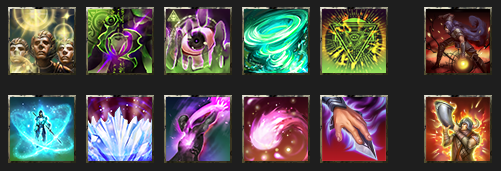
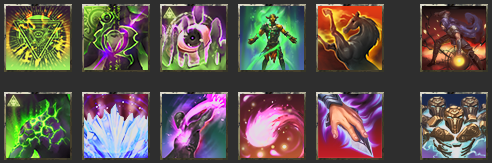
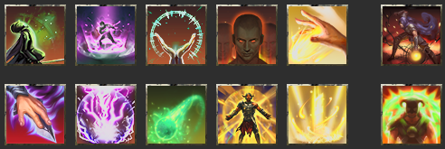
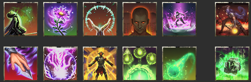
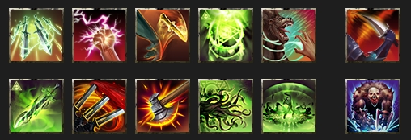
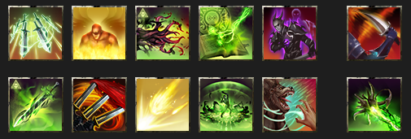
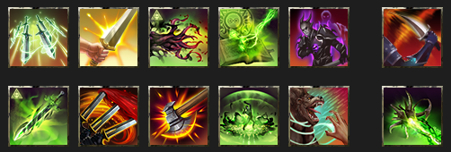
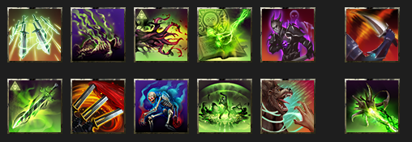
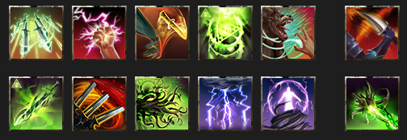
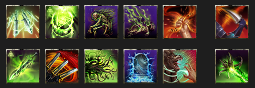

<input type="checkbox" id="menu-toggle" class="menu-toggle">
<label for="menu-toggle" class="hamburger-menu">
  
  
  
</label>

  

    <h3>Contents</h3>
    <!-- TOC will be inserted here by JavaScript -->
  

* TOC
{:toc}

_This is a work in progess; last updated 2026-01-30._

These represent Paradoxdruid's best attempt at capturing the mid-tier meta for Update 49 / U49, aimed at groups who regularly do vet and vet HM content; venturing in trifecta progs.

# Table of Contents

| Guide Section                                                                                                                                                                      | Why Do I Want To Read This?                                                                                                                                          |
| ---------------------------------------------------------------------------------------------------------------------------------------------------------------------------------- | -------------------------------------------------------------------------------------------------------------------------------------------------------------------- |
| • [U49 Build Guides](#eso-update-49-mid-tier-build-guides) &nbsp;&nbsp;• [Support Build Guides](#support-loadouts) &nbsp;&nbsp;• [DPS Build Guides](#update-49-dps-loadouts) | I want to see skill bars, subclassing, and commonly worn armor sets to get up and running fast. **(Start here!)**                                                    |
| • [Why Do I Use these Skills](#why-do-i-use-these-skills)                                                                                                                          | I want to see the details of why certain skills are used, and see alternative skills and breakdowns                                                                  |
| • [U49 Trial Rosters](#eso-update-49-mid-tier-trial-rosters)                                                                                                                       | I plan to lead a trial, and I'd like a discord-ready roster template with roles, sets, and trial specific roles and group organization                               |
| • [Notes](#notes)                                                                                                                                                                  | I want to understand how these builds reach penetration and crit damage cap, if there's other approaches that might work, or better understand assumptions made here |

---

# Other Pages

| Other Page                                            | Why Do I Want To Read This?                                                                                                  |
| ----------------------------------------------------- | ---------------------------------------------------------------------------------------------------------------------------- |
| • [Quickstart Guide](./quickstart.html)               | I I want a quick checklist of everything I need to get my DPS up and running                                                 |
| • [U49 Parses](./parses.html)                         | I want to see how some of these builds perform on the target dummy, dummy optimized and in-content setups. **(Start here!)** |
| • [Top DPS Skills and Gear](./usage.html)             | I want to see the the most used skills and gear for DPS players on each boss, pulled from esologs.com data                   |
| • [Top Support Skills and Gear](./support_usage.html) | I want to see the the most used skills and gear for Tank and Healer players on each boss, pulled from esologs.com data       |

---

**Wait, you've got it all wrong!** Yeah, maybe I do, that's totally fair. And in any case, there's lots of good approaches and strategies, and not a one-size-fits-all approach that will always apply. Thanks for all the feedback I've received to date!

---

# ESO Update 49 Mid-tier Build Guides

See [Guiding Principles](#guiding-principles) and [Buff Calculations](#buff-calculations) for explanations of set selections.

**Approach and Assumptions**

- In this standard setup, we rely on most DPS being Arc/NB, and bringing Cro/Plar lines.
- Because of this, Penetration and Crit Damage can be capped without some previously excellent support sets.

## Support Loadouts

**See also [Why Do I Use These Skills?](#why-do-i-use-these-skills) for details on why different skills are selected.**

### Main Tank

| Class Lines                                                                                | Skill Bars                                                                                                                                                                                                                                                                                                                                                                          | Typical Sets     | Notes                                                                                                                                                                                                                            |
| ------------------------------------------------------------------------------------------ | ----------------------------------------------------------------------------------------------------------------------------------------------------------------------------------------------------------------------------------------------------------------------------------------------------------------------------------------------------------------------------------- | ---------------- | -------------------------------------------------------------------------------------------------------------------------------------------------------------------------------------------------------------------------------- |
| Winter's Embrace (Warden),  Soldier of Apocrypha (Arcanist),  Siphoning (Nightblade) | _FB:_ Lingering Flare, Spiteward of the Lucid Mind, Runic Sunder, Polar Wind, Runeguard of Still Water, Soul Siphon  _BB:_ Expansive Frost Cloak, Elemental Blockade, Leashing Soul, Elemental Susceptibility, Siphoning Attacks, Aggressive Warhorn  [MT skill bars](https://sheumais.github.io/esoskillbarbuilder/?skills=428,29,26,211,33,60,206,270,430,288,69,408) | Pearl/Lucent/Naz | • Runic Sunder use makes Spiteward shield almost free to spam • Siphoning ability on both bars gives +6% resources • Typical Ult: Aggressive Warhorn  • **Wield Soul**: Pull / Druid's Resurgance / (Cowardice or Maim) |

### Off Tank

| Class Lines                                                                                   | Skill Bars                                                                                                                                                                                                                                                                                                                                                                       | Typical Sets                          | Notes                                                                                                                                                                                                                                            |
| --------------------------------------------------------------------------------------------- | -------------------------------------------------------------------------------------------------------------------------------------------------------------------------------------------------------------------------------------------------------------------------------------------------------------------------------------------------------------------------------- | ------------------------------------- | ------------------------------------------------------------------------------------------------------------------------------------------------------------------------------------------------------------------------------------------------ |
| Daedric Summoning (Sorcerer),  Soldier of Apocrypha (Arcanist),  Siphoning (Nightblade) | _FB:_ Runeguard of Still Waters, Spiteward of the Lucid Mind, Runic Sunder, Resolving Vigor, Trample, Soul Siphon  _BB:_ Cruxweaver Armor, Elemental Blockade, Leashing Soul, Elemental Susceptibility, Siphoning Attacks, Summon Charged Atronach  [OT skill bars](https://sheumais.github.io/esoskillbarbuilder/?skills=33,29,27,413,418,60,30,270,430,288,69,145) | Saxhleel Champion/Powerful Assault/AD | • Typical Ult: Summon Charged Atronach  • **Wield Soul**: Pull / Druid's Resurgance / (Cowardice or Maim)  • Paired with Runic Sunder, Spiteward is an almost free shield and heal • Siphoning ability on both bars gives +6% resources |

### ROJO or MA/PA Healer

| Class Lines                                                                                                         | Skill Bars                                                                                                                                                                                                                                                                                                                                                | Typical Sets                                                                                    | Notes                                                                                                                                                                                                                       |
| ------------------------------------------------------------------------------------------------------------------- | --------------------------------------------------------------------------------------------------------------------------------------------------------------------------------------------------------------------------------------------------------------------------------------------------------------------------------------------------------- | ----------------------------------------------------------------------------------------------- | --------------------------------------------------------------------------------------------------------------------------------------------------------------------------------------------------------------------------- |
| Siphoning (Nightblade),  Restoring Light (Templar),  Flex (typically Curative Runeforms or Daedric Summoning) | _FB:_ Illustrious Healing, Extended Ritual, Radiating Regeneration, Combat Prayer, Warding Burst, Soul Siphon  _BB:_ Siphoning Attacks, Elemental Blockade, Echoing Vigor, Radiant Aura, Energy Orb, Reviving Barrier  [ROJO skill bars](https://sheumais.github.io/esoskillbarbuilder/?skills=319,431,320,323,104,60,69,272,406,412,102,420) | • RO (BB)/JO (body)/ Master's Resto (FB)/ Symphony of Blades   • MA (body)/PA (FB)/Pearls | • Typical Ult: Reviving Barrier  • May drop Radianting Regen for Overflowing Altar  • Siphoning ability on each bar for +6% resources  • **Warding Burst**: Damage Shield / Anchorite's Potency / Minor Expedition |

### SPC/PP or MA Healer

| Class Lines                                                                           | Skill Bars                                                                                                                                                                                                                                                                                                                                            | Typical Sets                                        | Notes                                                                                                                                                                                                                                                                                  |
| ------------------------------------------------------------------------------------- | ----------------------------------------------------------------------------------------------------------------------------------------------------------------------------------------------------------------------------------------------------------------------------------------------------------------------------------------------------- | --------------------------------------------------- | -------------------------------------------------------------------------------------------------------------------------------------------------------------------------------------------------------------------------------------------------------------------------------------- |
| Green Balance (Warden),  Siphoning (Nightblade),  Curative Runeforms (Arcanist) | _FB:_ Illustrious Healing, Warding Burst, Radiating Regen, Budding Seeds, Combat Prayer, Soul Siphon  _BB:_ Siphoning Attacks, Elemental Blockade, Echoing Vigor, Chakram of Destiny, Energy Orb, Glyphic of the Tides  [SPC skill bars](https://sheumais.github.io/esoskillbarbuilder/?skills=319,196,320,323,431,60,69,272,412,6,406,0) | SPC (FB)/MA (or PP) (BB)/Pearls/Ozezan or the Blind | • Typical Ult: Glyphic of the Tides  • May drop Radiating Regen for Overflowing Altar   • If paired with ROJO healer, SPC/PA also can work  • Siphoning ability on each bar for +6% resources  • **Warding Burst**: Damage Shield / Anchorite's Potency / Minor Expedition |

### Support Zen/Colo DPS

| Class Lines                                                                                | Skill Bars                                                                                                                                                                                                                                                                                                                                        | Typical Sets                  | Notes                                                                                                                                                                                                                                                                                           |
| ------------------------------------------------------------------------------------------ | ------------------------------------------------------------------------------------------------------------------------------------------------------------------------------------------------------------------------------------------------------------------------------------------------------------------------------------------------- | ----------------------------- | ----------------------------------------------------------------------------------------------------------------------------------------------------------------------------------------------------------------------------------------------------------------------------------------------- |
| Herald of the Tome (Arcanist),  Gravelord (Necromancer),  Assassination (Nightblade) | _FB:_ Quick Cloak, Relentless Focus, Traveling Knife, Escalating Runeblades, Barbed Trap, Incapacitating Strikes  _BB:_ Inspired Scholarship, Stampede, Carve, Tentacular Dread, Fulminting Rune, Glacial Colossus  [Zen skill bars](https://sheumais.github.io/esoskillbarbuilder/?skills=299,47,302,14,372,36,20,334,336,19,22,228) | • Zen/Null Arca • Zen/Kosh | • Provides Major Vuln • Can wear Encratis monster set • Zen DoTs: Knife, Carve, Fulminating, Barbed Trap, Burning, Poison  • **Traveling Knife**: Multitarget / Lingering Torment / Off Balance  • Can replace Barbed Trap with Structured Entropy (Mage's Guild) for ranged fights |

## Update 49 DPS Loadouts

**See also [Why Do I Use These Skills?](#why-do-i-use-these-skills) for details on why different skills are selected.**

### Meta Beam Arcanist (Dawn's Wrath variant)

| Class Lines                                                                               | Skill Bars                                                                                                                                                                                                                                                                                                                                               | Typical Sets                                                                                                                                                                  | Notes                                                                                                                                                                       |
| ----------------------------------------------------------------------------------------- | -------------------------------------------------------------------------------------------------------------------------------------------------------------------------------------------------------------------------------------------------------------------------------------------------------------------------------------------------------- | ----------------------------------------------------------------------------------------------------------------------------------------------------------------------------- | --------------------------------------------------------------------------------------------------------------------------------------------------------------------------- |
| Herald of the Tome (Arcanist),  Assassination (Nightblade),  Dawn's Wrath (Templar) | _FB_: Quick Cloak, Radiant Glory, Cephaliarch's Flail, Pragmatic Fatecarver, Camo Hunter, Ult: Incapacitating Strike  _BB_: Inspired Scholarship, Stampede, Solar Barrage, Fulminating Rune, Barbed Trap, Ult: Languid Eye  [Beam skill bars](https://sheumais.github.io/esoskillbarbuilder/?skills=299,94,18,17,370,36,20,334,89,22,372,12) | • AOE: Ansuul's Torment/Deadly Strikes/Velothi/1 light Slimecraw/Maelstrom Inferno   • Single-Target: Null Arca/Tideborn/Velothi/1 light Slimecraw/Maelstrom Greatsword | • If running **Banner** (Shock/Cavaliar's Charge/Courage), replace Camo Hunter and Barbed Trap, and replace Fulminating with Merciless Resolve (for passive Major Savagery) |

### Meta Beam Arcanist (Draconic Power variant)

| Class Lines                                                                                      | Skill Bars                                                                                                                                                                                                                                                                                                                                      | Typical Sets                                                                                                                                                                  | Notes                                                                                                                                                                                                   |
| ------------------------------------------------------------------------------------------------ | ----------------------------------------------------------------------------------------------------------------------------------------------------------------------------------------------------------------------------------------------------------------------------------------------------------------------------------------------- | ----------------------------------------------------------------------------------------------------------------------------------------------------------------------------- | ------------------------------------------------------------------------------------------------------------------------------------------------------------------------------------------------------- |
| Herald of the Tome (Arcanist),  Assassination (Nightblade),  Draconic Power (Dragonknight) | _FB_: Quick Cloak, Engulfing Dragonfire, Cephaliarch's Flail, Pragmatic Fatecarver, Camo Hunter, Ult: Soul Harvest  _BB_: Inspired Scholarship, Stampede, Carve, Fulminating Rune, Barbed Trap, Ult: Take Flight  [Beam skill bars](https://sheumais.github.io/esoskillbarbuilder/?skills=299,80,18,17,370,36,20,334,336,22,372,12) | • AOE: Ansuul's Torment/Deadly Strikes/Velothi/1 light Slimecraw/Maelstrom Inferno   • Single-Target: Null Arca/Tideborn/Velothi/1 light Slimecraw/Maelstrom Greatsword | • When Take Flight is up, cast it, then Engulfing Dragonfire 3 times, otherwise, normal beam rotation  • Replace Camo Hunter and Barbed Trap if running **Banner** (Shock/Cavaliar's Charge/Courage) |

**See [Parse Examples](./parses.html) for the Beam Arcanist**

### Meta Beam Arcanist (Aedric Spear variant)

| Class Lines                                                                               | Skill Bars                                                                                                                                                                                                                                                                                                                               | Typical Sets                                                                                                                                                                  | Notes                                                                                         |
| ----------------------------------------------------------------------------------------- | ---------------------------------------------------------------------------------------------------------------------------------------------------------------------------------------------------------------------------------------------------------------------------------------------------------------------------------------- | ----------------------------------------------------------------------------------------------------------------------------------------------------------------------------- | --------------------------------------------------------------------------------------------- |
| Herald of the Tome (Arcanist),  Aedric Spear (Templar),  Assassination (Nightblade) | _FB_: Quick Cloak, Blazing Spear, Cephaliarch's Flail, Pragmatic Fatecarver, Camo Hunter, Ult: Soul Harvest  _BB_: Inspired Scholarship, Stampede, Carve, Fulminating Rune, Barbed Trap, Ult: Languid Eye  [Beam skill bars](https://sheumais.github.io/esoskillbarbuilder/?skills=299,80,18,17,370,36,20,334,336,22,372,12) | • AOE: Ansuul's Torment/Deadly Strikes/Velothi/1 light Slimecraw/Maelstrom Inferno   • Single-Target: Null Arca/Tideborn/Velothi/1 light Slimecraw/Maelstrom Greatsword | • Replace Camo Hunter and Barbed Trap if running **Banner** (Shock/Cavaliar's Charge/Courage) |

**See [Parse Examples](./parses.html) for the Beam Arcanist**

### Meta Beam Arcanist (Gravelord variant)

| Class Lines                                                                                | Skill Bars                                                                                                                                                                                                                                                                                                                                                             | Typical Sets                                                                                                                                                                  | Notes                                                                                         |
| ------------------------------------------------------------------------------------------ | ---------------------------------------------------------------------------------------------------------------------------------------------------------------------------------------------------------------------------------------------------------------------------------------------------------------------------------------------------------------------- | ----------------------------------------------------------------------------------------------------------------------------------------------------------------------------- | --------------------------------------------------------------------------------------------- |
| Herald of the Tome (Arcanist),  Assassination (Nightblade),  Gravelord (Necromancer) | _FB_: Quick Cloak, Detonating Siphon, Cephaliarch's Flail, Pragmatic Fatecarver, Camo Hunter, Ult: Incapacitating Strike  _BB_: Inspired Scholarship, Stampede, Gravelord's Sacrifice, Fulminating Rune, Barbed Trap, Ult: Languid Eye  [Beam skill bars](https://sheumais.github.io/esoskillbarbuilder/?skills=299,238,18,17,370,36,20,334,233,22,372,12) | • AOE: Ansuul's Torment/Deadly Strikes/Velothi/1 light Slimecraw/Maelstrom Inferno   • Single-Target: Null Arca/Tideborn/Velothi/1 light Slimecraw/Maelstrom Greatsword | • Replace Camo Hunter and Barbed Trap if running **Banner** (Shock/Cavaliar's Charge/Courage) |

### Runeblades (Stormcalling variant)

| Class Lines                                                                                    | Skill Bars                                                                                                                                                                                                                                                                                                                                                                   | Typical Sets                                                           | Notes                                |
| ---------------------------------------------------------------------------------------------- | ---------------------------------------------------------------------------------------------------------------------------------------------------------------------------------------------------------------------------------------------------------------------------------------------------------------------------------------------------------------------------- | ---------------------------------------------------------------------- | ------------------------------------ |
| Herald of the Tome (Arcanist),  Assassination (Nightblade),  Ardent Flame (Dragonknight) | _FB_: Quick Cloak, Tentacular Dread, Escalating Runeblades, Relentless Focus, Killer's Blade, Ult: Incapacitating Strike  _BB_: Inspired Scholarship, Stampede, Flames of Oblivion, Venomous Claw, Molten Whip, Ult: Standard of Might  [Runeblades skill bars](https://sheumais.github.io/esoskillbarbuilder/?skills=299,47,302,14,372,36,20,334,19,174,173,12) | Null Arca/Tideborn/Velthi/1 piece light Slimecraw/Maelstrom Greatsword | Can also use the new Warmask mythic. |

### Blastbones

| Class Lines                                                                               | Skill Bars                                                                                                                                                                                                                                                                                                                                                                           | Typical Sets                                                           | Notes                                |
| ----------------------------------------------------------------------------------------- | ------------------------------------------------------------------------------------------------------------------------------------------------------------------------------------------------------------------------------------------------------------------------------------------------------------------------------------------------------------------------------------ | ---------------------------------------------------------------------- | ------------------------------------ |
| Herald of the Tome (Aranist),  Assassination (Nightblade),  Gravelord (Necromancer) | _FB_: Quick Cloak, Escalating Runeblades, Blighted Blastbones, Detonating Siphon, Merciless Resolve, Ult: Incapacitating Strike  _BB_: Inspired Scholarship, Stampede, Tentacular Dread, Unnerving Boneyard, Barbed Trap, Ult: The Languid Eye  [Blastbones skill bars](https://sheumais.github.io/esoskillbarbuilder/?skills=299,14,232,238,46,36,20,334,19,235,372,12) | Null Arca/Tideborn/Velthi/1 piece light Slimecraw/Maelstrom Greatsword | Can also use the new Warmask mythic. |

---

# Why Do I Use These Skills?

- [Main Tank Skill explanations](#main-tank-skills)
- [Off Tank Skill explanations](#off-tank-skills)
- [Green Balance Healer Skill explanations](#green-balance-healer-skills)
- [Restoring Light Healer Skill explainations](#restoring-healer-skills)
- [Beam DPS Skill explanations](#beam-skills)

## Main Tank Skills

**Disclaimer**: As always, the "right" abilities will depend on group composition (what skills the other tank and the healers are running), what content you are doing (mechanics, boss specific needs, are you going to need to chain things), and other factors. This is just a starting point!

### Front Bar

| Icon                                                       | Name                                                        | Explanation                                                                                                                                                                                                                                                                                                                                                                                                                                          |
| ---------------------------------------------------------- | ----------------------------------------------------------- | ---------------------------------------------------------------------------------------------------------------------------------------------------------------------------------------------------------------------------------------------------------------------------------------------------------------------------------------------------------------------------------------------------------------------------------------------------- |
|  | **Runic Sunder**                                            | Your bread and butter Taunt. It has long-range, gives the group extra penetration, applies Minor Maim, generates crux, and reduces your damage taken.                                                                                                                                                                                                                                                                                                |
|  | **Runeguard of Still Waters**                               | Group Minor Resolve, reducing damage taken by ~4% (although this should be provided by healers from Combat Prayer), as well as 5% damage reduction from Minor Protection for yourself. Also gives you a self-heal when your health goes down, and Immobilizes small adds. From passives, also increases your armor by 3000 while active, and grants the group Minor Evasion, reducing AoE damage by 10%. (Can be swapped backbar with the flex spot) |
|     | **Spiteward of the Lucid Mind**                             | A large shield that can allow you to use Magicka instead spending stamina on a roll dodge to survive heavy attacks if you time it right. Spiteward also heals by spending crux, and has cost reduced with crux, making this ability almost free and spammable. crux.                                                                                                                                                                                 |
|    | **Lingering Flare**                                         | Passively provides Major Protection for 10% damage reduction. Very useful if you anticipate a lot of DoT damage.                                                                                                                                                                                                                                                                                                                                     |
|      | **Polar Wind**                                              | Your self-heal. It heals a big chunk upfront, and applies a strong HoT effect as well. Your spammable heal, usually cast right after Igneous Shields to maximize the healing.                                                                                                                                                                                                                                                                        |
|                                                            | Flex Ult spot:                                              |                                                                                                                                                                                                                                                                                                                                                                                                                                                      |
|                                                            |  | With Siphoning line: **Soul Siphon** ultimate to replace Barrier FB. Passively slotted, gives you +6% Mag and Stam, +3% self-healing, and it's again a great "oh shit" button.                                                                                                                                                                                                                                                                       |
|                                                            |             | Without Siphoning line: **Reviving Barrier** ultimate: This serves two purposes. First, it usually is just used for the passive, which will give +10% Magicka recovery. Second, it's a good "oh shit" button if you or especially the group is taking too much damage, to buy some breathing room.                                                                                                                                                   |

### Back Bar

| Icon                                                                | Name                                                           | Explanation                                                                                                                                                                                                                                                                                                                                                                                                                                                                                                 |
| ------------------------------------------------------------------- | -------------------------------------------------------------- | ----------------------------------------------------------------------------------------------------------------------------------------------------------------------------------------------------------------------------------------------------------------------------------------------------------------------------------------------------------------------------------------------------------------------------------------------------------------------------------------------------------- |
|  | **Blockade of Frost**                                          | This is one of your most important debuff skills, and should always be active. It applies minor breach to chilled enemies and gives a projectile shield to your team, as well as proccing your weapon enchantment (Crusher for pen)                                                                                                                                                                                                                                                                         |
|         | **Elemental Susceptibility**                                   | This is your most important debuff skill, and should always be active on important enemies. It applies Major Breach (increasing team damage by more than 10%) and the Burning, Chilled and Concussed status effects. These status effects provide Minor Maim, Minor Brittle and Minor Vulnerability. This skill also pairs well with wall of elements: Wall of Frost (from yourself) snares and reduces the armor of Chilled enemies and Wall of Storms (from a healer) sets Concussed enemies Off Balance. |
|        | **Leashing Soul**                                              | This scribed skill is the best Pull / chain in the game; long-range, cheap (with the Druid's script), and can apply Major Maim or Major Cowardice, reducing boss damage by up to 10%. I use this even on bosses I've taunted, to keep Major Maim up.                                                                                                                                                                                                                                                        |
|              | **Expansive Frost Cloak**                                      | Group-wide Major Resolve, which reduces damage taken by ~9%. It needs to always be up.                                                                                                                                                                                                                                                                                                                                                                                                                      |
|                                                                     | Flex spot:                                                     |                                                                                                                                                                                                                                                                                                                                                                                                                                                                                                             |
|                                                                     |       | With Siphoning line: **Siphoning Attacks**: A BB passive skill that keeps up the +6% Mag & Stam when you bar swap, and any damage you deal (like, constantly from Blockade) heals you and restores resources. Can also be cast to restore resources.                                                                                                                                                                                                                                                        |
|                                                                     |  | Without Siphoning line: **Ulfsild's Contingency**: A strong choice for survivability, it gives a good damage shield to you and allies, as well as a brief 8% unique damage reduction buff, and can give you Minor Mag & Stam recovery if you're far from group or healer isn't providing it.                                                                                                                                                                                                                |
|                        | Ultimate: **Aggressive Horn**                                  | Provides Major Force, which (if needed) gives ~4% damage to group --though many groups can reach crit cap without, as well as +10% max resources, which is another ~3% damage boost.                                                                                                                                                                                                                                                                                                                        |

### Situational Tank Skills

| Icon                                                    | Name                                                                       | Explanation                                                                                                                                                                                                                                                                                                                  |
| ------------------------------------------------------- | -------------------------------------------------------------------------- | ---------------------------------------------------------------------------------------------------------------------------------------------------------------------------------------------------------------------------------------------------------------------------------------------------------------------------- |
|        | **Razor Caltrops**                                                         | In trash, this replaces Ele Sus, to apply Major Breach to the whole group. It also slows small adds, giving DPS time to burn them before they get hit.                                                                                                                                                                       |
|  | **Goading Throw**                                                          | If you run sword and shield, this taunt is a stamina-based alternative that can also provide a variety of useful tools as needed. The strength of this skill is its customisability. If you need a heal, resources or a specific debuff that may be difficult to source otherwise it is very simple to put it on this skill. |
|     | **Runic Sunder**                                                           | Can replace Inner Rage as your taunt. It has shorter range and doesn't provide the powerful Radiate synergy, but applies Minor Maim, reducing boss damage 5%, a unique 2% damage reduction for you, and some penetration if your group needs it.                                                                             |
|        | **Charging Maneuver**                                                      | Gives your group +45% speed for running through long trials.                                                                                                                                                                                                                                                                 |
|   | **Impervious Runeward**                                                    | A massive shield, but does not provide heals or reduce in cost with crux.                                                                                                                                                                                                                                                    |
|     | **Temporal Guard**                                                         | A good FB ultimate for passive Minor Protection (not needed if using Runeguard skill) and a 5K shield that recharges after 10 seconds not blocking.                                                                                                                                                                          |
|         | **Race Against Time**                                                      | Immediately removes slows, which can be very useful for some add packs or bosses.                                                                                                                                                                                                                                            |
|                                                         | Other Class Lines                                                          | Instead of **Siphoning**, some groups prefer **Gravelord** or **Daedric Summoning** skill line. If so, you lose Soul Siphon and Siphoning Attacks, so you might use:                                                                                                                                                         |
|                                                         |           | **Glacial Colossus** ultimate to replace Aggressive Horn BB. Provides the critically important Major Vulnerability debuff.                                                                                                                                                                                                   |
|                                                         |  | **Charged Atronach**: ultimate to replace Aggressive Horn BB. Provides the important Major Berserk buff (+10% group damage while active).                                                                                                                                                                                    |

### Overall Outcomes

If you keep up all the skills above, you provide the group with:

- **Buffs:** Major Resolve, Minor Resolve, Minor Brutality, Igneous Shields ally shields, Polar Wind ally heal, Blockade of Ice projectile shields, Radiate Synergy, Horn resources.
- **Enemy Debuffs:** Major Breach, Minor Breach, Minor Brittle, Major Maim, Minor Maim, Off-Balance and Minor Vulnerability (with healer lightning staff), Crusher.

This gives roughly:

- Groupwide +18% damage, and consistent off-balance windows on boss for Exploiter bonus
- Groupwide -15% damage taken, and -10% more from AoEs
- Projectile shields for allies, igneous shields for allies, and Polar Wind heals; all small but add up
- Boss dealing -15% damage

## Off Tank Skills

**Disclaimer**: As always, the "right" abilities will depend on group composition (what skills the other tank and the healers are running), what content you are doing (mechanics, boss specific needs, are you going to need to chain things), and other factors. This is just a starting point!

### Front Bar

| Icon                                                        | Name                                                           | Explanation                                                                                                                                                                                                                                                                                                                                                                                                                                          |
| ----------------------------------------------------------- | -------------------------------------------------------------- | ---------------------------------------------------------------------------------------------------------------------------------------------------------------------------------------------------------------------------------------------------------------------------------------------------------------------------------------------------------------------------------------------------------------------------------------------------- |
|         | **Runic Sunder**                                               | Bread and butter taunt; applies Minor Maim, reducing boss damage 5%, a unique 2% damage reduction for you, and some penetration if your group needs it. Also generates Crux to heal with Runeward.                                                                                                                                                                                                                                                   |
|   | **Runeguard of Still Waters**                                  | Group Minor Resolve, reducing damage taken by ~4% (although this should be provided by healers from Combat Prayer), as well as 5% damage reduction from Minor Protection for yourself. Also gives you a self-heal when your health goes down, and Immobilizes small adds. From passives, also increases your armor by 3000 while active, and grants the group Minor Evasion, reducing AoE damage by 10%. (Can be swapped backbar with the flex spot) |
|      | **Spiteward of the Lucid Mind**                                | A large shield that can allow you to use Magicka instead spending stamina on a roll dodge to survive heavy attacks if you time it right. Spiteward also heals by spending crux, and has cost reduced with crux, making this ability almost free and spammable. crux.                                                                                                                                                                                 |
|     | **Resolving Vigor**                                            | A powerful heal and HoT you can spam as needed. Also gives Minor Resolve, but so does Runeguard.                                                                                                                                                                                                                                                                                                                                                     |
|                                                             | Flex Spot:                                                     |                                                                                                                                                                                                                                                                                                                                                                                                                                                      |
|                                                             |         | **Trample**: Provides Major Heroism to help you spam ults.                                                                                                                                                                                                                                                                                                                                                                                           |
|                                                             |  | **Ulfsild's Contingency**: A strong choice for survivability, it gives a good damage shield to you and allies, as well as a brief 8% unique damage reduction buff, and can give you Minor Mag & Stam recovery if you're far from group or healer isn't providing it.                                                                                                                                                                                 |
|                                                             |        | **Blinding Flare**: Passively provides Major Protection for 10% damage reduction. Very useful if you anticipate a lot of DoT damage.                                                                                                                                                                                                                                                                                                                 |
|  | Ultimate: **Soul Siphon**                                      | This serves two purposes. Passively slotted, it gives you +6% Mag and Stam, +3% self-healing. Second, it's a good "oh shit" button if you or especially the group is taking too much damage, to buy some breathing room.                                                                                                                                                                                                                             |

### Back Bar

| Icon                                                                | Name                                  | Explanation                                                                                                                                                                                                                                                                                                                                                                                                                                                                                                 |
| ------------------------------------------------------------------- | ------------------------------------- | ----------------------------------------------------------------------------------------------------------------------------------------------------------------------------------------------------------------------------------------------------------------------------------------------------------------------------------------------------------------------------------------------------------------------------------------------------------------------------------------------------------- |
|             | **Cruxweaver Armor**                  | Your source of Major Resolve, also procs Minor Breach on enemies and generates Crux for damage reduction.                                                                                                                                                                                                                                                                                                                                                                                                   |
|  | **Blockade of Frost**                 | This is one of your most important debuff skills, and should always be active. It applies minor breach to chilled enemies and gives a projectile shield to your team, as well as proccing your weapon enchantment (Crusher for pen)                                                                                                                                                                                                                                                                         |
|         | **Elemental Susceptibility**          | This is your most important debuff skill, and should always be active on important enemies. It applies Major Breach (increasing team damage by more than 10%) and the Burning, Chilled and Concussed status effects. These status effects provide Minor Maim, Minor Brittle and Minor Vulnerability. This skill also pairs well with wall of elements: Wall of Frost (from yourself) snares and reduces the armor of Chilled enemies and Wall of Storms (from a healer) sets Concussed enemies Off Balance. |
|        | **Leashing Soul**                     | This scribed skill is the best Pull / chain in the game; long-range, cheap (with the Druid's script), and can apply Major Maim or Major Cowardice, reducing boss damage by up to 10%. I use this even on bosses I've taunted, to keep Major Maim up.                                                                                                                                                                                                                                                        |
|            | **Siphoning Attacks**                 | A passive skill that keeps up the +6% Mag & Stam when you bar swap, and any damage you deal (like, constantly from Blockade) heals you and restores resources. Can also be cast to restore resources.                                                                                                                                                                                                                                                                                                       |
|   | Ultimate: **Summon Charged Atronach** | A powerful ult that also provides a synergy to give groupwide Major Berserk (+10% damage).                                                                                                                                                                                                                                                                                                                                                                                                                  |

### Situational Tank Skills

| Icon                                                    | Name                                                              | Explanation                                                                                                                                                                                                                                                                                                                  |
| ------------------------------------------------------- | ----------------------------------------------------------------- | ---------------------------------------------------------------------------------------------------------------------------------------------------------------------------------------------------------------------------------------------------------------------------------------------------------------------------- |
|        | **Razor Caltrops**                                                | In trash, this replaces Ele Sus, to apply Major Breach to the whole group. It also slows small adds, giving DPS time to burn them before they get hit.                                                                                                                                                                       |
|  | **Goading Throw**                                                 | If you run sword and shield, this taunt is a stamina-based alternative that can also provide a variety of useful tools as needed. The strength of this skill is its customisability. If you need a heal, resources or a specific debuff that may be difficult to source otherwise it is very simple to put it on this skill. |
|        | **Charging Maneuver**                                             | Gives your group +45% speed for running through long trials.                                                                                                                                                                                                                                                                 |
|     | **Temporal Guard**                                                | A good FB ultimate for passive Minor Protection (not needed if using Runeguard skill) and a 5K shield that recharges after 10 seconds not blocking.                                                                                                                                                                          |
|         | **Race Against Time**                                             | Immediately removes slows, which can be very useful for some add packs or bosses.                                                                                                                                                                                                                                            |
|                                                         | Other Class Lines                                                 | Instead of **Siphoning**, some groups prefer **Winter's Embrace** or **Gravelord** skill line on OT. If so, you lose Soul Siphon and Siphoning Attacks, so you might use:                                                                                                                                                    |
|                                                         |                   | **Reviving Barrier** ultimate: This serves two purposes. First, it usually is just used for the passive, which will give +10% Magicka recovery. Second, it's a good "oh shit" button if you or especially the group is taking too much damage, to buy some breathing room.                                                   |
|                                                         |            | **Expansive Frost Cloak**: Group-wide Major Resolve, which reduces damage taken by ~9%. It should always be up.                                                                                                                                                                                                              |
|                                                         |             | **Polar Wind**: A very strong self-heal. It heals a big chunk upfront, and applies a strong HoT effect as well. Your spammable heal, usually cast right after Igneous Shields to maximize the healing.                                                                                                                       |
|                                                         |  | **Glacial Colossus** ultimate to replace Charged Atronach BB. Provides the critically important Major Vulnerability debuff.                                                                                                                                                                                                  |

## Green Balance Healer Skills

**Disclaimer**: As always, the "right" abilities will depend on group composition (what skills the other tank and the healers are running), what content you are doing (mechanics, boss specific needs, are you going to need to chain things), and other factors. This is just a starting point!

**Note**: Just by having the Green Balance class line (specifically the maturation passive), all of your healing applies Minor Toughness to allies, an important and unique +10% max health buff.

### Front Bar

| Icon                                                                | Name                                                           | Explanation                                                                                                                                                                                                                                                      |
| ------------------------------------------------------------------- | -------------------------------------------------------------- | ---------------------------------------------------------------------------------------------------------------------------------------------------------------------------------------------------------------------------------------------------------------- |
|     | **Illustrious Healing**                                        | This is one of your primary ground heal over time (HoT) spells; it should always be up for the group. It smart targets, unlike the other morph.                                                                                                                  |
|            | **Budding Seeds**                                              | This is your other primary ground HoT. This also provides a good healing synergy. Often, you will keep this ability focused on the MT, so they have a synergy available to restore resources.                                                                    |
|  | **Combat Prayer**                                              | Your main healing spammable and probably most-cast ability. It heals everyone in a large rectangle in front of you, as well as providing Minor Resolve (~3% damage reduction) and Minor Berserk (5% damage increase). If in doubt, spam this during heal checks. |
|     | **Warding Burst**                                              | This provides a useful damage shield for HoTs to heal the group under, and with _Anchorite's Potency_ gives you and the group ultimate generation.                                                                                                               |
|                                                                     | Flex Spot:                                                     |                                                                                                                                                                                                                                                                  |
|                                                                     |  | **Radiating Regeneration**: This is a good semi-spammable for keeping magicka low and to provide a sticky heal when folks need to leave group for mechanics.                                                                                                     |
|                                                                     |  | **Warding Contingency**: With Damage Shield and Growing Impact, this skill can give groupwide Minor Protection (5% damage reduction) or Minor Mag & Stam recovery, if a healer with Restoring Light isn't providing it.                                          |
|                                                                     |        | **Healthy Offering**: This is a strong heal for single-target heal checks like Tombs, and will generate ultimate from passives.                                                                                                                                  |
|                                                                     |            | **Overflowing Altar**: One healer should always be running this strong heal and provider of massive heal synergy, preferably near the Tank.                                                                                                                      |
|          | Ultimate: **Soul Siphon**                                      | This serves two purposes. Passively slotted, it gives you +6% Mag and Stam, +3% self-healing. Second, it's a good "oh shit" button if you or especially the group is taking too much damage, to buy some breathing room.                                         |

### Back Bar

| Icon                                                           | Name                               | Explanation                                                                                                                                                                                                                                                                                                                                  |
| -------------------------------------------------------------- | ---------------------------------- | -------------------------------------------------------------------------------------------------------------------------------------------------------------------------------------------------------------------------------------------------------------------------------------------------------------------------------------------- |
|               | **Energy Orb**                     | A very strong HoT and source of an essential recovery synergy. It should always be up and active, usually aimed and near to tanks. (can switch with flex spot FB)                                                                                                                                                                            |
|  | **Blockade of Lightning**          | This is an important debuff skill. It sets concussed enemies (sourced from Tank's Ele Sus) off balance, and procs the Crusher or Weakening enchantment on your BB staff. Skill can be dropped sometimes, if you have a DPS with off-balance Knife skill, or just need barspace for Altar or situational skills.                              |
|          | **Echoing Vigor**                  | A very strong sticky HoT (so good to cast before dps run off to do mechanics) that is Stamina based, to help manage resources.                                                                                                                                                                                                               |
|           | **Chakram of Destiny**             | A good spammable shield skill. It also generates Crux, which increases all your healing by up to 12%. (can switch with flex spot FB)                                                                                                                                                                                                         |
|       | **Siphoning Attacks**              | A passive skill that keeps up the +6% Mag & Stam when you bar swap, and any damage you deal (like, constantly from Blockade) heals you and restores resources. Can also be cast to restore resources when low.                                                                                                                               |
|           | Ultimate: **Glyphic of the Tides** | One of the strongest HoT effects in the game, and importantly it ticks every 1 second, when many heals tick every 2 seconds. Great for heal checks like vKA Falgravn HM 3rd floor. It also boosts group damage more than Pearlescent Ward or Xoryn's set effects; worth casting anytime group is fighting even if they don't need the heals. |

### Situational Healer Skills

| Icon                                                          | Name                             | Explanation                                                                                                                                                                                       |
| ------------------------------------------------------------- | -------------------------------- | ------------------------------------------------------------------------------------------------------------------------------------------------------------------------------------------------- |
|               | **Reviving Barrier** BB ultimate | This serves two purposes. First, it passively gives +10% Magicka recovery. Second, it is a very strong shield and HoT for heavy damage moments, and is very useful for groupwide damage checks.   |
|            | **Healing Thicket**              | A strong extra HoT. Importantly, it's very cheap to cast, so if you need spammable extra healing, like vSE Ansuul HM, it's worth considering.                                                     |
|            | **Zenas' Empowering Disc**       | Minor Courage and Mag & Stam recovery is very nice, but only hits six targets. Useful for dungeons or trials with split Bosses like vLC Garg/Scorp.                                               |
|                 | **Efficient Purge**              | Purges harmful effects which can make some fights easier, such as in the first boss in vHoF. Many effects you would expect to be purgable in other trials... aren't.                              |
|   | **Elemental Susceptibility**     | For some trials, healers will need to slot this to debuff side adds, such as Protectors in vAS+2. Applies Major Breach, and will proc Off-Balance if your Blockade of Lightning is on the target. |
|  | **Leashing Soul**                | Sometimes healers need to taunt; using a Pull skill allows you to taunt without fear of stealing taunt from the Boss and you can apply Major Cowardice or Major Maim to reduce enemy damage.      |
|        | **Trample**                      | An alternative source of Major Heroism instead of the Pearls of Ehlnofey Mythic.                                                                                                                  |
|          | **Mystic Guard**                 | Powerful damage reduction for a Tank, used in certain boss fights, like vDSR Twins HM.                                                                                                            |

## Restoring Healer Skills

**Disclaimer**: As always, the "right" abilities will depend on group composition (what skills the other tank and the healers are running), what content you are doing (mechanics, boss specific needs, are you going to need to chain things), and other factors. This is just a starting point!

### Front Bar

| Icon                                                                | Name                                                           | Explanation                                                                                                                                                                                                                                                      |
| ------------------------------------------------------------------- | -------------------------------------------------------------- | ---------------------------------------------------------------------------------------------------------------------------------------------------------------------------------------------------------------------------------------------------------------- |
|     | **Illustrious Healing**                                        | This is one of your primary ground heal over time (HoT) spells; it should always be up for the group. It smart targets, unlike the other morph.                                                                                                                  |
|        | **Extended Ritual**                                            | Your other primary ground HoT. Extremely strong and long-lasting, and also provides a group-wide synergy for resource recovery.                                                                                                                                  |
|  | **Combat Prayer**                                              | Your main healing spammable and probably most-cast ability. It heals everyone in a large rectangle in front of you, as well as providing Minor Resolve (~3% damage reduction) and Minor Berserk (5% damage increase). If in doubt, spam this during heal checks. |
|     | **Warding Burst**                                              | This provides a useful damage shield for HoTs to heal the group under, and with _Anchorite's Potency_ gives you and the group ultimate generation.                                                                                                               |
|                                                                     | Flex Spot:                                                     |                                                                                                                                                                                                                                                                  |
|                                                                     |  | **Radiating Regeneration**: This is a good semi-spammable for keeping magicka low and to provide a sticky heal when folks need to leave group for mechanics.                                                                                                     |
|                                                                     |  | **Warding Contingency**: With Damage Shield and Growing Impact, this skill can give groupwide Minor Protection (5% damage reduction) or Minor Mag & Stam recovery, if a healer with Restoring Light isn't providing it.                                          |
|                                                                     |        | **Healthy Offering**: This is a strong heal for single-target heal checks like Tombs, and will generate ultimate from passives.                                                                                                                                  |
|                                                                     |            | **Overflowing Altar**: One healer should always be running this strong heal and provider of massive heal synergy, preferably near the Tank.                                                                                                                      |
|          | Ultimate: **Soul Siphon**                                      | This serves two purposes. Passively slotted, it gives you +6% Mag and Stam, +3% self-healing. Second, it's a good "oh shit" button if you or especially the group is taking too much damage, to buy some breathing room.                                         |

### Back Bar

| Icon                                                             | Name                           | Explanation                                                                                                                                                                                                                                                                                                         |
| ---------------------------------------------------------------- | ------------------------------ | ------------------------------------------------------------------------------------------------------------------------------------------------------------------------------------------------------------------------------------------------------------------------------------------------------------------- |
|                 | **Energy Orb**                 | A very strong HoT and source of an essential recovery synergy. It should always be up and active, usually aimed and near to tanks. (can switch with flex spot FB)                                                                                                                                                   |
|    | **Blockade of Lightning**      | This is an important debuff skill. It sets enemies Concussed (to get off-balance with Tank's Ele Sus cast), and procs the Crusher or Weakening enchantment on your BB staff. Skill can be dropped sometimes, if you have a DPS with off-balance Knife skill, or just need barspace for Altar or situational skills. |
|            | **Echoing Vigor**              | A very strong sticky HoT (so good to cast before dps run off to do mechanics) that is Stamina based, to help manage resources.                                                                                                                                                                                      |
|  | **Radiant Aura**               | A super-long lasting buff that provides important Minor Mag & Stam recovery for the group.                                                                                                                                                                                                                          |
|         | **Siphoning Attacks**          | A passive skill that keeps up the +6% Mag & Stam when you bar swap, and any damage you deal (like, constantly from Blockade) heals you and restores resources. Can also be cast to restore resources when low.                                                                                                      |
|                  | Ultimate: **Reviving Barrier** | This serves two purposes. First, it passively gives +10% Magicka recovery. Second, it is a very strong shield and HoT for heavy damage moments, and is very useful for group-wide damage checks.                                                                                                                    |

### Situational Healer Skills

| Icon                                                               | Name                                  | Explanation                                                                                                                                                                                       |
| ------------------------------------------------------------------ | ------------------------------------- | ------------------------------------------------------------------------------------------------------------------------------------------------------------------------------------------------- |
|  | Ultimate: **Summon Charged Atronach** | A powerful ult that also provides a synergy to give groupwide Major Berserk (+10% damage).                                                                                                        |
|                 | **Zena's Empowering Disc**            | Minor Courage and Mag & Stam recovery is very nice, but only hits six targets. Useful for dungeons or trials with split Bosses like vLC Garg/Scorp.                                               |
|                      | **Efficient Purge**                   | A few trials require this skill to purge harmful effects, notably vHoF. Many effects you would expect to be purgable in other trials... aren't.                                                   |
|        | **Elemental Susceptibility**          | For some trials, healers will need to slot this to debuff side adds, such as Protectors in vAS+2. Applies Major Breach, and will proc Off-Balance if your Blockade of Lightning is on the target. |
|       | **Leashing Soul**                     | Sometimes healers need to taunt; using a Pull skill allows you to taunt without fear of stealing taunt from the Boss and you can apply Major Cowardice or Major Maim to reduce enemy damage.      |
|             | **Trample**                           | An alternative source of Major Heroism instead of the Pearls of Ehlnofey Mythic.                                                                                                                  |
|               | **Mystic Guard**                      | Powerful damage reduction for a Tank, used in certain boss fights, like vDSR Twins HM.                                                                                                            |

## Beam Skills

**Disclaimer**: As always, the "right" abilities will depend on group composition (what skills and gear the other players are running), what content you are doing (mechanics, boss specific needs, are you going to need to chain things), and other factors. This is just a starting point!

### Front Bar

| Icon                                                                                                              | Name                                                     | Explanation                                                                                                                                                                                                                                                                                                                                                                                                                                                                                               |
| ----------------------------------------------------------------------------------------------------------------- | -------------------------------------------------------- | --------------------------------------------------------------------------------------------------------------------------------------------------------------------------------------------------------------------------------------------------------------------------------------------------------------------------------------------------------------------------------------------------------------------------------------------------------------------------------------------------------- |
|                                                               | **Quick Cloak**                                          | This important close-range DoT provides the important Major Evasion buff (-20% damage from AoEs), and procs both of the enchantments on your frontbar daggers.                                                                                                                                                                                                                                                                                                                                            |
|                                                                | **Cephaliarch's Flail**                                  | Your essential skill for building Crux. You should almost always follow the pattern (with Inspired Scholarship running) of "Flail, Flail, Beam". It also heals you if it hits an enemy, and gives a +5% damage taken to enemies hit.                                                                                                                                                                                                                                                                      |
|                                                           | **Pragmatic Fatecarver**                                 | Your core skill and typical over 50% of your total damage. **ABB: Always Be Beaming.** It gives you a strong damage shield as well. To survive extended AoE damage (vAS, vSS Lokke, etc), you can cast beam, tap Bash to cancel the beam, and immediately recast Beam to refresh the shield repeatedly.                                                                                                                                                                                                   |
|   | **Camouflaged Hunter** or **Banner Bearer**           | Slotted purely for the passives and never cast. You get Minor Berserk for +5% damage attacking enemies from behind, and +3% Weapon Damage for having it slotted. Can be replaced by **Banner Bearer** (typically Shock/Cavalier's Charge/Heroism). In fights like vSS, where you can never get behind the boss, it's less useful.                                                                                                                                                                         |
|                                                                                                                   | Flex spot:                                               |                                                                                                                                                                                                                                                                                                                                                                                                                                                                                                           |
|                                                                                                                   |  | **Engulfing Flames**: A decent DoT that makes enemies take +6% fire damage from all sources, and can refresh your Molten Whip stacks.                                                                                                                                                                                                                                                                                                                                                                     |
|                                                                                                                   |   | **Venomous Claw**: A very strong DoT that refreshes whip stacks. Because it's damage ramps up, you generally don't want to recast it early.                                                                                                                                                                                                                                                                                                                                                               |
|                                                                                                                   |   | **Barbed Trap**: A very strong DoT and source of hemorrhage status damage which provides +3% Weapon Damage from passives.                                                                                                                                                                                                                                                                                                                                                                                 |
|                                                                                                                   |  | **Resolving Vigor**: A self heal and source of Minor Resolve, useful for portals or other mechanics where you'll be far from healer.                                                                                                                                                                                                                                                                                                                                                                      |
|                                                              | Ultimate: **Incapacitating Strike** or **Soul Harvest**  | This serves two purposes. Passively slotted, it gives you +10% Crit Damage, and provides Minor Savagery (+6% Crit Chance). Second, it's a good "need damage now" skill or if you know you won't save enough ultimate to use Standard of Might before the fight ends. The morph choice depends on the content. When doing content with many enemies, such as dungeons and certain trials, soul harvest is the preferred morph due to its unique passive of giving 10 ultimate upon dealing a killing blow. |

### Back Bar

| Icon                                                                                                             | Name                                                           | Explanation                                                                                                                                                                                                                                                                                                                                                                                                                               |
| ---------------------------------------------------------------------------------------------------------------- | -------------------------------------------------------------- | ----------------------------------------------------------------------------------------------------------------------------------------------------------------------------------------------------------------------------------------------------------------------------------------------------------------------------------------------------------------------------------------------------------------------------------------- |
|                                                         | **Inspired Scholarship**                                       | A critical buff that passively provides Major Brutality (+20% damage done), generates a free Crux every time you spend Crux, and gives extra direct damage hits.                                                                                                                                                                                                                                                                          |
|                                                                                                                  | Weapon Skill:                                                  | This is the most important backbar skill to keep up because it procs your infused backbar weapon damage enchantment (regardless of sets/arena weapons).                                                                                                                                                                                                                                                                                   |
|                                                                                                                  |           | **Stampede**: If using Maelstrom Greatsword, this skill gives a guaranteed Crit hit, a decent DoT, but more importantly gives up to +12% direct damage done from Maelstrom set. Note that the small ground-based DoT is what needs to deal damage to proc your enchantment.                                                                                                                                                               |
|                                                                                                                  |  | **Blockade of Fire**: If using Maelstrom Inferno Staff, this skill gives a very, very high damage DoT (often in the top 3 or 4 sources of total dps).                                                                                                                                                                                                                                                                                     |
|                                                             | **Flames of Oblivion**                                         | Passive Major Savagery for slotting, a very important buff, as well as a strong DoT when active. Also refreshes whip stacks.                                                                                                                                                                                                                                                                                                              |
|                                                                                                                  | DoT Spot:                                                      |                                                                                                                                                                                                                                                                                                                                                                                                                                           |
|                                                                                                                  |         | **Venomous Claw**: A very strong DoT that refreshes whip stacks. Because it's damage ramps up, you generally don't want to recast it early. Definitely what to put here if it isn't on your front bar.                                                                                                                                                                                                                                    |
|                                                                                                                  |       | **Fulminating Rune**: A good DoT that also provides a good synergy to your team. This skill is a group dps net gain over other options if group members take the synergy. Its cost is tied to the lower of your maximum resources, which can help balance out sustain issues especially if using a Greatsword backbar.                                                                                                                    |
|                                                                                                                  |               | **Anti-Cavalry Caltrops**: A good damage, large AoE DoT. Useful in large add packs.                                                                                                                                                                                                                                                                                                                                                       |
|   | **Molten Whip** or **Banner Bearer**                        | Slotted purely passively, it provides +300 Weapon Damage if stacks are kept up. Can be replaced by **Banner Bearer** (typically Shock/Cavalier's Charge/Courage). Could also be replaced by a DoT especially if whip stacks can't be kept at 3x (which is common).                                                                                                                                                                        |
|                                                        | Ultimate: **Standard of Might**                                | A very strong DoT effect that also gives you +15% damage done and -15% damage taken, as well as provides allies with a synergy. It's only downsides are that it's expensive to cast and immobile, so make sure not to cast it right before a boss moves or goes into an invuln stage. Particularly potent when combined with Pillager's or Crypt due to the stacking damage done effects of both Standard and your Incapacitating Strike. |

---

# ESO Update 49 Mid-tier Trial Rosters

These rosters should be ready to copy and paste into Discord, though you may need to check the custom icons based on your servers and emoji availability. (Click to expand)

   
Maw of Lorkhaj

  <pre>
Your Local Time:

**Reqs**: Please state role(s) when signing up. Dps must parse 90K. Will take 3 without clear.

**Addons**: Crutch Alerts, Ody's Support Icons, Hodors (for supports)

▬▬▬▬▬▬▬▬▬▬▬▬▬▬▬
:red_point: MT (Winter/Soldier/Flex) `[Pearl/Lucent/Naz]` (Horn):  
:red_point: OT (Summon/Soldier/Flex) `[Sax/PA/AD]` (Atro):

:yellow_point: Healer (Green/Siphon/Curative) `[SPC/PP/Pearls]` (Glyphic):
:yellow_point: Healer (Restoring/Siphon/Summon) `[RO/JO/Symph]` (Barrier):

:green_point: DPS M1:
:green_point: DPS R1:
:green_point: DPS M2:
:green_point: DPS R2:
:green_point: DPS M3:
:green_point: DPS R3:
:green_point: DPS M4:
:green_point: DPS R4: `[Zen]` (Colo)
▬▬▬▬▬▬▬▬▬▬▬▬▬▬▬
Runners
L:
M:
R:
▬▬▬▬▬▬▬▬▬▬▬▬▬▬▬
Fill:
</pre>

   
Halls of Fabrication

  <pre>
Your Local Time:

**Reqs**: Please state role(s) when signing up. Dps must parse 90K. Will take 3 without clear.

**Addons**: Crutch Alerts, Ody's Support Icons

▬▬▬▬▬▬▬▬▬▬▬▬▬▬▬
**RIGHT STACK (Reactor)**
:red_point: MT (Winter/Soldier/Flex) `[Pearl/Lucent/Naz]` (Horn):  
:yellow_point: Healer (Restoring/Siphon/Flex) `[MA/PA/Pearls/Ozezan]` (Barrier):  
:green_point: DPS:
:green_point: DPS:
:green_point: DPS:
:green_point: DPS:
▬▬▬▬▬▬▬▬▬▬▬▬▬▬▬
**LEFT STACK (Reducer)**
:red_point: OT (Summon/Siphon/Flex) `[Sax/PA/AD]` (Atro):  
:yellow_point: Healer (Green/Siphon/Curative) `[SPC/MA/Pearls/Symph]` (Glyphic):
:green_point: DPS:
:green_point: DPS:
:green_point: DPS:
:green_point: DPS: `[Zen]` (Colo)
▬▬▬▬▬▬▬▬▬▬▬▬▬▬▬
Portals
N:
E:
S:
W:
▬▬▬▬▬▬▬▬▬▬▬▬▬▬▬
Fill:

</pre>

   
Asylum Sanctorium

  <pre>
Your Local Time:

**Reqs**:

**Addons**: Asylum Sanctorium Status Panel, Asylum Tracker, Elms Markers

▬▬▬▬▬▬▬▬▬▬▬▬▬▬▬
:red_point: MT (Soldier/Flex/Restoring) `[Pearl/Lucent/Naz]` (Horn):  
:red_point: OT (Winter/Summon/Flex) `[Sax/PA/BZ]` (Atro): (Crushing Shock)

:yellow_point: Group Healer (Green/Restoring/Siphon) `[SPC/PP/Pearls]` (Barrier):
:green_point: Front Kite `[Zen]`:

:green_point: DPS 1:
:green_point: DPS 2:
:green_point: DPS 3 `[WM]`:
:green_point: DPS 4: (Crushing Shock)
:green_point: DPS 5:
:green_point: DPS 6 `[WM]`:
:green_point: DPS 7:
:green_point: DPS 8:
▬▬▬▬▬▬▬▬▬▬▬▬▬▬▬
Fill:
</pre>

   
Cloudrest

  <pre>
Your Local Time:

**Reqs**: Please state role(s) when signing up. Dps must parse 95K. Will take 3 without clear.

_(NO OAKENSOUL)_

**Addons**: HowTo Cloudrest, Ody's Support Icons, Lock Weapon Swap Updated

▬▬▬▬▬▬▬▬▬▬▬▬▬▬▬
:red_point: Mini Tank (Winter/Soldier/Flex) `[Pearl/Lucent/Naz]` (Horn):  
▬▬▬▬▬▬▬▬▬▬▬▬▬▬▬
:red_point: Portal Tank 1 (Summon/Siphon/Flex) `[Sax/PA/AD]` (Atro), Steed mundus - Ele Sus Z'Maja/Crystal:
:red_point: Portal Tank 2 (Summon/Siphon/Flex) `[Sax/PA/AD]` (Atro), Steed mundus - Ele Sus Z'Maja/Crystal:
▬▬▬▬▬▬▬▬▬▬▬▬▬▬▬▬▬▬▬▬▬▬▬▬▬▬▬▬▬▬
Healers
:yellow_point: R Group Healer (Restoring/Siphon/Flex) `[MA/PA/Pearl/Ozezan]` (Barrier):  
:yellow_point: L Kite Healer (Green/Siphon/Curative) `[SPC/MA/Pearls/Symph]` (Glyphic):
▬▬▬▬▬▬▬▬▬▬▬▬▬▬▬▬▬▬▬▬▬▬▬▬▬▬▬▬▬▬
PORTAL 1
:green_point:L DPS CW:
:green_point:L DPS CCW:
▬▬▬▬▬▬▬▬▬▬▬▬▬▬▬▬▬▬▬▬▬▬▬▬▬▬▬▬▬▬
PORTAL 2
:green_point:L DPS CW:
:green_point:L DPS CCW:
▬▬▬▬▬▬▬▬▬▬▬▬▬▬▬▬▬▬▬▬▬▬▬▬▬▬▬▬▬▬
:green_point:R BACKUP PORTAL 1 DPS:
:green_point:R BACKUP PORTAL 2 DPS: `[Zen]` (Colo)
:green_point:R GRAPE SLAYER:
</pre>

   
Sunspire

  <pre>
Your Local Time:

**Reqs**: Please state role(s) when signing up. Dps must parse 95K. Will take 3 without clear.

**Addons**: HowTo Sunspire, Crutch Alerts, Ody's Support Icons, Hodors

▬▬▬▬▬▬▬▬▬▬▬▬▬▬▬
:red_point: MT (Winter/Soldier/Flex) `[Lucent/Pearl/Naz]` (Horn):  
:red_point: OT (Summon/Flex/Flex) `[Sax/PA/AD]` (Atro):  
▬▬▬▬▬▬▬▬▬▬▬▬▬▬▬
**HEAD STACK**
:yellow_point: Healer (Green/Siphon/Curative) `[SPC/MA/Pearls]` (Glyphic):
:green_point:DPS 1:
:green_point:DPS 2:
:green_point:DPS 3:  
:green_point:DPS 4:

**WING STACK**
:yellow_point: Healer (Restoring/Siphon/Flex) `[MA/PP/Symph]` (Barrier):  
:green_point:DPS 5:
:green_point:DPS 6:
:green_point:DPS 7:
:green_point:DPS 8: `[Zen]` (Colo)
▬▬▬▬▬▬▬▬▬▬▬▬▬▬▬
PORTAL:
L:
M:
R:
▬▬▬▬▬▬▬▬▬▬▬▬▬▬▬
TOMBS:
T1:
T2:
T3:
Backup:
▬▬▬▬▬▬▬▬▬▬▬▬▬▬▬
Fill:
</pre>

   
Kyne's Aegis

  <pre>
Your Local Time:

**Reqs**: Please state role(s) when signing up. Dps must parse 95K. Will take 3 without clear.

**Addons**: HowTo Kynes, Crutch Alerts, Ody's Support Icons, Hodors
▬▬▬▬▬▬▬▬▬▬▬▬▬▬▬
:red_point: MT (Winter/Soldier/Flex) `[Lucent/Pearl/Naz]` (Horn):  
:red_point: OT (Summon/Siphon/Flex) `[Sax/PA/AD]` (Atro):

:yellow_point: Healer (Green/Siphon/Curative) `[SPC/PP/Pearls]` (Glyphic):
:yellow_point: Healer (Restoring/Siphon/Flex) `[RO/JO/Symph]` (Barrier):

:green_point: DPS M1:
:green_point: DPS R1:
:green_point: DPS M2:
:green_point: DPS R2:
:green_point: DPS M3:
:green_point: DPS R3:
:green_point: DPS M4: (boat)
:green_point: DPS R4: `[Zen]` (Colo)
▬▬▬▬▬▬▬▬▬▬▬▬▬▬▬
Fill:
</pre>

   
Rockgrove

  <pre>
Your Local Time:

**Reqs**: Please state role(s) when signing up. Dps must parse 105K. Will take 3 without clear.

**Addons**: Qcells Rockgrove Helper, Crutch Alerts, Ody's Support Icons, Hodors

▬▬▬▬▬▬▬▬▬▬▬▬▬▬▬
:red_point: MT (Winter/Soldier/Flex) `[Lucent/Pearl/Naz]` (Horn):  
:red_point: OT (Bone/Summon/Siphon) `[Sax/PA/AD]` (Atro):  
:yellow_point: Kite Healer (Green/Siphon/Curative) `[SPC/PP/Pearls]` (Glyphic):
:yellow_point: Group Healer (Restoring/Siphon/Flex) `[RO/JO/Symph]` (Barrier):

:green_point: (HM: Guard) DPS:
:green_point: DPS 1.1:
:green_point: DPS 1.2:
:green_point: DPS 1.3:
:green_point: DPS 2.1:
:green_point: DPS 2.2:
:green_point: DPS 2.3:
:green_point: DPS 8: `[Zen]` (Colo)
▬▬▬▬▬▬▬▬▬▬▬▬▬▬▬
Fill:
</pre>

   
Dreadsail Reef

  <pre>
Your Local Time:

**Reqs**: Please state role(s) when signing up. Dps must parse 95K. Will take 3 without clear.

**Addons**: Qcell's Dreadsail Reef Helper, Crutch Alerts, Ody's Support Icons

▬▬▬▬▬▬▬▬▬▬▬▬▬▬▬
**RIGHT STACK**
:red_point: MT (Winter/Soldier/Flex) `[Lucent/Pearl/Naz]` (Horn):  
:yellow_point: Healer (Green/Siphon/Curative) `[SPC/MA/Pearls]` (Glyphic):
:green_point:M1 top right:
:green_point:M2 bottom right:
:green_point:M3 dome swap:  
:green_point:M4: `[Zen]` (Colo)

**LEFT STACK**
:red_point: OT (Summon/Siphon/Flex) `[Sax/PA/AD]` (Atro):  
:yellow_point: Healer (Restoring/Siphon/Flex) `[MA/PP/Symph]` (Barrier):  
:green_point:M1 top left:
:green_point:M2 bottom left:
:green_point:M3 dome swap:
:green_point:M4:

**BOSS 2 RUNNERS**
1:
2:
3:
Backup 1:
Backup 2:

**BOSS 3 BRIDGES**
1:
2:
3:
</pre>

   
Sanity's Edge

  <pre>
Your Local Time:

**Reqs**: Please state role(s) when signing up. Dps must parse 95K. Will take 3 without clear.

**Addons**: Crutch Alerts, Ody's Support Icons, Hodor's

▬▬▬▬▬▬▬▬▬▬▬▬▬▬▬
:red_point: MT (Winter/Soldier/Flex) `[Lucent/Pearl/Naz]` (Horn):  
:red_point: OT (Summon/Siphon/Flex) `[Sax/PA/AD]` (Atro):

:yellow_point: Healer (Green/Siphon/Curative) `[SPC/PP/Pearls]` (Glyphic):
:yellow_point: Healer (Restoring/Siphon/Flex) `[RO/JO/Symph]` (Barrier):

:green_point: DPS 1:
:green_point: DPS 2:
:green_point: DPS 3: (portal)
:green_point: DPS 4: (portal)
:green_point: DPS 5: (portal)
:green_point: DPS 6:
:green_point: DPS 7:

:green_point: DPS 8: `[Zen]` (Colo)
▬▬▬▬▬▬▬▬▬▬▬▬▬▬▬
</pre>

   
Lucent Citadel

  <pre>
Your Local Time:

**Reqs**: Please state role(s) when signing up. Dps must parse 95K. Will take 3 without clear.

**Addons**: Crutch Alerts, Ody's Support Icons, Hodor's

▬▬▬▬▬▬▬▬▬▬▬▬▬▬▬▬▬▬▬▬▬▬
**GARGOYLE**
:red_point: MT (Winter/Soldier/Flex) `[Lucent/Pearl/Naz]` (Horn):  
:yellow_point: Healer (Green/Siphon/Curative) `[SPC/PP or MA/Pearls]` (Glyphic): (W 90 /S 60)

:green_point:S DPS:
:green_point:SW DPS:
:green_point:W DPS: `[Zen]` (Colo)
:green_point:NW DPS:

**SCORPION**
:red_point: OT (Summon/Siphon/Flex) `[Sax/PA/AD]` (Atro): (kite boss 2)
:yellow_point: Healer (Restoring/Siphon/Flex) `[(ROJO or MA)/PP/Pearls/Symph]` (Barrier): (E 90 / N 60)

:green_point:N DPS:
:green_point:NE DPS:
:green_point:E DPS:  
:green_point:SE DPS:
▬▬▬▬▬▬▬▬▬▬▬▬▬▬▬▬▬▬▬▬▬▬
Knot:
1
2
3
4
5
▬▬▬▬▬▬▬▬▬▬▬▬▬▬▬▬▬▬▬▬▬▬
</pre>

  
Ossein Cage

  <pre>
Your local time:

**Reqs:** Please state role(s) when signing up. Dps must parse 120K. Will take 3 without clear.

**Addons:** Crutch Alerts, Ody's Support Icons, Hodor's, Ossein Cage Helper by Wondernuts

▬▬▬▬▬▬▬▬▬▬▬▬▬▬▬
**SKORKHIF**
:red_point: MT (Winter/Soldier/Flex) `[Lucent/Pearl/Naz]` (Horn):  
:yellow_point: Healer (Green/Siphon/Curative) `[SPC/PP/Pearls]` (Glyphic) (boss 3 stay):
:Reply: `[SPC/MA/Pearls/Ozezan]` on Boss 2
:green_point: DPS R1:
:green_point: DPS R2 (boss 1 portal):
:green_point: DPS R3 (boss 1 portal):
:green_point: DPS R4:

**JYNORAH**
:red_point: OT (Summon/Siphon/Flex) `[Sax/PA/AD]` (Atro):  
:yellow_point: Healer (Restoring/Siphon/Flex) `[RO/JO/Symph]` (Barrier):  
:Reply: `[SPC/MA/Pearls/Symph]` on Boss 2
:green_point: DPS B1:
:green_point: DPS B2 (boss 1 portal):
:green_point: DPS B3:
:green_point: DPS B4: `[Zen]` (Colo)
▬▬▬▬▬▬▬▬▬▬▬▬▬▬▬
Fill:
</pre>

---

# Notes

## Guiding Principles

- Most dps will be in meta Herald of the Tome/Assassination combos, which feature high penetration and crit damage. With Pragmatic Fatecarver and/or Reaving Blows CP, they have high innate survivability.
- Due to meta classes being Arc/NB, there is limited need for Roar of Alkosh or Crimson Oath's Rive sets in most fights (see calculations below).
- With the changes to Zenas' (targets 6, not smart targeting), sourcing Minor Courage requires a change. The primary method of achieving this is through the courage affix on two Banner Bearer DPS. The recovery buffs from Zenas' are moved to a healer running Radiant Aura.

## Buff Calculations

- **Typical Meta Penetration (Arc/NB/Aedric):**
  - Major Breach (Ele Sus) 5,949
  - Minor Breach (Cruxweaver on MT or good Wall/Ele Sus uptimes) 2,974
  - Crusher 2,108
  - Piercing Blue CP 700
  - (note than common Null Arca and Deadliy Strikes sets have no Pen lines)
  - Velothi: 1,650
  - Arcanist passives, 2 abilities slotted (Flail and Beam): 2,490
  - 1 Light Armor 939
  - Either:
    - Set with Penetration line (Ansuuls or Tideborn) 1,497
    - 1-piece Monster set with penetration (Valkyn Skoria) 1,497
    - Tank running Runic Sunder as Taunt 2,200
  - **TOTAL**: 18,307 (pen line set) or 19,010 (runic sunder taunt)
  - Over the penetration cap with no need for Kosh or Crimson

- **Typical Meta Crit Damage (Arc/NB):**
  - Base 50%
  - Minor Brittle 10%
  - Velothi / Minor Force 10%
  - 6 Medium armor 12%
  - Nightblade passive 10%
  - Arcanist passive 12%
  - Lucent Echoes 11%
  - Either:
    - Major Force (Saxhleel Champion, Aggressive Horn, or both) 20%
    - Elemental Catalyst 15%
  - **TOTAL**: 135% or 130%
  - Over the crit damage cap

## Other Approaches

- A common composition is to put minor heroism on banner and source minor courage from the Yolnahkriin set. **Why I don't recommend:**
  - Minor heroism is a luxury buff that can be sourced through potions. It is not a requirement, nor is it overly impactful. The buff itself provides 40 ultimate every 60 seconds.
  - We give up a 5 piece slot on a tank that could be used to source another more impactful buff such as Major Force from Saxhleel Champion, 307 Weapon Damage from Powerful Assault or 180 Weapon Damage from Pearlescent Ward.
  - Most fights in trials and dungeons are burst or phased fights. A set that provides a contant minor buff is less impactful and important than one which provides a stronger buff for a short time.
  - If we decide to give up a set like Saxhleel we need to change other parts of our build as well as the builds of others to compensate.
    - DPS have to change their CP, for example by dropping Wrathful Strikes (205 Weapon Damage) for Fighting Finesse (8% Critical Damage).
  - Using Yolnahkriin is always a damage loss, and the expected value loss in certain circumstances is huge.
  

    
Explanation and Calculations: (click to expand)

    <ul>
      <li>The ultimate generation of minor heroism increases DPS by approximately 4.5/60 * 14% = 1.05%
        <ul>
          <li>The ultimate generation from minor heroism provides approximately (40/70) * 8s = 4.5s of 20% bonus damage from Incap every 60 seconds.</li>
          <li>This is diluted down to ~14% bonus damage done due to other buffs which are always active such as minor berserk and our CPs (and even further with temporary buffs such as Major Berserk).</li>
        </ul>
      </li>
      <li>The DPS gain from keeping our wrathful strikes CP and using Saxhleel to reach crit cap in the important burst phases is ~2.5%.
        <ul>
          <li>When we don't have the Major Force from Saxhleel, our damage is only ~0.67% worse at 115% crit damage.</li>
          <li>We can calculate the expected value (whether this is worth it) with this formula: E(T) = (1-T) * -0.67% + T * 2.5% where T is the uptime of Major Force.</li>
          <li>The absolute minimum uptime is 20%, because we generate 3 ultimate per second from light attacking, however our class passives, skills (such as Trample and Exhilarating Drain) and the decisive trait can increase this.
            <ul>
              <li>If we take a conservative ultimate generation per second value of 4, our expected value from using Saxhleel is (1-0.267) * -0.67% + 0.267 * 2.5% = 0.18%, which only goes up the more you and your group improves.</li>
              <li>The absolute minimum uptime of 20% is only a (1-0.2%) * -0.67 + 0.2% * 2.5 = -0.036% damage loss, which is almost negligible and highlights how pointless it is to use Yoln.</li>
              <li>This minimum uptime also doesn't account for being able to start a fight phase with some ultimate already which can dramatically increase the uptime of Major Force.</li>
            </ul>
          </li>
        </ul>
      </li>
    </ul>
  

## Changelog

- 2025-01-30: Adjusted trial rosters, MT setups, and dps calculations
- 2025-01-18: Added initial Update 49 setups
- 2025-12-17: Added links to parses, top dps, and top support skills and sets
- 2025-12-14: Updated main tank to use Runic Sunder
- 2025-11-23: Incorporated extensive cleanup and insights from [TheMrPancake](https://github.com/sheumais). Thank you!
- 2025-11-19: Tweaked MT skills and added more explanations of scribing skills and Zen's dots to support setups
- 2025-11-14: Incorporate great feedback from Matthis and others
- 2025-11-13: Updated DPS guides to U49; revised support load outs to reflect knowledge gained in the last few months
- 2025-06-07: Revised support skill lines; made the meta of Ansuuls + 1 piece light armor the standard
- 2025-05-31: Added Dawn's Wrath variant meta Beam arcanist
- 2025-05-30: Explicitly list Master's Resto for MA/Sax / ROJO Healer; remove confusing Alternative loadouts; removed MK recommendation; clarify penetration minor breach
- 2025-05-28: Made ROJO a more explicit option (dang it); listed growing impact contigency option; switched OT to siphoning
- 2025-05-25: Fixed Support DPS skill bars, credit Banyu
- 2025-05-22: Explicitly listed alternative support loadout with Lucent and DPS with spear skill, to ditch Major Force.
- 2025-05-21: Made a support DPS explicit. Pointed out that MAPA Healer can use ROJO if desired.
- 2025-05-19: Revised support skills and gear loadouts for clarity. Added more discussin of other approaches and assumptions.
- 2025-05-17: Reverted usage of JO based on feedback, changed to Sax. Added scribed skills per suggestions.
- 2025-05-16: Added Other approaches section, fully gave up on Pillager's in suggested setups.
- 2025-05-15: Fixed Tank mentions of required Runic Sunder. Added note that Beam arcs can slot spear for increased crit damage.
- 2025-05-14: Adjusted Healer roles and sets to reflect the ability to spam Barrier and maximize Major Slayer uptimes. Swapped Tank sets for Sax and no TT.
- 2025-05-13: Added Buff calculations to explain why certain sets aren't needed; added explanation of Yolnakriin meta. Changed skill layouts to table form to include notes.
- 2025-05-12: Moved Glacial Colossus to SPC Healer; kept Reaving Blows CP requirement only for vAS; revised MT and OT lines to move Winter's Embrace to MT and add Siphoning to OT
- 2025-05-11: Initial setups


